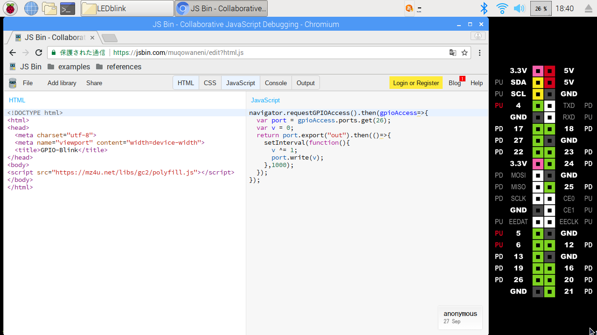

# CHIRIMEN for Raspberry Pi 3 Hello World

# 1. 今回のゴール
CHIRIMEN for Raspberry Pi 3 の使い方をおぼえて、Webアプリから「Lチカ」（LEDをつけたりけしたり）するプログラミングをやってみよう。

1. 今回のゴール
1. 準備
1. CHIRIMEN for Raspberry Pi 3 を起動してみよう
1. Lチカをやってみよう
1. コードを眺めてみよう

## CHIRIMEN for Raspberry Pi 3 とは
CHIRIMEN for Raspberry Pi 3 は、Raspberry Pi 3（以下「Raspi3」）上に構築したIoTプログラミング環境です。

[Web GPIO API (Draft)](https://rawgit.com/browserobo/WebGPIO/master/index.html)や、[Web I2C API (Draft)](https://rawgit.com/browserobo/WebI2C/master/index.html)といったAPIを活用したプログラミングにより、WebアプリからRaspi3に接続した電子パーツを直接制御することができます。


# 2. 準備（準備が終わってる場合は読み飛ばしてください）

## 用意するもの

### 基本ハードウエア
下記がCHIRIMEN for Raspberry Pi 3 の起動に最低限必要となる基本ハードウエアです。


* Raspberry Pi 3 Model B × 1
* ACアダプタ + micro B USB電源ケーブル(例えばコレなど) × 1
* HDMIケーブル (モニタ側の端子と合うものを選んでください) × 1
* HDMI入力つきのモニタ（720Pの解像度に対応したもの） × 1
* USBマウス × 1
* USBキーボード (日本語入力に対応したもの) × 1
* micro SDカード (Class 10以上の性能を持ち、8Gbyte以上の容量を持つもの) × 1

### Lチカに必要となるパーツ
基本ハードウエアに加え「Lチカ」を実施するには下記パーツも追加で必要です。


* ブレッドボード × 1
* リード付きLED × 1
* リード付き抵抗器 (150-470Ω ※お使いのLEDにより) × 1
* ジャンパーワイヤー (オス-メス) x 2

## SDカードへCHIRIMEN for Raspberry Pi 3 環境を書き込む
起動する前に、SDカードへCHIRIMEN for Raspberry Pi 3 環境（imageファイル）を書き込んでおく必要があります。

手順は、[SDカードへCHIRIMEN for Raspberry Pi 3 環境を構築する](https://gist.github.com/tadfmac/527b31a463df0c9de8c30a598872344d) を参照してください。

# 3. CHIRIMEN for Raspberry Pi 3 を起動してみよう
## 接続方法
材料が集まったら、いよいよRaspi3を接続して起動してみましょう。
基本ハードウエアを下図のように接続してください。(Raspi3への電源ケーブルの接続は最後にしましょう)


もしよくわからない場合には、Raspberry Pi Hardware Guide なども参照してみると良いでしょう。

電源ケーブルの接続、あるいは、スイッチ付きケーブルの場合はスイッチのONによりRaspi3が起動します。

## 起動確認
Raspi3の起動後、下記のようなデスクトップ画面が表示されたら CHIRIMEN for Raspberry Pi 3 の起動に成功しています。おめでとうございます。


## 残念ながら上記画面が表示されなかった！？
もし、違う画面が表示される場合には、CHIRIMEN for Raspberry Pi 3とは異なるSDカードで起動された可能性があります。
その場合は、もう一度 SDカードへCHIRIMEN for Raspberry Pi 3 環境を構築する をご確認ください。

また、電源を入れても何も画面に映らないような場合には、配線が誤っている可能性があります。
接続方法を再度確認してみましょう。正しく接続しているはずなのに、Raspi3の赤いLEDが点灯していない場合、ACアダプタまで電気が来ていない可能性もあります。

## WIFIの設定
デスクトップ画面が表示されたら、さっそくWIFIを設定して、インターネットに繋げてみましょう。
CHIRIMEN for Raspberry Pi 3 では、ネットワークに繋がなくてもローカルファイルを使ったプログラミングが一応可能ですが、JS BinやJSFiddleなどのWeb上のエディタを活用することで、より便利にプログラミングが進められるようになります。
また、CHIRIMEN for Raspberry Pi 3 に関する情報も今後インターネット上で充実していく予定です。

ぜひ、最初にインターネット接続環境を整えておきましょう。

WIFIの設定は、タスクバーの右上のWIFIアイコンから行えます。


# 4. Lチカをやってみよう
無事、Raspi3の起動とWIFIの設定が行えたら、いよいよLチカに挑戦してみましょう。

## そもそも「Lチカ」って何？
「Lチカ」とは、LEDを点けたり消したりすることで、チカチカさせることです。今回は「LEDを点ける」「LEDを消す」をプログラムで繰り返し実行することで実現します。

* 参考：[LED（発光ダイオード）](https://ja.wikipedia.org/wiki/%E7%99%BA%E5%85%89%E3%83%80%E3%82%A4%E3%82%AA%E3%83%BC%E3%83%89)

## 配線してみよう
LEDを点けたり消したりするためには、Raspi3と正しく配線する必要があります。
LEDは2本のリード線が出ていますが、長い方がアノード（+側）、短い側がカソード（-側）です。

Lチカのための配線図は、基本的な作例（examples）と一緒に、下記にプリインストールされています。

```
/home/pi/Desktop/gc/gpio/LEDblink/schematic.png
```


それでは、まず先に ```schematic.png``` をダブルクリックして見てみましょう。


LEDのリード線の方向に注意しながら、この図の通りにジャンパー線やブレッドボードを使って配線してみましょう。

(図のLEDの下側の方がアノード(+側))

実際に配線してみると、こんな感じになりました。


### 参考
* [ブレッドボードの使い方](https://www.sunhayato.co.jp/blog/2015/03/04/7)
* [LEDの使い方](https://www.marutsu.co.jp/pc/static/large_order/led)
* [抵抗値の読み方](http://www.jarl.org/Japanese/7_Technical/lib1/teikou.htm)
* [Raspberry Pi3のGPIO](https://tool-lab.com/make/raspberrypi-startup-22/)
* [テスターを使って抵抗値を確かめる](http://startelc.com/elcLink/tester/elc_nArtcTester2.html#chapter-2)

## exampleを実行してみる
配線がうまくできたら、さっそく動かしてみましょう。
Lチカのためのサンプルコードは先ほどの配線図と同じフォルダに格納されています。

```
/home/pi/Desktop/gc/gpio/LEDblink/index.html
```

index.htmlをダブルクリックすると、ブラウザが起動し、先ほど配線したLEDが点滅しているはずです！

## ブラウザ画面


## Lチカの様子


Lチカに成功しましたか？！

## うまくいかなかったら?
セキュリティーエラーが発生している可能性があります。

まずは、[CHIRIMEN for Raspberry Pi 3 におけるセキュリティーエラーへの対処方法](https://qiita.com/tadfmac/items/2d7929fe3560c77fe867) をご確認のうえ、セキュリティーエラーが発生している場合には対処をお願いします。

> ToDo: https://localhost:33330 のブックマーク箇所のスクリーンショットを貼る

# 5. コードを眺めてみよう
さきほどは、Lチカをデスクトップにあるexampleから実行してみました。
実は、CHIRIMEN for Raspberry Pi 3にはもうひとつ、「オンラインのexample」が用意されています。

こちらを利用することで、コードを書き換えながら学習を進めることができます。

今度はオンラインのexampleからさきほどと同じLチカを実行してコードを眺めてみましょう。

その前に。**オンラインのexampleを起動する前に、必ず先ほど実行した ```file:///home/pi/Desktop/gc/gpio/LEDblink/index.html```のブラウザWindowは閉じるようお願いします。Windowを閉じておかないと、これから実行するサンプルが正常に動作しなくなります。**

上記に記載したWindowを確実に閉じるには、一度ブラウザを閉じてから、再度ブラウザを起動すると確実です。(タブだけ消してももちろんOKです)


## ブラウザのブックマークから、JS Binのexampleを起動
それでは、さっそくオンラインのexampleを実行してみます。
配線は、さきほどのままでOKです。

ブラウザを起動後、ブックマークバーから```examples > GPIO-JSBIN > GPIO-Blink - JS Bin``` を選んでアクセスしてください。


そのまま起動すると下記のような画面になります。(下記スクリーンショットはアクセス直後の画面からJS Binのタイトルバー部の「Output」タブを1回押して非表示にしています)



それでは、コードを眺めてみましょう。

## HTML
```html
<!DOCTYPE html>
<html>
<head>
  <meta charset="utf-8">
  <meta name="viewport" content="width=device-width">
  <title>GPIO-Blink</title>
</head>
<body>
<script src="https://chirimen.org/chirimen-raspi3/gc/polyfill/polyfill.js"></script>
</body>
</html>
```

HTMLではpolyfill.jsというJavaScriptライブラリを読み込んでいます。
polyfill.jsはWeb GPIO APIと、Web I2C APIというW3Cでドラフト提案中の2つのAPIへの[Polyfill](https://developer.mozilla.org/ja/docs/Glossary/Polyfill)となっています。


## JavaScript
```javascript
mainFunction(); // 下記のasync関数を実行します（このプログラムのエントリーポイント）

async function mainFunction(){ // プログラムの本体となる関数、非同期処理のためプログラム全体をasync関数で包みます。
  var gpioAccess = await navigator.requestGPIOAccess(); // thenの前の関数をawait接頭辞をつけて呼び出します。
  var port = gpioAccess.ports.get(26);
  await port.export("out");
  while ( true ){ // 無限ループ
    await sleep(1000); // 1000ms待機する
    v ^= 1; // v = v ^ 1 (XOR 演算)の意。(vが1の場合はvが0に、0の場合は1に変化する。1でLED点灯、0で消灯するので、1秒間隔でLEDがON OFFする。)
    port.write(v);
  }
}

function sleep(ms){
  return new Promise( function(resolve) {
    setTimeout(resolve, ms);
  });
}
```

### 注記
CHIRIMEN for Raspberry Pi3はウェブブラウザをプログラムの実行環境として用いてシステムを構築します。ウェブブラウザが実行できるプログラムのプログラミング言語はJavaScriptです。JavaScriptを学んだことのない人は、まず[こちらの資料「JavaScript 1 Day 講習」](https://webiotmakers.github.io/static/docs/2017/maebashi-js.pdf)を履修しましょう。

## 非同期処理

物理デバイスを使用するためには非同期処理をする必要があります。本チュートリアルではこれをasync awaitによって記述することにします。

非同期処理を学んだことのない人、およびasync awaitによる記述をしたことのない人は、まず[こちらの資料「非同期処理 (async await版)」](appendix0.md)を参照し、理解したうえで次に進んでください。

### Note:
本チュートリアルがasync awaitを用いた非同期処理に統一している理由は初心者にとってわかりやすいことです。ただしこの機能は比較的新しいjavascript処理系からサポートされたもののため非対応のブラウザもありますが、Raspberry PI3のChromeはサポートしています。([様々なウェブブラウザでのサポート状況](https://caniuse.com/#feat=async-functions))

## 処理の解説

JavaScriptファイルで、最初に出てくるコードが```navigator.requestGPIOAccess()```です。
ここで先ほど出て来た[Web GPIO API](https://rawgit.com/browserobo/WebGPIO/master/index.html) を使い、```gpioAccess```というGPIOにアクセスするためのインタフェースを取得しています。

コードを読み進める前に、ここで少しGPIOについて記載しておきたいと思います。

## GPIOとは
[GPIO](https://ja.wikipedia.org/wiki/GPIO)は、「General-purpose input/output」の略で汎用的な入出力インタフェースのことです。

Raspi3に実装されている40本のピンヘッダからGPIOを利用することができます。（40本全てのピンがGPIOとして利用できるわけではありません）

CHIRIMEN for Raspberry Pi 3ではRaspi3が提供する40本のピンヘッダのうち、下記緑色のピン(合計17本)をWebアプリから利用可能なGPIOとして設定しています。

Raspberry Pi3のGPIO端子は、GND端子との間に、0Vもしくは3.3Vの電圧を印加(出力)したり、逆に0Vもしくは3.3Vの電圧を検知(入力)したりすることができます。LEDは数mAの電流を流すことによって点灯することができる電子部品のため、印加する電圧を3.3V(点灯)、0V(消灯)と変化させることでLチカが実現できるのです。

詳しくは[こちらのサイトの解説](https://tool-lab.com/make/raspberrypi-startup-22/)などを参考にしてみましょう。


## GPIOPortの処理
さて、コードに戻りましょう。

```var port = gpioAccess.ports.get(26);```という部分で、**GPIOの26番ポートにアクセスするためのオブジェクト** を取得しています。

続いて、```await port.export("out")``` で、**GPIOの26番を「出力設定」**にしています。これによりLEDへの電圧の切り替えが可能になっています。

ここで、関数の呼び出しに```await```接頭詞がついていることに注意してください。この関数は非同期処理の関数でその処理の完了を待って次の処理に進みます。そしてawait接頭詞を使いますので、それを使っている関数(```mainFunction()```)はasync接頭詞が付く、非同期処理の関数となっています。

最後に ```await sleep(1000)```で1000ms待機させて無限ループをつくることで、 1000msごとに```port.write(1)``` と ```port.write(0)``` を交互に呼び出し、GPIO 26番に対する電圧を 3.3V→0V→3.3V→0Vと繰り返し設定しています。

LEDは一定以上の電圧 (赤LEDだと概ね1.8V程度、青LEDだと3.1V程度) 以上になると点灯する性質を持っていますので、3.3Vになったときに点灯、0Vになったときに消灯を繰り返すことになります。

まとめると下図のような流れになります。


## exampleを修正してみよう
JS BinのJavaScriptのペインにカーソルを当てればコード修正が可能です。
試しにいろいろ変えてみましょう。

* 点滅を早くしたり遅くしたりしてみる
* GPIOポートを他のポートに変えてみる (指定したGPIOへジャンパーを付け替える必要があります)
* index.htmlにボタンなどのインターフェースを作ってみて、押すとLEDが反応するよう変えてみる

# まとめ
このチュートリアルでは、下記を実践してみました。

* CHIRIMEN for Raspberry Pi 3の起動
* Lチカのサンプルを動かしてみた
* JS BinでLチカのコードを変更してみた

次回『CHIRIMEN for Raspberry Pi 3 チュートリアル 1. GPIO編』ではGPIOの入力方法についてチュートリアルを進める予定です。
