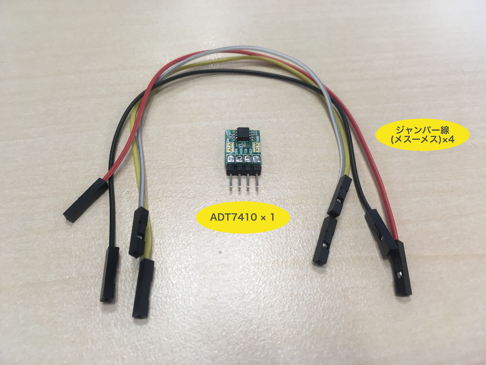

# 概要

CHIRIMEN for Raspberry Pi 3 を使ったプログラミングを通じて、[Web I2C API](https://rawgit.com/browserobo/WebI2C/master/index.html) の使い方を学びます。

## (※1) CHIRIMEN for Raspberry Pi 3とは

Raspberry Pi 3（以下「Raspi3」）上に構築したIoTプログラミング環境です。

[Web GPIO API](https://rawgit.com/browserobo/WebGPIO/master/index.html) (Draft)や、[Web I2C API](https://rawgit.com/browserobo/WebI2C/master/index.html) (Draft)といったAPIを活用したプログラミングにより、WebアプリからRaspi3に接続した電子パーツを直接制御することができます。 
CHIRIMEN Open Hardware コミュニティにより開発が進められています。

## 前回までのおさらい

本チュートリアルを進める前に「[CHIRIMEN for Raspberry Pi 3 Hello World](section1.md)」と、「[CHIRIMEN for Raspberry Pi 3 チュートリアル 1. GPIO編](section1.md)」でCHIRIMEN for Raspberry Pi 3 の基本的な操作方法とプログラミング方法を確認しておいてください。

* [CHIRIMEN for Raspberry Pi 3 Hello World](section0.md)
* [CHIRIMEN for Raspberry Pi 3 チュートリアル 1. GPIO編](section1.md)

前回までのチュートリアルで学んだことは下記のとおりです。

* CHIRIMEN for Raspberry Pi 3 では、各種exampleが `~/Desktop/gc/`配下においてある。配線図も一緒に置いてある
* CHIRIMEN for Raspberry Pi 3 で利用可能なGPIO Port番号と位置は壁紙を見よう
* CHIRIMEN for Raspberry Pi 3 ではWebアプリからのGPIOの制御には[Web GPIO API](https://rawgit.com/browserobo/WebGPIO/master/index.html) を利用する。GPIOポートは「出力モード」に設定することでLEDのON/OFFなどが行える。また「入力モード」にすることで、GPIOポートの状態を読み取ることができる
* [async function](https://developer.mozilla.org/ja/docs/Web/JavaScript/Reference/Statements/async_function) を利用すると複数ポートの非同期コードがすっきり書ける

# 1.準備

## 用意するもの

このチュートリアル全体で必要になるハードウエア・部品は下記の通りです。

* [CHIRIMEN for Raspberry Pi 3 Hello World](section0.md) に記載の「基本ハードウエア」
* [ジャンパーワイヤー (メス-メス)] x 4
* [ADT7410](http://akizukidenshi.com/catalog/g/gM-06675/) x 1 ※付属のピンヘッダでなく、通常サイズのピンヘッダをハンダ付けしておいてください

# 2.I2Cとは

[I2C](https://ja.wikipedia.org/wiki/I2C)とは2線式の同期式シリアル通信インタフェースです。「アイ・スクエア・シー」とか「アイ・ ツー・シー」などと読みます。 

SDA（シリアルデータ）と SCL（シリアルクロック）の2本の線で通信を行います。


上図のように、i2cのSDA、SCLは複数のモジュール間で共有します。（「I2Cバス」と言います。）

I2Cではマスターとスレーブの間で通信が行われます。常にマスター側からスレーブ側に要求が行われます。スレーブ側からマスター側へ要求を行うことはできません。

マスターは、スレーブが持つ「SlaveAddress」を用いて、特定のスレーブとの通信を行います。

このため、同じI2Cバス上に同じSlaveAddressのスレーブを繋ぐことはできません。


通信するモジュール同士が同一基板上にない場合には、SDA、SCLの2本の通信線に加え電源やGNDの線を加えて4本のケーブルを用いて接続するのが一般的です。

詳細は下記をご参照ください。

* [I2C](https://ja.wikipedia.org/wiki/I2C) - Wikipedia
* I2Cバス仕様書　最新版（[日本語](http://www.nxp.com/documents/user_manual/UM10204_JA.pdf)、[English](http://www.nxp.com/documents/user_manual/UM10204.pdf)）
* [I2Cの使い方](http://www.picfun.com/i2cframe.html)（後閑哲也氏サイト)

ここではI2Cの概要として下記を押さえておきましょう。

* I2Cには複数のモジュールが繋がる（I2Cバス）
* I2Cに繋がるモジュールにはマスターとスレーブがある
* I2Cでは必ずマスターからスレーブに対して通信要求が行われる
* I2CスレーブはSlaveAddressを持っている
* 同じI2Cバスに同じSlaveAddressのスレーブは繋げない

# 3.温度センサー(ADT7410)を使ってみる

それでは実際にI2Cに対応したモジュールを使ってみましょう。

CHIRIMEN for Raspberry Pi 3 では、センサーなど、いくつかのI2Cモジュールのサンプルがプリインストールされています。

`/home/pi/Desktop/gc/i2c/`

この中から、ADT7410という温度センサーモジュールを使ってみたいと思います。

Raspberry Pi 3とADT7410との接続方法(回路図)とexampleコードは下記フォルダに格納されています。

`/home/pi/Desktop/gc/i2c/i2c-ADT7410/`

> I2Cバス上、Raspberry Pi 3 がマスター、ADT7410がスレーブになります。

## a. 部品と配線について

まずは、下記ファイルをダブルクリックしてください。回路図が表示されます。

`/home/pi/Desktop/gc/i2c/i2c-ADT7410/schematic.png`

この回路を作成するのに必要な部品は下記の通りです。(Raspi3基本セットを除く)



これらのパーツを下記回路図の通りに接続してみてください。


下記がRaspberry Pi 3 側の接続ピンの位置を拡大した図になります。

間違えないよう接続をお願いします。


## b. 接続がうまくいったか確認する

ここで、ターミナルを起動して下記コマンドを入力してみてください。

`$ i2cdetect -y -r 1`

すると、下記のような画面が表示されるはずです。


`48`という表示が見えます。これは16進数表示ですので`0x48`という意味です。

`i2cdetect`コマンドではI2Cバスに接続されているSlaveAddressを確認することができます。

`0x48`は、ADT7410のSlaveAddressと思われるものですが、念のためデータシートも確認してみましょう。

> [ADT7410のデータシート](http://www.analog.com/media/en/technical-documentation/data-sheets/ADT7410.pdf)

データシートのP.17に「SERIAL BUS ADDRESS」の項があり、ここにSlaveAddressの記載があります。

ADT7410は`0x48`がデフォルトのSlaveAddressで、A0,A1ピンのHIGH/LOWによりSlaveAddeessの下位2bitを変更できることがわかります。


(ADT7410 Data Sheetより抜粋)

試しに、一度 Raspberry Pi の3.3Vに接続している線を抜いて、もう一度`i2cdetect -y -r 1`を実行してみてください。


`0x48` が見つからなくなりました。

これで、ADT7410のSlaveAddressが`0x48`となっていることが確認できました。

再度、先ほど外した3.3Vの線を戻してADT7410に電源を供給しておいてください。

## c. exampleを実行してみる

配線とSlaveAddressが確認できましたので、さっそく動かしてみましょう。

ADT7410のためのサンプルコードは先ほどの配線図と同じフォルダに格納されています。

`/home/pi/Desktop/gc/i2c/i2c-ADT7410/index.html`

index.htmlをダブルクリックすると、ブラウザが起動し下記のような画面になります。


画面の回路図の下の数値が温度（摂氏）になります。

ADT7410センサーに触ると、ゆっくりと温度が上がるはずです。

ADT7410はI2Cという通信方式でセンサーデータを送出するモジュールです。

この情報をWeb I2C API 経由でWebアプリが読み取り、画面に情報を表示しているわけです。

# 4.温度センサー(ADT7410)exampleのコードを読んでみる

それでは、コードを見てみましょう。

`/home/pi/Desktop/gc/i2c/i2c-ADT7410/` 配下の `index.html`、`main.js` をみてみます。

## d-1. index.html

下記がindex.htmlの中から主要な部分を抜き出したコードです。

index.html
```html
  : 
  <script src="../../polyfill/polyfill.js"></script>
  <script src="../../drivers/i2c-ADT7410.js"></script>
  <script src="./main.js"></script>
  :
  <body>
    :
    <p id="head">TEST</p>
    :
  </body>
```

まず最初に読み込んでいるのが`polyfill.js`。Web GPIO APIの時に出てきた`https://mz4u.net/libs/gc2/polyfill.js`と同じWeb GPIO APIとWeb I2C APIのPolyfillです。

次に読み込んでいるのが、`i2c-ADT7410.js`。このファイルは、Web I2C APIを使ってADT7410との通信を行うためのドライバーとなるライブラリです。

最後に読み込んでいる`main.js` が、ドライバーライブラリを使ってこのアプリケーションの動作を記述している部分です。

## d-2. main.js

次に、`main.js`を見てみましょう。(重要な部分以外は削っています)

main.js
```javascript
navigator.requestI2CAccess().then((i2cAccess)=>{
  var port = i2cAccess.ports.get(1);
  var adt7410 = new ADT7410(port,0x48);
  adt7410.init().then(()=>{
    setInterval(()=>{
      adt7410.read().then((value)=>{
        head.innerHTML = value ? value : head.innerHTML;
      });
    },1000);
  });
});
```

ここで温度センサーの情報を定期的に取得し、画面に出力する処理が行われています。
少し詳し解説してみます。

### navigator.requestI2CAccess()

Web I2C APIを利用するための`I2CAccess` インタフェースを取得するための最初のAPI呼び出しです。

正しくインタフェースが取得されたら`Promise`の`then`に指定したコールバック関数が`I2CAccess`パラメータ付きでコールされます。

### i2cAccess.ports.get()

`I2CAccess.ports` は、利用可能なI2Cポートの一覧です。

```javascript
  var port = i2cAccess.ports.get(1);
```

CHIRIMEN for Raspberry Pi 3 で利用可能なI2Cポート番号は`1`番だけです。
ここでは、ポート番号に`1` を指定して、`port`オブジェクトを取得しています。

### var adt7410 = new ADT7410(port,0x48)

ここでADT7410用のドライバーライブラリのインスタンス生成を行なっています。

### adt7410.init()

`init()`では、インスタンス生成時に指定したportオブジェクトと`slaveAddress(0x48)`を用いて`I2CPort.open()`を行なっています。

`I2CPort.open()`が成功すると、`I2CSlaveDevice`というI2Cポートへデータ書き込みや読み込みなどを行うインタフェースが返されます。
`I2CSlaveDevice`インタフェースは、ライブラリ内に保存され、その後`resolve()`で呼び出し元に処理が返されます。

### adt7410.read()

ADT7410の仕様に基づくデータ読み出し処理をここで実施しています。

内部では、`I2CSlaveDevice.read8()` というAPIを2回呼び出すことで、温度データのMSB,LSBを8bitずつ読み出し、両方の読み出しが終わった時点でMSBとLSBを合成、16ビットデータとしたのちに、温度データに変換して返却しています。

### Web I2C APIに着目して流れをまとめると

1. navigator.requestI2CAccess() で I2CAccessインタフェースを取得
1. i2cAccess.ports.get(1) で、1番ポートのportオブジェクトを取得
1. port.open(0x48) で、SlaveAddress 0x48番のI2CSlaveDeviceインタフェースを取得
1. i2cSlave.read8() で 温度データ を読み込み (ADT7410の場合、常に2回セット)

となります。

この流れは、ADT7410以外の他のI2Cデバイスでも同じです。

I2Cデバイスにより変わるのは、`port.open()`に指定するSlaveAddressと、[4.の実際の処理](#4温度センサーadt7410の値をドライバーを使わずに読むコードを書いてみる) になります。

CHIRIMEN for Raspberry Pi 3のexamplesとして用意されているサンプルコードとドライバーが提供されているI2Cデバイスは下記リストの通りですが、下記リストに無いI2Cデバイスでも、上記流れを押さえておけば対応するコードを書くのはそれほど難しくありません。

新たなI2Cデバイスへの対応方法については、下記記事も参考にしてください。

(CHIRIMEN for Raspberry Pi ではなく、CHIRIMENボード向けの記事ですが、Web I2C APIへの対応観点では同じ方法論で対応が可能です)

[CHIRIMENでI2Cデバイスを使ってみる](https://qiita.com/tadfmac/items/04257bfe982ba0f050bb)

# 4.温度センサー(ADT7410)の値をドライバーを使わずに読むコードを書いてみる

だいたい流れがわかったところで、一応コードを書いてみましょう。

exampleと同じコードを書いても面白くないので、今回は`i2c-ADT7410.js`は使わずに、[JSFiddle](https://jsfiddle.net/)を使って一通り温度を読み込む処理を書いてみましょう。

もし、ブラウザで `/home/pi/Desktop/gc/i2c/i2c-ADT7410/index.html` 開いている場合、一度閉じておいてください。

## JSFiddleでHTMLを書く

それでは始めましょう。

JSFiddleのHTMLのペインにPolyfillの読み込みと、温度表示のためのタグだけ書いておきます。

```html
<div id="value">---</div>
<script src="https://mz4u.net/libs/gc2/polyfill.js"></script>
```

こんな感じで良いでしょう。

## JavaScriptを書いてみる
次にJavaScriptです。async functionを使って書いてみます。

今回は定期的なポーリング処理が必要になるので、[CHIRIMEN for Raspberry Pi 3 チュートリアル 1. GPIO編 c. スイッチに反応するようにする (port.read()を使ってみる)](section1.md#c. スイッチに反応するようにする (port.read()を使ってみる)) の時に書いたコードが参考になります。

```javascript
(async ()=>{
  var sleep = (ms)=>{
    return new Promise((resolve)=>setTimeout(resolve,ms));
  };
  var value = document.getElementById("value");
  var i2cAccess = await navigator.requestI2CAccess();
  var port = i2cAccess.ports.get(1);
  var i2cSlaveDevice = await port.open(0x48);
  while(1){
    var MSB = await i2cSlaveDevice.read8(0x00);
    var LSB = await i2cSlaveDevice.read8(0x01);
    value.innerHTML = ((MSB << 8)|(LSB & 0xff))/128.0;
    sleep(1000);
  }
})();
```

JavaScriptを書いたら、`▷ Run` を押して実行してみましょう。

温度センサーの値が表示されたはずです。

ADT7410を指で触って温度が変わることを確認してみてください。

# まとめ

このチュートリアルでは 下記について学びました。

* I2Cの基礎知識
* i2cdetectコマンドを使ったRaspberry Pi 3に接続されたI2CモジュールのSlaveAddress確認方法
* Web I2C APIを使った処理の流れ
* ADT7410温度センサーの制御方法

次回『[CHIRIMEN for Raspberry Pi 3 チュートリアル 3. I2C　応用編（その他のセンサー）](section3.md)』では加速度センサーなど他のセンサーも触ってみる予定です。

