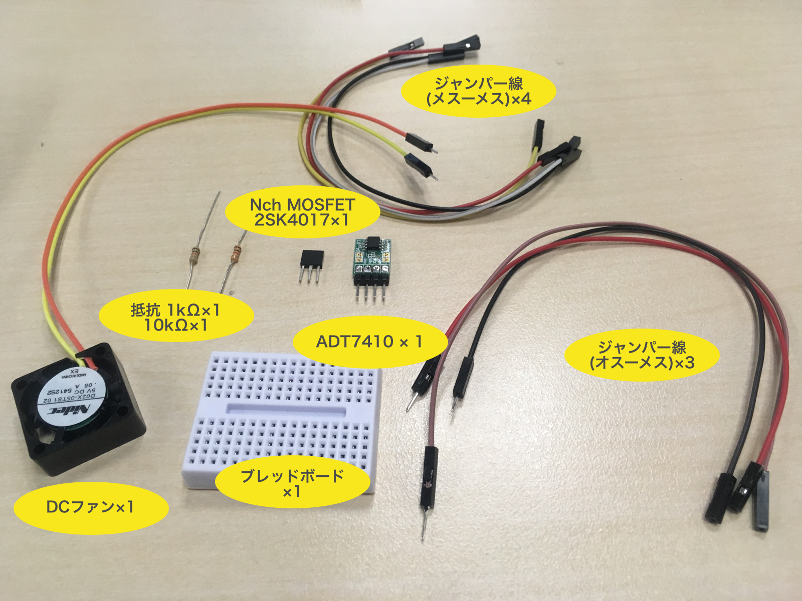
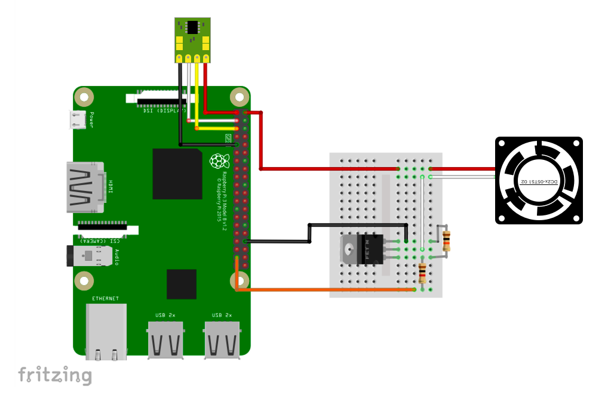

# 概要

CHIRIMEN for Raspberry Pi 3 を使ったプログラミングを通じて、[Web GPIO API](https://rawgit.com/browserobo/WebGPIO/master/index.html) や [Web I2C API](https://rawgit.com/browserobo/WebI2C/master/index.html) の使い方を学ぶチュートリアルです。

今回は、Web GPIO API と Web I2C APIを組み合わせたWebアプリを作ってみます。

# (※1) CHIRIMEN for Raspberry Pi 3とは

Raspberry Pi 3（以下「Raspi3」）上に構築したIoTプログラミング環境です。

[Web GPIO API (Draft)](https://rawgit.com/browserobo/WebGPIO/master/index.html)や、[Web I2C API (Draft)](https://rawgit.com/browserobo/WebI2C/master/index.html)といったAPIを活用したプログラミングにより、WebアプリからRaspi3に接続した電子パーツを直接制御することができます。 

CHIRIMEN Open Hardware コミュニティにより開発が進められています。

## 前回までのおさらい

本チュートリアルを進める前に前回までのチュートリアルを進めておいてください。

* [CHIRIMEN for Raspberry Pi 3 Hello World](section0.md)
* [CHIRIMEN for Raspberry Pi 3 チュートリアル 1. GPIO編](section1.md)
* [CHIRIMEN for Raspberry Pi 3 チュートリアル 2. I2C　基本編（ADT7410温度センサー）](section2.md)
* [CHIRIMEN for Raspberry Pi 3 チュートリアル 3. I2C　応用編（その他のセンサー）](section3.md)

前回までのチュートリアルで学んだことは下記のとおりです。

* CHIRIMEN for Raspberry Pi 3 では、各種exampleが `~/Desktop/gc/`配下においてある。配線図も一緒に置いてある
* CHIRIMEN for Raspberry Pi 3 で利用可能なGPIO Port番号と位置は壁紙を見よう
* CHIRIMEN for Raspberry Pi 3 ではWebアプリからのGPIOの制御には[Web GPIO API](https://rawgit.com/browserobo/WebGPIO/master/index.html) を利用する。GPIOポートは「出力モード」に設定することでLEDのON/OFFなどが行える。また「入力モード」にすることで、GPIOポートの状態を読み取ることができる
* [async function](https://developer.mozilla.org/ja/docs/Web/JavaScript/Reference/Statements/async_function) を利用すると複数ポートの非同期コードがすっきり書ける
* CHIRIMEN for Raspberry Pi 3 ではWebアプリからI2C通信に対応したモジュールの制御に[Web I2C API](https://rawgit.com/browserobo/WebI2C/master/index.html) を利用することができる
* I2Cモジュールは1つのI2Cバス上に複数接続することができる。Grove I2C Hubを利用すると接続が簡単になる

# 今回つくるもの

シンプルに下記のような基本仕様にしてみます。

* 定期的に測定した温度を画面に表示する。
* 一定温度以上になったらDCファンを回す。一定温度以下になったらDCファンを止める。

[1. GPIO編](section1.md) でMOSFET＋DCファンと[2. I2C　基本編（ADT7410温度センサー）](section2.md) で使った温度センサーがあればできそうですね。

# 1.準備

用意するもの

このチュートリアル全体で必要になるハードウエア・部品は下記の通りです。

* [CHIRIMEN for Raspberry Pi 3 Hello World](https://qiita.com/tadfmac/items/82817476615fdc7394b3) に記載の「基本ハードウエア」
* ブレッドボード x 1
* ジャンパーワイヤー (オス-メス) x 3
* [Nch MOSFET (2SK4017)](http://akizukidenshi.com/catalog/g/gI-07597/) x 1
* リード抵抗 (1KΩ) x 1
* リード抵抗 (10KΩ) x 1
* [DCファン](http://akizukidenshi.com/catalog/g/gP-02480/) x 1
* ADT7410 x 1
* ジャンパーワイヤー (メス-メス) x 4

今回用意するものが多いですが、これまでのチュートリアルで使ったことがあるものばかりですので、ご安心ください。

# 2.まずは仕様通りにつくる

## a. 部品と配線について

Raspberry Pi 3との接続方法については、下記回路図を参照ください。

## b. 接続確認

今回の回路用のコードはまだ書いていませんので、下記方法で配線の確認をおこなっておきましょう。

* Lチカのサンプルを使って、DCファンが回ったり止まったりすることを確認
* `i2cdetect`コマンドを使い、SlaveAddress `0x48` が見つかることを確認

## c.コードを書いてみる

[jsfiddle](https://jsfiddle.net/) を使ってコードを書いていきましょう。

今回は「あえて」記事中にコードを掲載しません！

これまでのチュートリアルで実施してきたことの復習です。頑張ってください！

## HTML

[jsfiddle](https://jsfiddle.net/) の`HTML`ペインには下記内容のコードを記載してください。

1. [Web GPIO API / Web I2C API の polyfill](https://mz4u.net/libs/gc2/polyfill.js) を読み込むコード
1. [ADT7410のドライバーライブラリ](https://mz4u.net/libs/gc2/i2c-ADT7410.js)を読み込むコード ※任意。[以前の記事](srction2.md) を参考に、ドライバーを使わずに書いても良いです。
1. 温度表示用の要素 (DIVタグなど)

## JavaScript

続いて`JavaScript`ペインには下記内容のコードを記載します。

1. Web GPIO API の初期化 (`navigator.requestGPIOAccess()`で`GPIOAccess`インタフェースの取得)
1. `GPIOAccess`で 26番ポートの`port`オブジェクトを取得
1. 26番ポートを「出力モード」に設定

1. Web I2C API の初期化 (`navigator.requestI2CAccess()`で`I2CAccess`インタフェースの取得)

1. `I2CAccess`で、1番のI2Cポートの`I2CPort`オブジェクトを取得

1. `ADT7410`のインスタンスを生成し、`init()`による初期化を行なっておく

ここまでを実施しておきましょう。

> ヒント: Promiseやasync functionを使って「3. 26番ポートを「出力モード」に設定」が終わってから、「4. Web I2C API の初期化」を開始するように書いてみましょう。

1.〜 6. までの処理が全て終わってから、以降の処理が行われるように書いていきます。

* `adt7410.read()`を使い定期的(1秒ごと)に温度を読み込む
* 温度データを HTMLの表示用要素に反映させる。温度が30度以上なら、表示に変化をつける (文字を大きくする、赤くする、等)
* 温度が32度以上になったら GPIO 26番ポートに`1 (HIGH)`を書き込むことでファンを回す。温度が32度未満なら、GPIO 26番ポートに`0 (LOW)` を書き込むことでファンを止める

ここまでできたら動くはずです！

> と書いてる人が実は動かなくて 3時間悩んだのは秘密... 
> 
> 動かない原因→ Ver. 2017.09.27-2 に同梱のPolyfillに不具合があることがわかったので、オンライン側は対応済み。
> 
> 次回環境リリース時に環境同梱版のPolyfillも直ります。

# 3.完成度を上げるために

ここまでのチュートリアルで Web GPIO APIや Web I2C APIの使い方はもうお腹いっぱい！という状況かと思います。おつかれさまでした！

最後に、CHIRIMEN for Raspberry Pi 3を使って「楽しい作品」を仕上げるためのTipsをいくつか書いてこのチュートリアルを締めくくりたいと思います。

## a. 全画面表示
[jsbin](http://jsbin.com/)や[jsfiddle](https://jsfiddle.net/)はコードの学習を進める上では便利なサービスですが、各サービスのメニューやコードが常に表示されてしまい「画面だけを表示する」ということが
できません。

このため、プログラミングを進める時はjsfiddleなどで進め、ある程度コードが固まって来たら index.htmlファイルなどに保存して、ブラウザで直接 index.htmlを表示する方が良いでしょう。

さらに、サイネージのような作品の場合、ブラウザのメニューやタスクバーすらも表示せずに全画面表示にしたいケースもあるでしょう。

Raspberry Pi 3 の Chromium Browserで全画面表示を行うには、コマンドラインから下記のように入力します。

`chromium --kiosk`

全画面表示を終了するには、`ctrl + F4` を押します。

## b. Web GPIO API / Web I2C API 以外のIoT向け機能

今回は、CHIRIMEN for Raspberry Pi 3 で拡張を行った Web GPIO API と Web I2C API の利用方法を学習してきましたが、他の方法でもブラウザと外部デバイスがコミュニケーションする方法がありますので、CHIRIMEN for Raspberry Pi 3で利用可能な他の手段を簡単にいくつか紹介しておきます。

* [Web Bluetooth API](https://webbluetoothcg.github.io/web-bluetooth/) : Webアプリから BLEを使った通信を行うためのAPIです。無線で外部機器と通信することができます。入出力が可能です。
* [Web MIDI API](https://www.w3.org/TR/webmidi/) : WebアプリからMIDI機器と通信するためのAPIです。外部機器との入出力が可能です。
* keyイベント/Mouseイベントの応用 : USB-HIDデバイスを作成できるArduino Leonardoなどを利用することで、そういったボードからの入力をキーイベントやマウスイベントとして受け取ることができます。入力にしか使えませんが、USB経由でKeyイベントに対応するブラウザは非常に多いので、様々な環境への応用が必要な場合には選択肢になりうると思います。

また、将来的にはUSB機器が直接ブラウザから制御可能になる Web USB API なども利用可能になる可能性がありますが、残念ながら現在のバージョンの CHIRIMEN for Raspberry Pi 3 環境で利用している Chromium Browserでは利用できません。

## c. githubの活用

現状の CHIRIMEN for Raspberry Pi 3 には標準では Webサーバが含まれていません。
最近のセキュアドメイン からの実行でないと許可されない Web APIも増えています。

index.htmlなどのファイルができたら、[GitHub pages](https://pages.github.com/)などを使って公開すると良いでしょう。

GitHub Pagesの使い方は、下記記事が参考になります。

* [GitHubを使ってWebサイトを公開する](https://qiita.com/wifeofvillon/items/bed79dc85f956c8169a0)
* [無料で使える！GitHub Pagesを使ってWebページを公開する方法](https://techacademy.jp/magazine/6445) (TechAcademy Magazine)

## d. Raspberry Pi で使えなかった機能 (WIP)

Raspberry Pi 3 は非常に使いやすいSBC（シングルボードコンピュータ）ですが、一般的なPCと比べるとやはり非力です。

筆者が試してダメだー！ってなったポイントを書いてみたいと思います。(今後も追記予定)

> 他にもいろいろあると思うのでコメントいただけたら嬉しいです！

* WebGLがまともに動作しない → 諦めてCanvasを使おう
* Speech Synthesis APIが動作しない

# さいごに

このチュートリアルでは 下記について学びました。

Web GPIO APIと Web I2C APIを組み合わせたプログラミング

* WebBluetooth編に続きます!

また、CHIRIMEN for Raspberry Piはまだ生まれたばかりです。いろいろと至らない点も多く、今後もオープンソースを前提にどんどん洗練していかなければなりません。課題は山積みです。

どうか、様々なご支援をいただきたく、よろしくお願いいたします。
