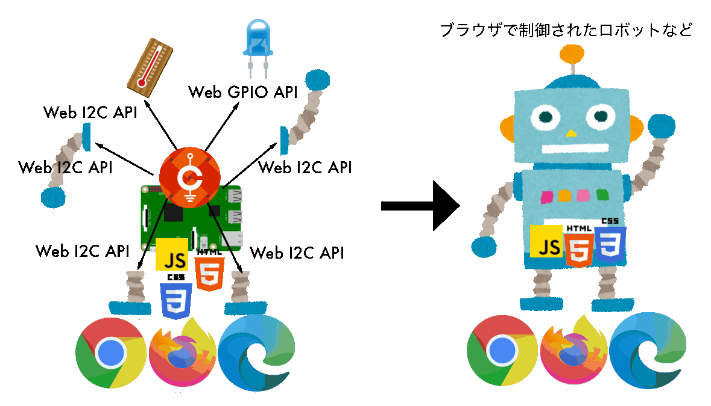
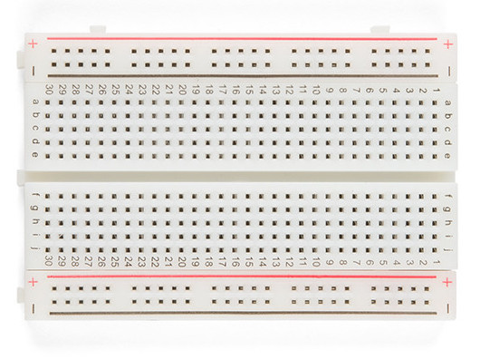
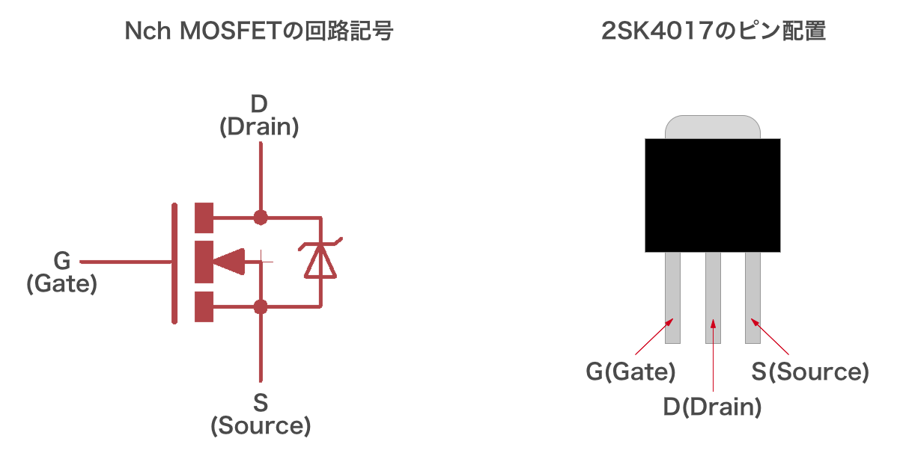
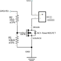
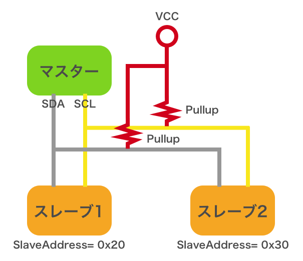
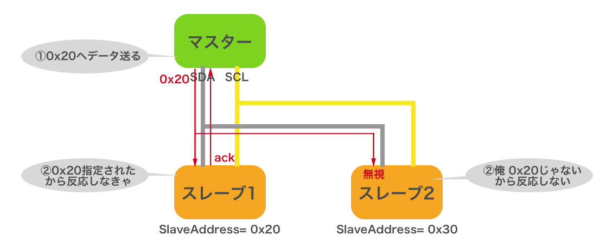
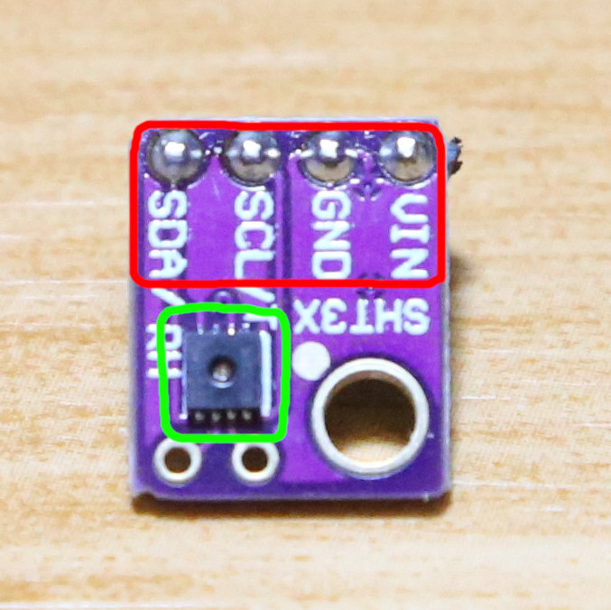

# CHIRIMEN

CHIRIMEN とは、Webの標準的な技術・ブラウザやNode.js等で実行できるJavaScript で電子パーツを制御し、[フィジカルコンピューティング](https://www.iizuka.kyutech.ac.jp/faculty/physicalcomputing)や[IoTシステム](#iot)を開発可能なプロトタイピング環境です。

デジタルのソフトとフィジカルなハードをWWW上で連携するデバイスを Web標準技術、JavaScript だけで容易に実現できます。

## CHIRIMENについて
* [こちらを参照ください](../about.md)

## CHIRIMENのメリット
* 広く使われている標準技術を学習できるので
  * 学習のハードルが低い
  * 得たスキルが広く長く役立つ
  * インターネットでノウハウを検索しやすい
* Web技術を活用するので
  * WWWのサービスと簡単に連携できる
  * ユーザーインターフェースやコンテンツを簡単に作れる
  * Webブラウザを使って開発できる
 
# ハードウェア・デバイス

- [予備知識・資料集～電子工作について](../reference#section-1)


## そもそも「L チカ」って何？

「L チカ」とは、LED を点けたり消したりチカチカ点滅させることです。今回は「LED を点ける」「LED を消す」をプログラムで繰り返し実行することで実現します。

- 参考：[LED（発光ダイオード）](https://ja.wikipedia.org/wiki/%E7%99%BA%E5%85%89%E3%83%80%E3%82%A4%E3%82%AA%E3%83%BC%E3%83%89)


## LED
- [LED（発光ダイオード）](https://ja.wikipedia.org/wiki/%E7%99%BA%E5%85%89%E3%83%80%E3%82%A4%E3%82%AA%E3%83%BC%E3%83%89)
- [LED の使い方](https://www.marutsu.co.jp/pc/static/large_order/led)

### ヒント: LED の電圧

LED の順方向電圧は色により異なっており、赤色 LED は 1.8V 程度、青色 LED は 3.1V 程度とされています。


## ブレッドボード
- [ブレッドボードの使い方](https://shop.sunhayato.co.jp/blogs/problem-solving/breadboard)

| 外観                            | 内部の接続状態                            |
| ------------------------------- | ----------------------------------------- |
|  |  |

* +と-のライン(上下の横のピン列)が無いブレッドボードもあります（CHIRIMEN Starter Kitのブレッドボードにはありません）

* 配線に使うケーブルの色に厳密な決まりはありませんが、一般的にGNDは黒(や黒っぽい色)、電源(VCC, +3.3V, +5V)には赤(や赤っぽい色)が用いられます。配線間違いを防ぐためにもなるべく合わせましょう。
* 抵抗やLEDの足(リード線)は手で簡単に曲げられます。ブレッドボードに差し込めるように適当に成型してください。

## 抵抗値の読み方
- [抵抗値の読み方](http://www.jarl.org/Japanese/7_Technical/lib1/teikou.htm)
- [テスターを使って抵抗値を確かめる](http://startelc.com/elcLink/tester/elc_nArtcTester2.html#chapter-2)

## MOSFETによる大電力制御
### GPIO の制約事項

Raspberry Pi の GPIO ポートは、全体で流せる電流の上限が決められています。

- [合計 50mA](https://elinux.org/RPi_Low-level_peripherals#Power_pins)
- 3.3 V

小さな LED 数個の場合はこの条件内で使えますが、モーターやソレノイド、パワー LED など電流を多く消費するデバイスは直接接続して使うことができません。

## MOSFET とは

[MOSFET](https://ja.wikipedia.org/wiki/MOSFET) とは[電界効果トランジスタ (FET)](https://ja.wikipedia.org/wiki/%E9%9B%BB%E7%95%8C%E5%8A%B9%E6%9E%9C%E3%83%88%E3%83%A9%E3%83%B3%E3%82%B8%E3%82%B9%E3%82%BF) の一種で、主にスイッチング素子として利用される (小さな電圧の変更で大きな電流・電圧のオンオフを切り替える) 部品です。

今回は Nch MOSFET「[2SK4017](http://akizukidenshi.com/catalog/g/gI-07597/)」を利用します。



プルダウンの GPIO ポートを使った典型的な回路は以下のようになります。



### 電源

図の GND 端子は Raspberry Pi と DC 負荷用電源のものと共通ですが、VCC 端子は、基本的には Raspberry Pi の 3.3V や 5V 端子とは異なります。
DC 負荷用に Raspberry Pi とは別に電源を用意するのが望ましいです。

ちびギアモータを使った作例では、その消費電力が十分小さいので、例外的に Raspberry Pi の 5V 端子か電力を供給しています。


# JavaScript
標準化されたプログラミング言語の一種で、ウェブブラウザが代表的な実行環境です(プログラムコードを解釈して動作させるシステム)。CHIRIMENでもRasberry Pi及びmicro:bit版はウェブブラウザを実行環境として使用します。Raspberry Pi Zero版はNode.jsを実行環境として使っています。
別名としてECMA Scriptと呼ばれることもあります。
* [Mozilla Developer Networkの解説](https://developer.mozilla.org/ja/docs/Web/JavaScript)

## JavaScript の基礎
JavaScript に慣れていない人は、[「JavaScript 初学者向け資料集」](../js/readme.md)を参考にしてください。

* その他の情報：[予備知識・資料集の情報](../reference#javascript)

## javascriptコード・ライブラリの読み込み

### ウェブアプリ：HTMLで読み込み
Raspberry Pi Zero版以外のCHIRIMENはプログラムの起点はHTMLファイルです。（[ウェブアプリ](https://ja.wikipedia.org/wiki/%E3%82%A6%E3%82%A7%E3%83%96%E3%82%A2%E3%83%97%E3%83%AA%E3%82%B1%E3%83%BC%E3%82%B7%E3%83%A7%E3%83%B3)）ブラウザはまずHTMLファイルを読み込んだうえで、そこに書かれた内容で動きます。したがって作ったコードや必要なライブラリの読み込みは基本的に全てこのHTMLの中で指定します。（なお、javascript Moduleを有効化している場合はjavascriptコードの中でjsライブラリを読み込むことがある）

ポイントは `<script ...></script>` の部分です。
`polyfill.js` という JavaScript ライブラリを読み込んでいます。これは [Web GPIO API](http://browserobo.github.io/WebGPIO) と、[Web I2C API](http://browserobo.github.io/WebI2C) という W3C でドラフト提案中の 2 つの API への [Polyfill (新しい API を未実装のブラウザでも同じコードが書けるようにするためのライブラリ)](https://developer.mozilla.org/ja/docs/Glossary/Polyfill) で、最初に読み込むとそれ以降のコードで GPIO や I2C を操作する JavaScript API が使えるようになります。

次の行にある `main.js` は、JavaScript のプログラム本体です。

### Node.js (CHIRIMEN Raspberry Pi Zero版)
Raspberry Pi Zero版はプログラムの起点が自分が作ったjavascriptコード自体になります。ブラウザの代わりに[Node.js](https://ja.wikipedia.org/wiki/Node.js)というjavascriptコードだけを解釈するソフト（javascript [インタープリタ](https://ja.wikipedia.org/wiki/%E3%82%A4%E3%83%B3%E3%82%BF%E3%83%97%E3%83%AA%E3%82%BF)）にコードを読み込ませて実行します。

CHIRIMEN環境のために必要なライブラリや、[I2Cデバイスのドライバ](#WebI2Cとデバイスドライバ)(後述)は次のECMA Script Moduleという仕組みを使って読み込みます。

### javascript Module (ECMA Script Module)
* ウェブアプリでのModule有効化：HTMLのscript要素でjavascriptを読み込むとき、ttype="module"プロパティを設定する。
  * `<script type="module" src="main.js"></script>`
* import文で外部のライブラリを読み込む。
  *  `import {RelayServer} from "https://chirimen.org/remote-connection/js/beta/RelayServer.js";`
*  importされるライブラリ側には、importできるオブジェクトを指定するexport文を記述する。
  * `export {RelayServer};`
* [例を見てみる](https://codesandbox.io/s/github/chirimen-oh/chirimen.org/tree/master/pizero/esm-examples/remote_gpio_led/pc)
* [Mozilla Developer Networkの解説](https://developer.mozilla.org/ja/docs/Web/JavaScript/Guide/Modules)


## 非同期処理

物理デバイス制御やネットワーク通信などでは、応答待ち中にブラウザが停止しないよう非同期処理を使う必要があります。
本チュートリアルではこれを [async 関数](https://developer.mozilla.org/docs/Web/JavaScript/Reference/Statements/async_function) で記述しています。async 関数による非同期処理に慣れていない人は、[こちらの資料「非同期処理 (async await 版)」](../js/async.md) も参考にしてください。非同期処理についてより詳しくは [JS Primer の非同期処理説明ページ](https://jsprimer.net/basic/async/) をご覧ください。

非同期処理を使いこなすのは難しいですが、本チュートリアルでは次のルールでコードを書けば大丈夫です:

- **非同期関数の呼び出し時には前に `await` を付けて呼び出す**
  - 非同期関数呼び出し前に `await` を付けると、その処理の完了を待ってから次のコードが実行されます
  - GPIO/I2C の初期化、ポートの設定などは非同期処理なので `await` キーワードを付けて呼び出します
- **非同期処理を含む関数は前に `async` を付けて非同期関数として定義する**
  - `async function 関数名() { ... }` のように頭に `async` を付けるだけで非同期関数になります

非同期関数を `await` なしで呼び出すと返り値が Promise オブジェクトとなり、Promise を理解しないと返り値の判断や実行順序が入れ替わり意図せぬ挙動になります。例えば、ポートの初期化を `await` なしで呼ぶと、ポート初期化前に初期化未完了のハードウェアを操作しようとして失敗したりします。

ハードウェアを制御するときは基本的に非同期呼び出しをする (その処理を含む関数もまた非同期で呼びす) と決めておけば迷うことなく、コードの実行順序も上から下に見たとおりの順番で実行され読み書きしやすくなります。

## 開発環境
### GitHub
* [予備知識・資料集を参照ください](../reference#github-)
### CodeSandbox
* [予備知識・資料集を参照ください](../reference#github-)
* 

# GPIO

## GPIOとは

[GPIO](https://ja.wikipedia.org/wiki/GPIO)は、「General-purpose input/output」の略で汎用的な入出力インタフェースのことです。

Raspi に実装されている 40 本のピンヘッダから GPIO を利用することができます。

CHIRIMEN Raspi、Raspi Zero では Raspi が提供する 40 本のピンヘッダのうち、下記緑色のピン(合計 17 本)が利用可能です。CHIRIMEN micro:bitでは[こちらのページ](https://chirimen.org/chirimen-micro-bit/guidebooks/diff_rpi3.html#%E4%BD%BF%E7%94%A8%E3%81%A7%E3%81%8D%E3%82%8Bgpio%E3%83%9D%E3%83%BC%E3%83%88)に記載されている端子が利用可能です。

Raspiやmicro:bit の GPIO 端子は、GND 端子との間に、0V もしくは 3.3V の電圧を印加(出力)したり、逆に 0V もしくは 3.3V の電圧を検知(入力)したりすることができます。LED は数 mA の電流を流すことによって点灯できる電子部品のため、印加する電圧を 3.3V(点灯)、0V(消灯) と変化させることで L チカが実現できるのです。

詳しくは[こちらのサイトの解説](https://tool-lab.com/make/raspberrypi-startup-22/)などを参考にしてみましょう。

### Raspberry Piのピン配置図

<!--


-->
### Raspverry Pi Zeroのピン配置図
Raspberry Piの端子と同じ配列です。

### micro:bitのピン配置図


### プルアップ(PU)、プルダウン(PD)
GPIOポートを入力モードで使用する場合、ポートが解放状態(電気的に切り離されている状態)のときに設定される値があります。
プルアップは1、プルダウンは0になります。　Raspberry Piのピン配置図に書かれているPU,PDがその設定値です。micro:bitではすべてプルダウンに設定されていますが、GPIOポート初期化時にプルアップに設定することもできます。

* [より詳しく知る(voltechno)](https://voltechno.com/blog/pullup-pulldown/)

## GPIOポートの初期化
今回の JavaScript ファイルで、最初に呼び出されるコードは `await navigator.requestGPIOAccess()` です。
ここで先ほど出て来た [Web GPIO API](http://browserobo.github.io/WebGPIO) を使い、`gpioAccess` という GPIO にアクセスするためのインタフェースを取得しています。

<script src="https://emgithub.com/embed.js?target=https%3A%2F%2Fgithub.com%2Fchirimen-oh%2Fchirimen%2Fblob%2F5c520c21820304901553f2adf22da1012f54722d%2Fgc%2Fgpio%2FLEDblink%2Fmain.js%23L4-L4&style=github&showBorder=on&showFileMeta=on"></script>

**関数の呼び出しに `await` 接頭詞を付けることに注意してください。** この関数は非同期関数で、その処理の完了を待ってから次の処理をする必要があります。また、`await` 接頭詞を使うコードを含むために、それを含む関数 `main()` は async 接頭詞付きの非同期関数として定義する必要があります。

## GPIOPort の出力処理
GPIOの**出力**機能を使います。
**`const port = gpioAccess.ports.get(26)` で GPIO の 26 番ポートにアクセスするためのオブジェクト** を取得しています。

<script src="https://emgithub.com/embed.js?target=https%3A%2F%2Fgithub.com%2Fchirimen-oh%2Fchirimen%2Fblob%2F5c520c21820304901553f2adf22da1012f54722d%2Fgc%2Fgpio%2FLEDblink%2Fmain.js%23L5-L5&style=github&showBorder=on&showFileMeta=on"></script>

続いて、 **`await port.export("out")` で GPIO の 26 番を「出力設定」にしています**。これにより LED への電圧の切り替えが可能になっています。

<script src="https://emgithub.com/embed.js?target=https%3A%2F%2Fgithub.com%2Fchirimen-oh%2Fchirimen%2Fblob%2F5c520c21820304901553f2adf22da1012f54722d%2Fgc%2Fgpio%2FLEDblink%2Fmain.js%23L7-L7&style=github&showBorder=on&showFileMeta=on"></script>

最後に、無限ループのなかで `await sleep(1000)` によって 1000 ms (1 秒) 待機さ 1 秒ごとに `await port.write(1)` と `await port.write(0)` を交互に呼び出し、GPIO 26 番に加える電圧を 3.3V → 0V → 3.3V → 0V → … と繰り返しています。

<script src="https://emgithub.com/embed.js?target=https%3A%2F%2Fgithub.com%2Fchirimen-oh%2Fchirimen%2Fblob%2F5c520c21820304901553f2adf22da1012f54722d%2Fgc%2Fgpio%2FLEDblink%2Fmain.js%23L9-L17&style=github&showBorder=on&showFileMeta=on"></script>

LED は一定以上の電圧を加え、電流を流すと点灯する性質を持っています。
つまり、3.3 V を加えたとき点灯し、0 V を加えたとき消灯、これを繰り返すことになります。

### サンプルコードを編集してみよう
- 点滅周期を早く・遅く (```sleep()```の引数を変更)
- 点灯する時間と消灯する時間を変える (同上)
- GPIO ポートを他のポートに変える・配線を変える (```gpioAccess.ports.get```の引数を変更)


## GPIOPortの入力処理
GPIOポートに繋いだスイッチやセンサーの状態を取得するには、GPIOの**入力**機能を使います。出力とは違って入力は二つの方法があります。onchangeとポーリングの二つの方法があります。


### onchange編
GPIOポートの値が変化するたびに、指定した関数が実行されます。

<script src="https://emgithub.com/embed.js?target=https%3A%2F%2Fgithub.com%2Fchirimen-oh%2Ftutorials%2Ftree%2F163ce18afdddd4d55c251b6b8b8d4181d3aa1695%2Fraspi%2Fexamples%2Fsection1%2Fs1_5%2Fmain.js&style=github&showBorder=on&showFileMeta=on"></script>

 `port.onchange` は **入力モードの GPIO ポートの「状態変化時に呼び出される関数を設定する」** 機能です。このような関数のことをコールバック関数と呼びます。下記の`port.read()` を使ったコードと異なりポーリング処理が不要でコードも簡潔ですが、値が変化したタイミング以外では読み取りができませんのでユースケースが少し限られます。

### 単純入力＋ポーリング
こちらはGPIOポートの入力値を一回きり単発で取得する単純入力機能と、ポーリングの組み合わせです。

#### ポーリングとは
様々な情報や値の取得や入力のための基本的な機能・関数は、入力を指定した瞬間、一回きり取得するだけのものがほとんどです。そこで、無限ループをつくりこの中で一回きりの入力を定期的に繰り返すことで、入力の変化を読み取る　ということがよく行われます。このような処理を一般にポーリングと呼びます。 ([wikipedia:ポーリング](https://ja.wikipedia.org/wiki/%E3%83%9D%E3%83%BC%E3%83%AA%E3%83%B3%E3%82%B0_(%E6%83%85%E5%A0%B1)))
ポーリングはセンサーの情報入力だけでなく、たとえば電子メールの到着を通知するために定期的にメールサーバにメール着信数を確認する　といった、ネットワークサービスでの処理など様々なシステムで広く使われています。

#### GPIOの単純入力関数
単純に「GPIO ポートの状態を読み込む」には `port.read()` を使います。

`port.read()` で GPIO を読み込むコードは次のように書けます:

```js
const gpioAccess = await navigator.requestGPIOAccess();
const switchPort = gpioAccess.ports.get(5); // GPIO ポート 5 番を取得
await switchPort.export("in"); // 「入力モード」に
const state = await switchPort.read(); // GPIO ポート 5 番に接続したスイッチの状態を読み込む
```

##### await port.export()

`port.export("in")` により取得した **GPIO ポートを「入力モード」で初期化** しています。このモードは GPIO ポートにかかる電圧を Web アプリ側から読み取りたい時に使います。初期化は非同期処理であり `await` で完了を待つ必要があることに注意してください。

##### await port.read()

`port.export("in")` で入力モードに設定した **GPIO ポートの現時点の状態を読み取ります**。読み取りは非同期処理になるので `await` で完了を待つようにしてください。

##### ポーリングルーチン
上記コードで GPIO ポートの読み取りを 1 度だけ行えますが、今回は「スイッチが押され状態を監視する」必要がありますので、定期的に `await port.read()` を繰り返して GPIO ポートの状態を監視するポーリングのルーチンを組みます。

```js
const gpioAccess = await navigator.requestGPIOAccess();
const switchPort = gpioAccess.ports.get(5);
await switchPort.export("in");
// 無限ループ
while (true) {
  const state = await switchPort.read(); /
  //
  // ここにswitchの状態による処理を書き足す
  //
  await sleep(100); // 100 ms 待機
}

// sleep() は polyfill 内で定義済みなので省略可能:
function sleep(ms) {
  return new Promise(function(resolve) {
    setTimeout(resolve, ms);
  });
}
```


# I2C
## I2Cの概要

[I2C](https://ja.wikipedia.org/wiki/I2C) とは 2 線式の同期式シリアル通信インタフェースです。「アイ・スクエア・シー」や「アイ・ ツー・シー」と読みます。I2C では SDA（シリアルデータ）と SCL（シリアルクロック）の 2 本の線で通信を行います。


<!--

-->
上図のように、I2C の SDA、SCL は複数のデバイス間で共有され、これを「I2C バス」と言います。I2C ではマスターとスレーブの間で通信が行われます。常にマスター側からスレーブ側に要求が行われ、スレーブ側からマスター側へ要求を行うことはできません。

本チュートリアルでいえばCHIRIMEN環境を動かすボードコンピュータがマスターとなり、ここに接続されるセンサーやアクチュエータデバイスなどがスレーブとして想定されます。スレーブデバイスの一例として[こちらに紹介](../partslist)されているI2Cデバイスをご覧ください。

マスターは、スレーブが持つ「SlaveAddress (スレーブアドレス)」を指定して、特定のスレーブとの通信を行います。このため、同じ I2C バス上に同じ SlaveAddress のスレーブを繋ぐことはできません。
I2Cデバイスは小型のICチップデバイスとなっており、デバイスによってはSlaveAddressは製品ごとに固定されています。


<!--

-->

通信するデバイス同士が同一基板上にない場合には、SDA、SCL の 2 本の通信線に加え電源や GND の線を加えて 4 本のケーブルを用いて接続するのが一般的です。電源電圧はデバイスに応じたものを繋ぐ必要があります。

### Raspberry PiのI2C端子
下図のSCL, SDAがI2C端子です（黄色の端子）

<!--

-->
### Raspverry Pi ZeroのI2C端子

　Raspberry PiのI2C端子と同じ配列です。

### micro:bitのI2C端子
下図のSCL, SDAがI2C端子です (P19,P20～オレンジ色I2C1のグループ)


## 参考: I2C に関する詳細情報

I2C に関する詳細は下記をご参照ください。

- [I2C](https://ja.wikipedia.org/wiki/I2C) - Wikipedia
- I2C バス仕様書 最新版（[日本語](https://www.nxp.com/docs/ja/user-guide/UM10204.pdf)、[English](http://www.nxp.com/documents/user_manual/UM10204.pdf)）
- [I2C の使い方](http://www.picfun.com/i2cframe.html)（後閑哲也氏サイト)

## ポイント

I2C の概要として下記を押さえておきましょう。

- I2C バスを介して複数のデバイスが繋がる
- I2C デバイスにはマスターとスレーブがある
- I2C ではマスターからスレーブに対して通信要求が行われる
- I2C スレーブは SlaveAddress を持つ
- 同じ I2C バスに同じ SlaveAddress のデバイスは繋げない

## I2Cデバイスの実例：I2C 温湿度センサー (SHT30, SHT31)

I2C に対応したデバイスの実例を見てみましょう。CHIRIMENでは [Examples](../partslist#i2c-) にセンサーなど、いくつかの I2C デバイスを使うサンプルコードと Raspi との接続方法を示す回路図が提供されており、SHT30/SHT31も紹介されて
います。

### SHT30, SHT31について
- [湿度・温度センサ (SHT31)](http://akizukidenshi.com/catalog/g/gK-12125/) x 1
  - または SHT30 ([Amazon](https://www.amazon.co.jp/s?k=sht30), [AliExpress](https://ja.aliexpress.com/item/32962846003.html))。
  - note: SHT31 は氷点下や 65 度以上などの高温での計測時の精度が SHT30 よりも少し高いが室温程度ではほぼ同様の類似モデルです。同シリーズには他にも SHT35 などもありますがそちらは未検証です。 (参考: [データシート](https://www.sensirion.com/fileadmin/user_upload/customers/sensirion/Dokumente/2_Humidity_Sensors/Datasheets/Sensirion_Humidity_Sensors_SHT3x_Datasheet_digital.pdf))

### I2Cデバイスモジュールの接続について
I2Cデバイスは一般的に小さなチップ部品です。下の拡大写真で緑で囲んだものがSHT31の本体で 上下に出ている微細な端子を接続して使いますが、微細過ぎてプロトタイピングには向きません。そこでブレッドボードで使いやすい端子に変換したモジュールが販売されています。モジュールには**赤で囲んだように端子名の記載**があります。これを**ホストのコンピュータの端子名と一致させて結線**することでI2Cデバイスが正しく接続されます。(電源端子はVIN,V+,3V,VCCなど別名になっていることがあります)




#### 注意: 配線時のポイント

配線の接続先やデバイスの基板の表裏など間違えないように注意してください。
配線を間違えると、故障や怪我などの原因になることがあります。おかしいなと思ったら、すぐに外して、配線をきちんと確認しましょう。

## b. i2cdetectで接続がうまくいったか確認する

`i2cdetect` を使って SlaveAddress を確認し、正しく接続・認識できているか確かめてみましょう。ターミナルを起動して下記コマンドを入力してみてください。

* [ic2 detectとは](https://tutorial.chirimen.org/ty51822r3/i2cdetect)

### コマンドラインから
```sh
i2cdetect -y -r 1
```
(microbit版はコマンドラインがないので下記webAppを使いましょう)

### i2cdetect webApp
#### Raspberry Pi
SlaveAddress を確認する i2cdetect には WebI2C(後述) を使って実装したwebApp版もあります。[https://r.chirimen.org/i2cdetect](https://r.chirimen.org/i2cdetect) をご利用ください。ただし、WebI2C 版 i2cdetect を利用中は他のページから I2C デバイスを操作できません。確認が済んだらタブを閉じるようにしましょう。

#### Raspberry PiZeroW
Raspberry PiZeroWでは、[ターミナルウィンド](https://chirimen.org/PiZeroWebSerialConsole/PiZeroWebSerialConsole.html)⇒CHIRIMEN Panel⇒i2c detect　でコマンドラインのショートカットが使えます。

#### micro:bit
microbitではWebI2C(後述) を使って実装した専用のwebAppが使えます。

[i2cdetect microbit webApp](https://chirimen.org/chirimen-micro-bit/examples/i2cdetect/index.html)

### i2c detectの結果

正しく接続できていれば下記のように表示されるはずです。

```
$ i2cdetect -y -r 1
     0  1  2  3  4  5  6  7  8  9  a  b  c  d  e  f
00:          -- -- -- -- -- -- -- -- -- -- -- -- --
10: -- -- -- -- -- -- -- -- -- -- -- -- -- -- -- --
20: -- -- -- -- -- -- -- -- -- -- -- -- -- -- -- --
30: -- -- -- -- -- -- -- -- -- -- -- -- -- -- -- --
40: -- -- -- -- 44 -- -- -- -- -- -- -- -- -- -- --
50: -- -- -- -- -- -- -- -- -- -- -- -- -- -- -- --
60: -- -- -- -- -- -- -- -- -- -- -- -- -- -- -- --
70: -- -- -- -- -- -- -- --
```

`44`という表示が見えます。これは 16 進数表示であり、 `0x44` は SHT30 の SlaveAddress です。

念のためSHT30のデータシートも確認してみましょう。

> | SHT3x-DIS     | I2C Address in Hex. representation | Condition                            |
> | ------------- | ---------------------------------- | ------------------------------------ |
> | I2C address A | 0x44 (default)                     | ADDR (pin 2) connected to logic low  |
> | I2C address B | 0x45                               | ADDR (pin 2) connected to logic high |
>
> **Table 8 I2C device addresses.**
>
> [SHT30 のデータシート p.9](https://www.sensirion.com/fileadmin/user_upload/customers/sensirion/Dokumente/2_Humidity_Sensors/Datasheets/Sensirion_Humidity_Sensors_SHT3x_Datasheet_digital.pdf)より引用

SHT30 は`0x44`がデフォルトの SlaveAddress で、ADDR ピンの HIGH/LOW により SlaveAddeess を `0x44` か `0x45` に変更できることがわかります。

### 認識されないとき

試しに I2C デバイスへの電源供給を止めて、認識されないケースをあえて確かめてみます。
一度 RasPi の 3.3V に接続している線を抜いて、もう一度 `i2cdetect -y -r 1` を実行してみてください。

```
$ i2cdetect -y -r 1
     0  1  2  3  4  5  6  7  8  9  a  b  c  d  e  f
00:          -- -- -- -- -- -- -- -- -- -- -- -- --
10: -- -- -- -- -- -- -- -- -- -- -- -- -- -- -- --
20: -- -- -- -- -- -- -- -- -- -- -- -- -- -- -- --
30: -- -- -- -- -- -- -- -- -- -- -- -- -- -- -- --
40: -- -- -- -- -- -- -- -- -- -- -- -- -- -- -- --
50: -- -- -- -- -- -- -- -- -- -- -- -- -- -- -- --
60: -- -- -- -- -- -- -- -- -- -- -- -- -- -- -- --
70: -- -- -- -- -- -- -- --
```

`44` という表示が見つからなくなりました。このことによって間違いなく SHT30 の SlaveAddress が `0x44` となっていることを確認できました。
確認できたら、先ほど外した 3.3V の線を戻して再び SHT30 に電源を供給して認識されるようにしておきましょう。


## WebI2Cとデバイスドライバ

CHIRIMENでは、GPIOインターフェースをWeb GPIOと呼ぶAPIで使用しました。I2Cインターフェースに接続されたスレーブデバイスは[Web I2C API](http://browserobo.github.io/WebI2C)と呼ぶAPIによって使用することができます。

しかしI2CスレーブデバイスはGPIOの先に繋げるデバイスと比べてずっと複雑な機能を持っています。実際にはそれは極小のコンピュータで、I2Cを通しデバイス専用のコマンドやデータを送受信（通信）し、固有の機能を利用します。
このようなコードは、各デバイスのデータシートをよく読み込んだうえで書くことができます。これはかなり手間のかかる開発ですので簡単にデバイスが使用できるライブラリ(デバイスドライバ)があらかじめ用意されています。

### デバイスドライバが用意されているI2Cデバイスのリスト

[デバイスドライバが用意され簡単に利用できるI2Cデバイスのリスト](../partslist#i2c-)

よく利用される、30種類ぐらいの比較的安価なデバイス向けのドライバが用意されています。

### I2C 温湿度センサー (SHT30, SHT31)の使用例

 Raspberry Pi, micro:bitでは、index.htmlの中で、Raspberry Pi Zero Wではmain.jsの中で以下のライブラリを読み込んでいます。
  
* WebI2C APIを使用できるようにするためのライブラリ( Raspberry Pi: `polyfill.js`, micro:bit: `microbitble.js`, Raspberry Pi Zero W: xxx)でうｓ。

* ( Raspberry Pi, micro:bit:`https://cdn.jsdelivr.net/npm/@chirimen/sht30`、 Raspberry Pi Zero W: `@chirimen/sht30`)　このファイルは、Web I2C API を使って SHT30 との通信を行うための、SHT30用のデバイスドライバー (ハードウェアを操作する為のライブラリ) です。

`main.js` がドライバーライブラリを使ってこのアプリケーションの動作を記述している部分です。

#### d-2. main.js

次に、`main.js` の処理の流れを見てみましょう。

<script src="https://emgithub.com/embed.js?target=https%3A%2F%2Fgithub.com%2Fchirimen-oh%2Fchirimen%2Fblob%2F8d14c8a35319c1df287126eef1aa41c1f3b8c856%2Fgc%2Fi2c%2Fi2c-SHT30%2Fmain.js&style=github&showBorder=on&showFileMeta=on"></script>

ここで温度センサーの情報を定期的に取得し、画面に出力する処理が行われています。
少し詳し解説してみます。

##### await navigator.requestI2CAccess()

Web I2C API を利用するための **`I2CAccess` インタフェースを取得** するための最初の API 呼び出しです。この関数も非同期処理ですので `await` で処理完了を待機し、その結果正しくインタフェースが取得されたら `i2cAccess` オブジェクトに保持します。

##### i2cAccess.ports.get()

`I2CAccess.ports` は、利用可能な I2C ポートの一覧です。

<script src="https://emgithub.com/embed.js?target=https%3A%2F%2Fgithub.com%2Fchirimen-oh%2Fchirimen%2Fblob%2F8d14c8a35319c1df287126eef1aa41c1f3b8c856%2Fgc%2Fi2c%2Fi2c-SHT30%2Fmain.js%23L7-L7&style=github&showBorder=on&showFileMeta=on"></script>

CHIRIMEN RasPi、RasPiZero、micro:bit で利用可能な I2C ポート番号は`1`番だけです。ポート番号に`1` を指定して **`port` オブジェクトを取得** しています。

##### new SHT30(port, 0x44)

ドライバーライブラリを使い **SHT30 を操作する為のインスタンスを生成** しています。

<script src="https://emgithub.com/embed.js?target=https%3A%2F%2Fgithub.com%2Fchirimen-oh%2Fchirimen%2Fblob%2F8d14c8a35319c1df287126eef1aa41c1f3b8c856%2Fgc%2Fi2c%2Fi2c-SHT30%2Fmain.js%23L8-L8&style=github&showBorder=on&showFileMeta=on"></script>

##### await sht30.init()

ドライバーライブラリのインスタンス (`sht30`) の `init()` メソッドを通じて **I2C ポートを開いてセンサーを初期化** しています。

<script src="https://emgithub.com/embed.js?target=https%3A%2F%2Fgithub.com%2Fchirimen-oh%2Fchirimen%2Fblob%2F8d14c8a35319c1df287126eef1aa41c1f3b8c856%2Fgc%2Fi2c%2Fi2c-SHT30%2Fmain.js%23L9-L9&style=github&showBorder=on&showFileMeta=on"></script>

具体的に内部では、インスタンス生成時に指定した `port` オブジェクトと `slaveAddress(0x44)` を用いて `I2CPort.open()` を行なっています。`I2CPort.open()` が成功すると、`I2CSlaveDevice` という I2C ポートへデータ書き込みや読み込みなどを行うインタフェースが返されます。`I2CSlaveDevice` インタフェースは、ライブラリ内に保存され、その後の処理でこのインターフェイスを使って I2C デバイス SHT30 との通信が可能になります。

##### await sht30.readData()

これで実際にデータを読み取っています。 この読み取り関数はGPIOで紹介した、一回きりの単純入力に相当するものです。そのため連続的な変化を知りたい場合はポーリングルーチンを組む必要がありますね。

**SHT30 の仕様に基づくデータ読み出し処理です**。

<script src="https://emgithub.com/embed.js?target=https%3A%2F%2Fgithub.com%2Fchirimen-oh%2Fchirimen%2Fblob%2F8d14c8a35319c1df287126eef1aa41c1f3b8c856%2Fgc%2Fi2c%2Fi2c-SHT30%2Fmain.js%23L12-L12&style=github&showBorder=on&showFileMeta=on"></script>

ドライバーライブラリ内部では、SHT30 から得られる温度と湿度それぞれ 16bit の数値を、温度・湿度の物理量の数値に変換して返却しています。

#### Web I2C API に着目して流れをまとめると

1. **I2C の準備:** `await navigator.requestI2CAccess()` で I2CAccess インタフェースを取得
2. **ポートの準備:** `await i2cAccess.ports.get(1)` で、1 番ポートの `port` オブジェクトを取得
3. **デバイス初期化:** `await port.open(0x44)` で、SlaveAddress `0x44` 番の I2CSlaveDevice インタフェースを取得
4. **データ読み込み・書き込み:** 

この流れは他の I2C デバイスでも基本的に同様になります。


### デバイスドライバーなしにSHT30を使う

デバイスドライバーはI2Cデバイスを簡単に使えるようにするライブラリでしかありませんので、ライブラリなしにWebI2CAPIを用いて直接デバイスを使うこともできます。運悪くデバイスドライバーが用意されていないI2Cデバイスを使いたい場合や、デバイスドライバーで省略されている機能を使いたい場合などのために、[Web I2C API](http://browserobo.github.io/WebI2C)の振る舞いを理解しておきましょう。


まず、デバイスドライバーなしに使うにはそのデバイスのデータシートをよく読み込みながら開発する必要があります。

**[SHT30データシート](https://www.sensirion.com/fileadmin/user_upload/customers/sensirion/Dokumente/2_Humidity_Sensors/Datasheets/Sensirion_Humidity_Sensors_SHT3x_Datasheet_digital.pdf)**

[ドライバーライブラリを GitHub で見てみる](https://github.com/chirimen-oh/chirimen-drivers/tree/master/packages/sht30/sht30.js)

それではSHT30ドライバのコードを見てみましょう。

* 初期化 `init()`
```js
if (!slaveAddress){
		slaveAddress = 0x44;
}
```
データシート（９ページ)に記載の通り、ドライバでは　指定がない場合スレーブアドレス0x44を指定して通信を開始しています。

* データの読み取り `readData()`
```js
// 単発高精度計測指示コマンドをi2cインターフェースに送信（
// データシート９～１０ページ、及び２ページ（計測精度スペック））
await this.i2cSlave.write8(0x2C, 0x06); 
// 計測完了の待機時間(100ms)
//（データシート７ページ～15ms以上の待機）
await sleep(100);
// i2cインターフェースから、６バイトの計測データを読み取り
//（データシート１０ページ）
var mdata = await this.i2cSlave.readBytes(6);
// 計算式（データシート１４ページ）に従い温度（摂氏）を算出
var cTemp = ((((mdata[0] * 256.0) + mdata[1]) * 175) / 65535.0) - 45;
// 同様に湿度（％）を算出
var humidity = 100 * (mdata[3] * 256 + mdata[4]) / 65535.0;
```
ドライバーライブラリ内部では、上記のようにSHT30 に単発の高精度計測を指示し、得られた温度と湿度それぞれ 16bit の数値を、温度・湿度の物理量の浮動小数点数に変換して返却しています。

# IoT
これまでのチュートリアルでは、いずれもそのコンピュータに直接接続されたデバイスを使うものでした。このようなシステムは「スタンドアロン」と呼ばれます。
今までは、ウェブブラウザを使っていたのに、実はウェブの重要な機能～インターネット上の情報基盤WWWを活用したシステムを作っていなかったのです。（開発環境としてはgithubやcodesandboxなどWWW上の情報サービスを活用していますが）

このようなインターネットを活用するシステムのことをIoT (Internet of Thingの略)と呼びます。ただし単にPCやスマホで使うウェブサービスがIoTと呼ばれることがありません。チュートリアルで学んだようなセンサーやアクチュエータがシステムに組み込まれ、物理的なモノと相互作用するようなものを特にIoTと呼びます。（なお、WWWを用いずネットワーク部のインターネットだけを使ったものでもIoTと呼びます。詳しくは[wiki](https://ja.wikipedia.org/wiki/%E3%83%A2%E3%83%8E%E3%81%AE%E3%82%A4%E3%83%B3%E3%82%BF%E3%83%BC%E3%83%8D%E3%83%83%E3%83%88)や、[こちらの資料](https://smartiot-forum.jp/application/files/5315/8642/5503/iot-jinzai-text_verR0202.pdf)なども参考にしてください）

## webSocketとpub/sub services
### システム構成


今回のチュートリアルでつくるIoTシステムの構成図です。

インターネットを介して、左側のアクチュエータやLEDを右側のウェブアプリから操作したり、
左側でセンシングしたデータを右側のウェブアプリで表示させたりするシステムですね。

構成要素を見ていきます。

* 左側のボードコンピュータはCHIRIMENを使ったプログラミングで使用してきた環境やデバイスを使います。
* 右側のPCはどんなブラウザでも動かせるので、スマートフォンを使うこともできます。<br>インターネットにつながっていさえすれば別の場所のPCやスマホでも動きます。これがIoTの便利なところ～遠隔操作ですね。

* InternetのrelayServiceが見慣れないものだと思います。以下で解説します。

### relayService

送り側(左側)のWebAppsが、受け側(右側)のwebAppsに情報を送るなら、直接接続するのが簡単そうです。これはピアツーピア通信と言います。

実はこれは簡単ではありません。webAppsはインターネット上のあらゆるコンピュータ（サーバやブラウザの乗ったPCも含め）にURLでアクセスする必要がありますが、相手のPCにURLでアクセスすることは難しいのです。

一方、(あらかじめ用意されていれば)ウェブサーバにはURLでアクセスできます。そこで登場するのがrelayServerです。下図のようにrelayServer(Web Socket Relay Service)を介してwebAppsが通信します。

 

relayServerは特定のウェブサイトの固有名ではなく、「ウェブアプリ間でリアルタイム性の高いデータのやり取りを仲介する」という機能を持ったウェブサイトの抽象的な名称でpub/sub servicesと呼ばれることもあります。(SNSとかblogとかというのと同じです）

relayServerはトークン(ユーザーやシステムごとに割り当てられたランダムな文字列)ごとにスペース(図の濃い青色)が設けられ、その中にいくつかのチャンネル(図の茶色)を置くことができます。

同じトークンとチャンネルにアクセスしたウェブアプリ同士が通信でき、図ではウェブアプリは２個つながっていますが、何個でもつなげることができます。チャットスペースのようなイメージですね。

#### リアルタイム性
例えば遠隔からカメラのパンチルトをコントロールしたい　などのケースを考えると、IoTではデバイスのコントロールを機敏に行いたいケースが多くあります。（リアルタイム性の高いユースケースが多い）このようなリアルタイム性の高い情報のやり取りのために[WebSocket](https://ja.wikipedia.org/wiki/WebSocket)というブラウザが標準としてサポートするプロトコルがよく使われます。

#### relayServer.js

IoTにはrelayServerの機能を持つウェブサイトが必要になりますが、これを誰かが運営しなければなりません。実習やプロトタイピングのためにこのようなサイトを自分たちで立ち上げるのはかなり大変ですが、インターネット上では既にいくつもの事業者がrelayServerサービスを提供しています。

今回はCHIRIMEN環境の試験用に、CHIRIMEN用に用意された検証用サービス(chirimentest)を使うことにしますが、いくつかある事業者間でサービスの内容に差異があります。サイトごとの差異は主に接続できる端末の管理と情報の取り扱いに関する機能になります。

[relayServer.js](https://chirimen.org/remote-connection/)は、relayServerサービスによる差異を吸収し複数の事業者を自由に切り替えられ、webSocketの標準API仕様に沿った作法でwebApps(含Node.jsプログラム)間の通信を簡単に使えるようにするライブラリです。

##### プログラムの流れ
###### 初期化（受信側、送信側共通の処理
[詳しくはこちらを参照](https://chirimen.org/remote-connection/#使用方法)

```javascript
import {RelayServer} from "https://chirimen.org/remote-connection/js/beta/RelayServer.js";
var relay = RelayServer("achex", "chirimenSocket" );
```

  import文でライブラリRelayServer.jsを読み込んだ後、relayServiceのひとつ**achex**に接続しています。
  RelayServerの第二引数`("chirimenSocket")`はそのサービスを使うためのトークンですが、**achex**は任意の文字列で利用できてます。

*Node.jsでは第三,第四引数が必要になります (後述)*

##### チャンネルの作成
* `channel = await relay.subscribe("chirimenMbitSensors");`

  変数`channel`にRelayServerのチャンネルのインスタンスを登録
  引数はチャンネル名で、自分で好きな名前を与えられます。

  受信側と送信側で同じサービス、トークン、チャンネルを指定する必要があります。

##### データの送信
* `channel.send(data);`

  任意のデータ(data)をrelayServerの指定チャンネルに送信します。

  dataは文字列だけでなく、連想配列(構造化されたデータ、オブジェクト)も送信可能です。

##### データの受信
* `channel.onmessage = getMessage;`
チャンネルにメッセージがポストされた時に起動する関数(コールバック関数)を登録しています。

* `function getMessage(msg)`
上で登録した関数の第一引数(`msg`)のメンバ変数msg.dataに送信されたメッセージが構造もそのままで届きます。


#### セキュリティを考えよう

relayServerを使うということは、情報をインターネット上のウェブサイトに送信することになります。すると このウェブサイトがその情報をどのように取り扱うのかを理解しておく必要があります。achexは無料で使え　しかもユーザ登録も不要です。つまりこのサイトに送信した情報は誰でも見ることができてしまうということです。（ただし、トークンとチャンネルを知る必要がある。これがachexのセキュリティレベル）今回は個人情報などのセキュリティを考慮する必要がない、チュートリアルで使うセンシングデータを送るだけですので問題ありませんが、セキュリティを考慮する必要がある多くの用途ではそのセキュリティ基準に適合したサイトを契約して利用する、もしくは自分でそのようなサイトを立てるなどの必要が出てきます。relayServer.jsでも[いくつかの商用サイト](https://chirimen.org/remote-connection/#%E3%82%B5%E3%83%BC%E3%83%93%E3%82%B9%E3%81%94%E3%81%A8%E3%81%AE%E5%88%A9%E7%94%A8%E6%96%B9%E6%B3%95)の比較と使用方法が記載されているので参考にしてください。

#### Node.jsでの利用

初期化手順に差異があります。

```javascript
import nodeWebSocketLib from "websocket";
import {RelayServer} from "./RelayServer.js";
var relay = RelayServer("achex", "chirimenSocket" , nodeWebSocketLib, "https://chirimen.org");
```

* Node.jsではwebSocketを使用するためにはwebsocketライブラリが必要なので読み込みます
* RelayServer.jsやwebSocket等のライブラリは、ローカルからの読み込みになります
* RelayServerの第三引数でwebsocketライブラリを渡す必要があります
* RelayServerの第四引数で、[リファラー](https://e-words.jp/w/%E3%83%AA%E3%83%95%E3%82%A1%E3%83%A9.html)の指定が必要です
  * webアプリの場合はそのコンテンツの配信元のURLがリファラーとして自動設定されますが、Node.jsのアプリはローカルにあるので別途指定が必要
  * achexの場合URLは何でも許可されますが、他のrelayServerサービスでは あらかじめ指定したリファラーが設定されていなければアクセス拒否されるものもあります(これも一つのセキュリティ)

## Webhooks
relayServerが必要なほどリアルタイム性は求めないけれど、むしろ既存のWebサービス・アプリと簡単につなぎたいようなケースでは、httpをそのまま使うことができるでしょう。ただし既存のWebサービス・アプリはウェブブラウザを介して人が操作することが前提でつくられていますので、直接センサーやアクチュエータ（を制御するコンピュータとプログラム～IoTデバイス）をつなげるにはハードルがあります。
IFTTTに代表されるようなWebhooksサービスは、httpを活用することで既存の多くのウェブサービス（twitterやgoogleのサービスなど）とIoTデバイスを簡単に接続できるようにする中継サービスです。

## IoTクラウドサービス
Webhookのような中継サービスを介さずに、直接IoTデバイスを接続できるように設計されたサービスが多くの事業者から提供されています。これらのサービスを使うには、各サービス事業者ごとに提供しているAPI・プロトコル等の仕様に基づいた開発が必要になります。

## W3C WoT, FIWARE
先述のようなIoT事業者間の非互換を解消するとともに、多様なユースケースにも対応するための国際標準化が現在進行中です。
* [WoT](https://www.w3.org/WoT/)
* [FIWARE](https://www.fiware.org/)
