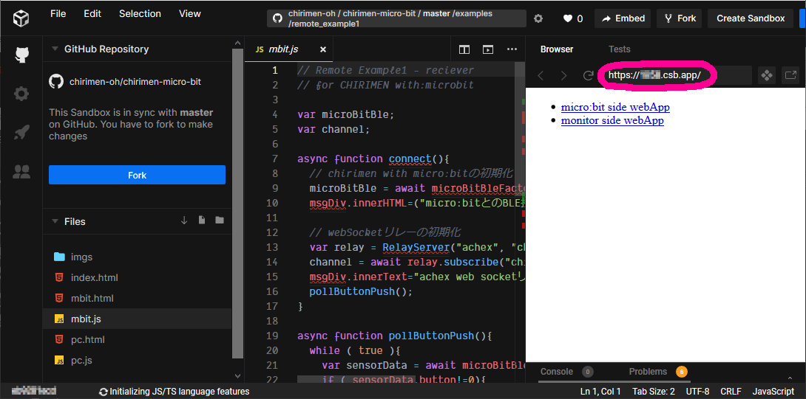

# 概要

CHIRIMEN with micro:bit （以下「CHIRIMEN microbit」）を使ったプログラミングを通じて、IoTシステムを学びます。

# IoT

CHIRIMEN with micro:bit（以下 「CHIRIMEN microbit」） を使ったプログラミングを通じて、IoTシステムを学びます。

前回のチュートリアルまでは、いずれもそのコンピュータにローカルで接続されたデバイスを使うものでした。このようなシステムは「スタンドアロン」と呼ばれます。
CHIRIMEN with micro:bitはウェブブラウザを使うのに、実はウェブの重要な機能～インターネット上の情報基盤WWWを活用したシステムを作っていなかったのです。（開発環境としてはgithubやcodesandboxなどWWW上の情報サービスを活用していますが）

このようなインターネットを活用したシステムのことをIoT (Internet of Thingの略)と呼びます。ただし単にPCやスマホで使うウェブサービスがIoTと呼ばれることがありません。チュートリアルで学んだようなセンサーやアクチュエータがシステムに組み込まれたものを特にIoTと呼びます。（なお、WWWを用いずネットワーク部のインターネットだけを使ったものでもIoTと呼びます。詳しくは[wiki](https://ja.wikipedia.org/wiki/%E3%83%A2%E3%83%8E%E3%81%AE%E3%82%A4%E3%83%B3%E3%82%BF%E3%83%BC%E3%83%8D%E3%83%83%E3%83%88)や、[こちらの資料](https://smartiot-forum.jp/application/files/5315/8642/5503/iot-jinzai-text_verR0202.pdf)なども参考にしてください）

# 温度をリモートからモニタする

それでは早速IoTシステムを構築してみましょう。といってもそんなに用意するものは多くありません。

# 準備

## 用意するもの

* 準備編 に記載の「基本セット」
  * 電池ボックス
  * micro:bit
  * PC

* 遠隔からモニタできることを確かめるスマートフォン

たったこれだけです！

## システム構成

今回のチュートリアルでつくるIoTシステムの構成図です。

インターネットを介して、左側でセンシングしたデータを右側のウェブアプリで表示させるシステムですね。

構成要素を見ていきます。

* 左側のPCやmicro:bitはCHIRIMEN with micro:bitを使たプログラミングで使用してきた環境を使います。
  * micro:bitは、今回内蔵センサーを使うので電池ボックス以外何も結線しません。
* 右側のPCはどんなブラウザでも動かせるので、今回スマートフォンを使うことにします。 (別の場所のPCでも動きます。また　遠隔動作が体験できませんが、左側と同じPCで別のブラウザウィンド上で動かしても動作は確認できます。)

* InternetのrelayServiceが見慣れないものだと思います。以下で解説します。

### relayService

送り側(左側)のWebAppsが、受け側(右側)のwebAppsに情報を送るなら、直接接続するのが簡単そうです。これはピアツーピア通信と言います。

実はこれは簡単ではありません。webAppsはインターネット上のあらゆるコンピュータ（サーバやブラウザの乗ったPCも含め）にURLでアクセスする必要がありますが、相手のPCにURLでアクセスすることは難しいのです。

一方、(あらかじめ用意されていれば)ウェブサーバにはURLでアクセスできます。そこで登場するのがrelayServerです。relayServerは特定のウェブサイトの固有名ではなく、「ウェブアプリ間でリアルタイム性の高いデータのやり取りを仲介する」という機能を持ったウェブサイトの抽象的な名称です。(SNSとかblogとかというのと同じです）

今回は、このようなrelayServerの機能を持つウェブサイトとして[achex](https://achex.ca/)という、無料で利用できるサイトを使うことにします。

relayServerの機能は他にもいろいろなサイトが提供していますが、リアルタイム性の高い情報のやり取りのために[WebSocket](https://ja.wikipedia.org/wiki/WebSocket)というブラウザがサポートする標準機能がよく使われます。サイトごとに差異は主に接続できる端末の管理と情報の取り扱いに関する機能になります。そこでrelayServerサイトによる差異を吸収し自由に切り替えられ、webSocketのAPI仕様に沿った作法でwebApps間の通信を簡単に使えるようにするライブラリ[relayServer.js](https://chirimen.org/remote-connection/)を用意しましたので、それを使ってシステムを組むことにします。

### セキュリティを考えよう

relayServerを使うということは、情報をインターネット上のウェブサイトに送信することになります。すると このウェブサイトがその情報をどのように取り扱うのかを理解しておく必要があります。achexは無料で使えしかもユーザ登録も不要です。つまりこのサイトに送信した情報は誰でも見ることができてしまうということです。今回は個人情報などのセキュリティを考慮する必要がない、チュートリアルで使うセンシングデータを送るだけですので問題ありませんが、セキュリティを考慮する必要がある多くの用途ではそのセキュリティ基準に適合したサイトを契約して利用する、もしくは自分でそういうサイトを立てるなどの必要が出てきます。relayServer.jsでも[いくつかの商用サイト](https://chirimen.org/remote-connection/#%E3%82%B5%E3%83%BC%E3%83%93%E3%82%B9%E3%81%94%E3%81%A8%E3%81%AE%E5%88%A9%E7%94%A8%E6%96%B9%E6%B3%95)の比較と使用方法が記載されているので参考にしてください。

## 動かしてみる

* micro:bitを繋ぐPC側(データ送信側)で[こちらを開きましょう。](https://codesandbox.io/s/github/chirimen-oh/chirimen-micro-bit/tree/master/examples/remote_example1?file=/mbit.js)
* codesandboxのBrowserフレームのURLをちょっと覚えておきます。
 
* スマートフォンでブラウザを開き、覚えたURLを開きます。
  * **monitor side webApp** リンクを開きます。
* PC側は、これまで通り右上のを押して、新しいウィンドを開きます。
  * **micro:bit side webApp** リンクを開きます。
  * これまで通り[connect]ボタンを押して、micro:bitを接続します。
* スマートフォン側を見てみましょう。micro:bitの内蔵センサーの情報が約1秒おきに表示されていると思います。
