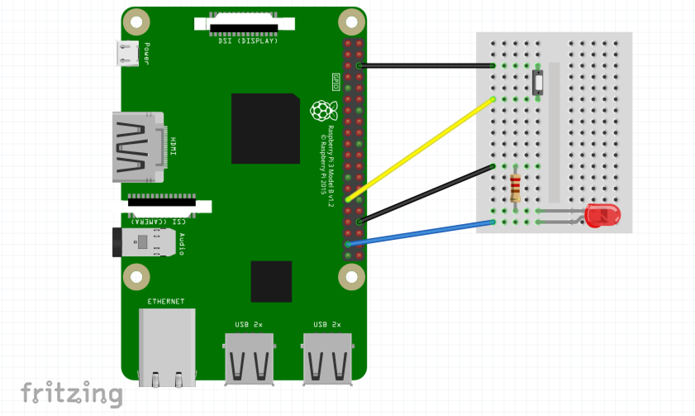

# 1. GPIO の使い方

# 概要

CHIRIMEN for Raspberry Pi (以下 CHIRIMEN Raspi) を使ったプログラミングを通じて、Web GPIO API の使い方を学びます。

CHIRIMEN Raspi の基本的な操作方法は「[L チカしてみよう](section0.md)」で確認済みという前提で進めます。

# 1. 準備

## 用意するもの

このチュートリアル全体で必要になるハードウェア・部品は下記の通りです。

- [L チカしてみよう](section0.md) に記載の「基本ハードウェア」と「L チカに必要となるパーツ」
- 2pin タクトスイッチ (4pin を使う場合は向きに注意) x 1
- ジャンパーワイヤー (オス-メス) x 5
- [Nch MOSFET (2SK4017)](http://akizukidenshi.com/catalog/g/gI-07597/)
- [リード抵抗 (1KΩ)](https://akizukidenshi.com/catalog/g/gR-07980/) x 1
- [リード抵抗 (10KΩ)](https://akizukidenshi.com/catalog/g/gR-07990/) x 1
- [ちびギアモータ](https://tiisai.dip.jp/?p=2676) x 1

## CHIRIMEN for Raspberry Pi の起動と L チカの確認

- [L チカしてみよう](section0.md)「3. CHIRIMEN for Raspberry Pi を起動してみよう」を参照し CHIRIMEN RasPi を起動してください。
- また [L チカしてみよう](section0.md)「4. L チカをやってみよう」を実施して、L チカが正しく動作することを確認してください。

## CHIRIMEN RasPi の基本のおさらい

- [Web GPIO API](http://browserobo.github.io/WebGPIO) を利用することで Web アプリからの GPIO の制御を行えます
- CHIRIMEN RasPi で利用可能な GPIO Port 番号と位置は壁紙を見よう
- LED の配線には向きがあります。足が長い方 (アノード、+側) を GPIO ポートに、反対 (カソード、-側) を GND 側に繋ぐ。どちら側かの間に抵抗を繋ぐ。
- そのほかサンプルコードは [Examples](https://r.chirimen.org/examples) にあるので参考にしましょう

# 2. マウスで LED の点灯・消灯を制御してみる

それでは、実際にプログラミングしてみます。

## a. 部品と配線について

ここでは「[L チカしてみよう](section0.md)」で実施した L チカの配線をそのまま利用します。



LED と抵抗は、GPIO 26 番ポートと GND 端子に接続します。



## b. HTML/CSS を記載する

さて、今回は画面上にマウスでクリックできるボタンと LED の点灯状態インジケーターを作ります。
index.html ファイルの `<body>` 要素の下に `<button>` と `<div>` 要素を作ります。

<script src="https://emgithub.com/embed.js?target=https%3A%2F%2Fgithub.com%2Fchirimen-oh%2Ftutorials%2Ftree%2F163ce18afdddd4d55c251b6b8b8d4181d3aa1695%2Fraspi%2Fexamples%2Fsection1%2Fs1_1%2Findex.html%23L20-L21&style=github&showBorder=on&showFileMeta=on"></script>

ID `ledView` 要素には下記のようなスタイルを付けて黒い丸として表示させましょう。

<script src="https://emgithub.com/embed.js?target=https%3A%2F%2Fgithub.com%2Fchirimen-oh%2Ftutorials%2Ftree%2F163ce18afdddd4d55c251b6b8b8d4181d3aa1695%2Fraspi%2Fexamples%2Fsection1%2Fs1_1%2Findex.html%23L9-L16&style=github&showBorder=on&showFileMeta=on"></script>

最後に、[Web GPIO API](http://browserobo.github.io/WebGPIO) を利用可能にする Polyfill とプログラム本体を読み込ませましょう。
`<script>` タグを記載します。

<script src="https://emgithub.com/embed.js?target=https%3A%2F%2Fgithub.com%2Fchirimen-oh%2Ftutorials%2Ftree%2F163ce18afdddd4d55c251b6b8b8d4181d3aa1695%2Fraspi%2Fexamples%2Fsection1%2Fs1_1%2Findex.html%23L7-L8&style=github&showBorder=on&showFileMeta=on"></script>

ここまでのコードを整理すると、次のようになります。

<script src="https://emgithub.com/embed.js?target=https%3A%2F%2Fgithub.com%2Fchirimen-oh%2Ftutorials%2Ftree%2F163ce18afdddd4d55c251b6b8b8d4181d3aa1695%2Fraspi%2Fexamples%2Fsection1%2Fs1_1%2Findex.html&style=github&showBorder=on&showFileMeta=on"></script>

[](https://codesandbox.io/s/github/chirimen-oh/tutorials/tree/163ce18afdddd4d55c251b6b8b8d4181d3aa1695/raspi/examples/section1/s1_1)

## c. ボタンに反応する画面を作る

実際に GPIO を使う前に、まずは「ボタンを押したら LED の ON/OFF 状態を表示する画面を切り替える」部分を作ってみます。

早速 JavaScript を書いていきましょう。

<script src="https://emgithub.com/embed.js?target=https%3A%2F%2Fgithub.com%2Fchirimen-oh%2Ftutorials%2Ftree%2F163ce18afdddd4d55c251b6b8b8d4181d3aa1695%2Fraspi%2Fexamples%2Fsection1%2Fs1_1%2Fmain.js&style=github&showBorder=on&showFileMeta=on"></script>

[](https://codesandbox.io/s/github/chirimen-oh/tutorials/tree/163ce18afdddd4d55c251b6b8b8d4181d3aa1695/raspi/examples/section1/s1_1?file=/main.js)



## d. ボタンに LED を反応させる

画面ができたので、いよいよ Web GPIO を使った LED 制御コードを書きます。一度 L チカの時に学んだことを思い出せばできるはずですが、まずは書き換えてみましょう。

<script src="https://emgithub.com/embed.js?target=https%3A%2F%2Fgithub.com%2Fchirimen-oh%2Ftutorials%2Ftree%2F163ce18afdddd4d55c251b6b8b8d4181d3aa1695%2Fraspi%2Fexamples%2Fsection1%2Fs1_2%2Fmain.js&style=github&showBorder=on&showFileMeta=on"></script>

[](https://codesandbox.io/s/github/chirimen-oh/tutorials/tree/163ce18afdddd4d55c251b6b8b8d4181d3aa1695/raspi/examples/section1/s1_2?file=/main.js)

これで、画面のボタンクリックに反応して LED の ON/OFF ができたら成功です。

[L チカしてみよう](section0.md) の L チカのパートでも簡単に説明しましたが、ここでもういちど GPIO を使う流れをおさらいします。

### await navigator.requestGPIOAccess()

まずは **Web GPIO を利用する `GPIOAccess` インタフェースを取得** します。`requestGPIOAccess()` は非同期処理でインターフェイス初期化を行う非同期メソッドですので `await` で完了を待ってから次の処理を行います。

### gpioAccess.ports.get()

`GPIOAccess.ports` は利用可能なポートオブジェクトの一覧 ([Map](https://developer.mozilla.org/docs/Web/JavaScript/Reference/Global_Objects/Map)) です。

`gpioAccess.ports.get(26)` のようにすることで利用可能なポートオブジェクトの一覧から、 **GPIO ポート番号 26 を指定して `port` オブジェクトを取得** しています。

### await port.export()

`await ledPort.export("out")` により取得した GPIO ポートを **「出力モード」で初期化** しています。

GPIO ポートにかける電圧を Web アプリで変化させたい時には「出力モード」を指定する必要があります。一方、GPIO ポートはもうひとつ「入力モード」があり、これは GPIO ポートの状態 (電圧の High/Low 状態) を読み取りたい時に利用します。入力モードについてはスイッチを使う例の中で説明します。

### await port.write()

`await ledPort.write()` は、出力モードに指定した **GPIO ポートの電圧を切り替える** API です。
`await ledPort.write(1)` で、指定したポートから HIGH (RasPi では 3.3V) の電圧がかかり、`await ledPort.write(0)` で LOW(0V) になります。

# 3. マウスクリックのかわりにタクトスイッチを使ってみる

それでは、さきほどまで書いたコードをベースに、マウスクリックの替わりにスイッチを利用するよう変更します。今回は一般的に「タクトスイッチ」と呼ばれるものを利用します。

### タクトスイッチについて

本チュートリアルでは次のような仕様の「電気部品屋さん等でタクトスイッチとして売られてるスイッチ」を使います。

- SPST (Single-Pole Single-Throw、1 回路 1 接点)
- プッシュボタンが 1 つで押し込みでスイッチ ON、離すとスイッチ OFF (モーメンタリ動作)

タクトスイッチには 2 端子のものだけでなく、端子が 4 つあるタクトスイッチも多いので注意が必要です。4 ピンのタクトスイッチではどの端子間が常に接続されており、どの端子間がボタンによってオンオフされるか注意してください。

[タクトスイッチの製品ページ](https://www.alps.com/prod/info/J/HTML/Tact/SnapIn/SKHW/SKHWALA010.html) などにも回路図がありますが、端子が出ている向き (次の図では縦方向) は常に接続されており、それと直行する (横) 方向がボタンによって切り替わります。次の図では左の 4pin スイッチと右の 2pin スイッチ (とジャンパーワイヤ) が同じ回路となります。



#### ヒント:「タクトスイッチ」という名称

「タクトスイッチ」は[アルプス電気の商標](http://www.alps.com/j/trademark/)ですが、アルプス電気製ではないスイッチも、同様の形状・配線のものは「タクトスイッチ」として広く売られています。

- [秋月電気の「タクトスイッチ」一覧](http://akizukidenshi.com/catalog/c/ctactsw/)

## a. 準備：画面のボタンをモーメンタリ動作に変えておく

これまでに作成したプログラムは「ブラウザ画面のボタンをクリックしたら LED の HIGH/LOW を切り替える」というものでした。

クリック後は変更後の状態が維持されます。これは「オルタネート」のスイッチと同じ動きです。一方で、今回用意したタクトスイッチは「モーメンタリ」のものです。

### スイッチの動作：オルタネートとモーメンタリ

- オルタネート : 状態をトグル (切り替え) します。一度ボタンを押すと ON になりボタンから手を離しても OFF に変わりません。次にボタンを押すと OFF になります。ボタンから手を離しても ON に変わることはありません。
- モーメンタリ : 押している間だけ ON になります。スイッチから手を離すと OFF に戻ります (タクトスイッチはこちら)。

画面のマウス操作がオルタネートでタクトスイッチがモーメンタリと、2 つの動作が混在すると整合性がとれないので、ブラウザ画面のボタンを「モーメンタリ」に合わせて変更しましょう。

下記のように、現在は `onclick` イベントで切り替えています。クリックイベントは、「マウスのボタンを押して離す」ことで発生します。

<script src="https://emgithub.com/embed.js?target=https%3A%2F%2Fgithub.com%2Fchirimen-oh%2Ftutorials%2Ftree%2F163ce18afdddd4d55c251b6b8b8d4181d3aa1695%2Fraspi%2Fexamples%2Fsection1%2Fs1_2%2Fmain.js%23L8-15&style=github&showBorder=on&showFileMeta=on"></script>

これを、マウスボタンを押した時と離した時にそれぞれオンオフさせるように変えましょう。押している間だけオンになる「モーメンタリ」動作です。

- マウスのボタンを押す → LED を ON
- マウスのボタンを離す → LED を OFF

<script src="https://emgithub.com/embed.js?target=https%3A%2F%2Fgithub.com%2Fchirimen-oh%2Ftutorials%2Ftree%2F163ce18afdddd4d55c251b6b8b8d4181d3aa1695%2Fraspi%2Fexamples%2Fsection1%2Fs1_3%2Fmain.js%23L14-L21&style=github&showBorder=on&showFileMeta=on"></script>

これでマウスもタクトスイッチも同じ挙動で揃いました。

タクトスイッチから操作する時も同じ処理を呼ぶことになるので、ここで LED の ON/OFF と `ledView` のスタイル切り替えをまとめて関数化しておきましょう。すると次のようなコードになります:

<script src="https://emgithub.com/embed.js?target=https%3A%2F%2Fgithub.com%2Fchirimen-oh%2Ftutorials%2Ftree%2F163ce18afdddd4d55c251b6b8b8d4181d3aa1695%2Fraspi%2Fexamples%2Fsection1%2Fs1_3%2Fmain.js&style=github&showBorder=on&showFileMeta=on"></script>

[](https://codesandbox.io/s/github/chirimen-oh/tutorials/tree/163ce18afdddd4d55c251b6b8b8d4181d3aa1695/raspi/examples/section1/s1_3?file=/main.js)

## b. 部品と配線について

今回追加するのは下記部品です。

- 前述のタクトスイッチ × 1
- ジャンパーワイヤー（オスーメス）× 2



下図のように、さきほどの LED の配線にタクトスイッチを追加しましょう。この図の例では 2 ピンのタクトスイッチを使っていますが、4 ピンの場合も黄色と黒のジャンパーワイヤの間にボタンでオンオフが切り替わるよう向きに注意してスイッチを配置してください。

<!--

-->


#### ヒント: 配線図とタクトスイッチの種類が異なる

タクトスイッチが 2pin ではなく 4pin の場合、[4pin のタクトスイッチを利用した配線図](imgs/section1/s.png)をご覧ください。

### 今回のスイッチは「プルアップ」回路で接続

上記回路ではスイッチが下記のように接続されています。

- Port 5 にスイッチを接続
- GND にスイッチの反対側を接続

これでどのようになるかというと、下記のようになります。

- スイッチを押す前は、Port 5 は HIGH (3.3V)
- スイッチを押している間、Port 5 は LOW (0V)

どうしてこうなるのでしょうか。実は、RasPi の GPIO ポートのいくつかは、初期状態で「プルアップ」されています。プルアップとは、回路を初期状態で「HIGH にしておく」ことですが、CHIRIMEN RasPi で利用可能な GPIO ポートのうち、下記ポート番号がプルアップ状態となっています。



今回の回路では、このうち、Port 5 を利用しています。
さきほどの動作となるメカニズムは下記の通りです。



この動作を頭に入れておきましょう。

## c. スイッチに反応するようにする (port.read()を使ってみる)

いよいよ、スイッチに対応させます。まずは、単純に「GPIO ポートの状態を読み込む」 `port.read()` を使います。

`port.read()` で GPIO を読み込むコードは次のように書けます:

```js
const gpioAccess = await navigator.requestGPIOAccess();
const switchPort = gpioAccess.ports.get(5); // GPIO ポート 5 番を取得
await switchPort.export("in"); // 「入力モード」に
const state = await switchPort.read(); // GPIO ポート 5 番に接続したスイッチの状態を読み込む
```

### await port.export()

`port.export("in")` により取得した **GPIO ポートを「入力モード」で初期化** しています。このモードは GPIO ポートにかかる電圧を Web アプリ側から読み取りたい時に使います。初期化は非同期処理であり `await` で完了を待つ必要があることに注意してください。

### await port.read()

`port.export("in")` で入力モードに設定した **GPIO ポートの現時点の状態を読み取ります**。読み取りは非同期処理になるので `await` で完了を待つようにしてください。

上記コードで GPIO ポートの読み取りを 1 度だけ行えますが、今回は「スイッチが押され状態を監視する」必要がありますので、定期的に `await port.read()` を繰り返して GPIO ポートの状態を監視する必要があります。

```js
const gpioAccess = await navigator.requestGPIOAccess();
const switchPort = gpioAccess.ports.get(5);
await switchPort.export("in");
// 無限ループ
while (true) {
  const state = await switchPort.read(); /
  //
  // ここにswitchの状態による処理を書き足す
  //
  await sleep(100); // 100 ms 待機
}

// sleep() は polyfill 内で定義済みなので省略可能:
function sleep(ms) {
  return new Promise(function(resolve) {
    setTimeout(resolve, ms);
  });
}
```

LED の処理と組み合わせた全体のコードは次のようになります:

<script src="https://emgithub.com/embed.js?target=https%3A%2F%2Fgithub.com%2Fchirimen-oh%2Ftutorials%2Ftree%2F163ce18afdddd4d55c251b6b8b8d4181d3aa1695%2Fraspi%2Fexamples%2Fsection1%2Fs1_4%2Fmain.js&style=github&showBorder=on&showFileMeta=on"></script>

[](https://codesandbox.io/s/github/chirimen-oh/tutorials/tree/163ce18afdddd4d55c251b6b8b8d4181d3aa1695/raspi/examples/section1/s1_4?file=/main.js)

さて、ここまでできたらスイッチを押してみてください。LED が押してる間だけ点灯したら成功です。

ただ、このコードでは今度はブラウザ画面上の「LED ON/OFF」ボタンを押したときに正しく点灯しなくなってしまっています。スイッチの状態を読んで LED を切り替える処理がポーリング動作しているため、スイッチが押されていないとすぐに LED が消えてしまいます。

## d. スイッチに反応するようにする (port.onchange)

これまでひととおり `port.read()` を使ったスイッチの制御方法を見てきましたが、実は Web GPIO API には「入力モード」の GPIO ポートの状態に応じて処理する方法がもうひとつ用意されています。それが `port.onchange` です。

`port.onchange` の説明は後回しにして、さきほどのサンプルを `port.onchange` を使ったコードに書き換えてみます。

<script src="https://emgithub.com/embed.js?target=https%3A%2F%2Fgithub.com%2Fchirimen-oh%2Ftutorials%2Ftree%2F163ce18afdddd4d55c251b6b8b8d4181d3aa1695%2Fraspi%2Fexamples%2Fsection1%2Fs1_5%2Fmain.js&style=github&showBorder=on&showFileMeta=on"></script>

[](https://codesandbox.io/s/github/chirimen-oh/tutorials/tree/163ce18afdddd4d55c251b6b8b8d4181d3aa1695/raspi/examples/section1/s1_5?file=/main.js)

コードを見ていただけたらお気づきかもしれません。 `switchPort.onchange` は **入力モードの GPIO ポートの「状態変化時に呼び出される関数を設定する」** 機能です。

`port.read()` を使ったコードと異なりポーリング処理が不要となり、コードも簡潔になりました。

ポーリングによる LED 制御処理を行なっていないので、ブラウザ画面のボタンも正しく反応できるようになります。

# 4. ギアモータ（ちびギアモータ）を動かしてみる

Web GPIO API の機能をひととおり確認できましたので、次は違う部品を制御してみます。

ここでは、**MOSFET** を使ってギアモータ（ちびギアモータ）を制御します。

#### ヒント: GPIO の制約事項

Raspberry Pi の GPIO ポートは、全体で流せる電流の上限が決められています。

- [合計 50mA](https://elinux.org/RPi_Low-level_peripherals#Power_pins)
- 3.3 V

小さな LED 数個の場合はこの条件内で使えますが、モーターやソレノイド、パワー LED など電流を多く消費するデバイスは直接接続して使うことができません。

## MOSFET とは

[MOSFET](https://ja.wikipedia.org/wiki/MOSFET) とは[電界効果トランジスタ (FET)](https://ja.wikipedia.org/wiki/%E9%9B%BB%E7%95%8C%E5%8A%B9%E6%9E%9C%E3%83%88%E3%83%A9%E3%83%B3%E3%82%B8%E3%82%B9%E3%82%BF) の一種で、主にスイッチング素子として利用される (小さな電圧の変更で大きな電流・電圧のオンオフを切り替える) 部品です。

今回は Nch MOSFET「[2SK4017](http://akizukidenshi.com/catalog/g/gI-07597/)」を利用します。



プルダウンの GPIO ポートを使った典型的な回路は以下のようになります。


#### ヒント: 電源

図の GND 端子は Raspberry Pi と DC 負荷用電源のものと共通ですが、VCC 端子は、基本的には Raspberry Pi の 3.3V や 5V 端子とは異なります。
DC 負荷用に Raspberry Pi とは別に電源を用意するのが望ましいです。

ちびギアモータを使った次節の作例では、ちびギアモータの消費電力が十分小さいので、例外的に Raspberry Pi の 5V 端子か電力を供給しています。

<!--

-->

## ギアモータとは

ギアモータとは、モーターに歯車による減速機（ギア）を組み合わせることにより、低回転、高トルクを出せる駆動装置です。

今回はとても小型なギアモータである、[ちびギアモータ](https://tiisai.dip.jp/?p=2676)を利用します。

 

## a. 部品と配線について

ギアモータ本体に加え、以下のものを用意します。



次に、先ほどのタクトスイッチを押したら LED が点滅する回路から、LED と LED 用の抵抗を外し、MOSFET と抵抗、ちびギアモータを次のように配置します。



回路図の配置を多少調整していますが、黄色のジャンパーピンと黒のジャンパーピンの間をスイッチでオンオフできるように配線するのは同じです。手持ちのスイッチやジャンパワイヤに合わせて上手く配線してみてください。

#### ヒント: 配線図とタクトスイッチの種類が異なる

もし、手元に 2pin のタクトスイッチではなく 4pin のタクトスイッチがある場合は、代わりに[4pin のタクトスイッチを利用した配線図](imgs/section1/DC3motor.png)をご覧ください。

## b. コードは…書き換えなくて良い

実は、この回路は先ほどまでのコード **「d. スイッチに反応するようにする (port.onchange())」** と同じコードで動きます。
LED が点灯する代わりに、ギアモータを動かせるようになりました。

<!-- TODO: アニメーション画像が用意でき次第挿入 -->

# まとめ

このチュートリアルでは、実際にコードを書きながら Web GPIO API の基本的な利用方法を学びました。

- 出力 `port.write()`
- 入力 `port.read()`
- 入力の変化の検知 `port.onchange()`

このチュートリアルで書いたコードは以下のページで参照できます:

- [GitHub リポジトリで参照](https://github.com/chirimen-oh/tutorials/tree/master/raspi/examples/section1)
- ブラウザで開くページ (各ステップ)
  - [画面のボタンで画面の要素の色を変える](examples/section1/s1_1/) - [CodeSandBox で参照](https://codesandbox.io/s/github/chirimen-oh/tutorials/tree/master/raspi/examples/section1/s1_1/?module=main.js)
  - [他面のボタンで LED が光り画面の要素の色も変わる](examples/section1/s1_2/) - [CodeSandBox で参照](https://codesandbox.io/s/github/chirimen-oh/tutorials/tree/master/raspi/examples/section1/s1_2/?module=main.js)
  - [マウスで画面のボタンを押している間だけ LED が光る](examples/section1/s1_3/) - [CodeSandBox で参照](https://codesandbox.io/s/github/chirimen-oh/tutorials/tree/master/raspi/examples/section1/s1_3/?module=main.js)
  - [タクトスイッチを押している間だけ LED が光る](examples/section1/s1_4/) - [CodeSandBox で参照](https://codesandbox.io/s/github/chirimen-oh/tutorials/tree/master/raspi/examples/section1/s1_4/?module=main.js)
  - [画面のボタンまたはタクトスイッチを押している間だけ LED が光る](examples/section1/s1_5/) - [CodeSandBox で参照](https://codesandbox.io/s/github/chirimen-oh/tutorials/tree/master/raspi/examples/section1/s1_5/?module=main.js)

次の『[チュートリアル 2. センサーを使ってみよう](section2.md)』では Web I2C API を使ってセンサーの値を読み出す手順を学習します。
