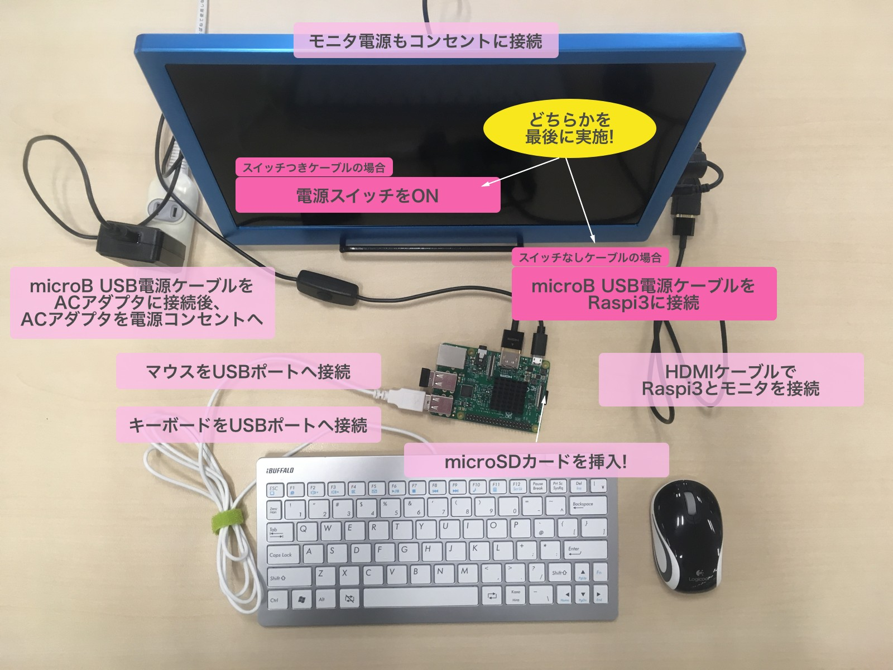

# Hello World

# 1. 今回のゴール
CHIRIMEN for Raspberry Pi 3 の使い方をおぼえて、Webアプリから「Lチカ」（LEDをつけたりけしたり）するプログラミングをやってみよう。

1. 今回のゴール
2. 事前準備
3. CHIRIMEN for Raspberry Pi 3 を起動してみよう
4. Lチカをやってみよう
5. コードを眺めてみよう

## CHIRIMEN for Raspberry Pi 3 とは
CHIRIMEN for Raspberry Pi 3 (以下 CHIRIMEN Raspi3) は、Raspberry Pi 3 (以下 Raspi) で動作する IoT プログラミング環境です。

[Web GPIO API](http://browserobo.github.io/WebGPIO/) や、[Web I2C API](http://browserobo.github.io/WebI2C/) といった JavaScript でハードを制御する API を活用したプログラミングにより、Web アプリ上で Raspi に接続した電子パーツを直接制御できます。


# 2. 事前準備 (機材確認)

## 用意するもの

### 基本ハードウエア
下記が CHIRIMEN for Raspberry Pi 3 の起動に最低限必要となる基本ハードウエアです。


* [Raspberry Pi 3 Model B](https://www.raspberrypi.org/products/raspberry-pi-3-model-b/) もしくは [Raspberry Pi 3 Model B+](https://www.raspberrypi.org/products/raspberry-pi-3-model-b-plus/) × 1
* AC アダプタ + micro B USB電源ケーブル  × 1
  * 例: [Raspberry Pi用電源セット(5V 3.0A) - Pi3フル負荷検証済](https://www.physical-computing.jp/product/1171)
  * 注意: 一般的なスマホ向けのもの (1.0〜2.0A 程度の出力) でも起動できることがありますが、公式には 3.0A を必要としており、PC からの給電などでは電力不足で性能が落ちたり電力不足で不安定になることがあります。また、microUSB 端子は強度がそれほど高くないのでスイッチ付きでコネクタの抜き差しの回数を少なく済ませられるケーブルのものがオススメです
* HDMI ケーブル (モニタ側の端子と合うものを選んでください) × 1
* HDMI 入力つきのモニタ (720Pの解像度に対応したもの) × 1
  * モバイルモニタでも文字が見やすいようデフォルト解像度を 720p としています
* USB マウス × 1
* USB キーボード (日本語入力に対応したもの) × 1
* micro SDカード (8GB 以上必須、Class 10 以上で高速なものを推奨) × 1

### L チカに必要となるパーツ
基本ハードウエアに加え「Lチカ (えるちか)」を実施するには下記パーツも追加で必要です。


* ブレッドボード × 1
* リード付き LED × 1
* リード付き抵抗器 (150-470Ω ※お使いのLEDにより) × 1
* ジャンパーワイヤー (オス-メス) x 2

## SD カードへ CHIRIMEN for Raspberry Pi 3 環境を書き込む
起動する前に、SD カードへ CHIRIMEN Raspi3 環境（起動イメージファイル）を書き込んでおく必要があります。

手順は [CHIRIMEN for Raspberry Pi 3 の SD カードを作成する](sdcard) を参照してください。

# 3. CHIRIMEN for Raspberry Pi 3 を起動してみよう
## 接続方法
材料が集まったら、いよいよ Raspi を接続して起動してみましょう。
基本ハードウエアを下図のように接続してください。(Raspi への電源ケーブルの接続は最後にしましょう)



もしよくわからない場合には、[Raspberry Pi Hardware Guide](https://www.raspberrypi.org/learning/hardware-guide/) なども参照してみると良いでしょう。

電源ケーブルの接続、あるいは、スイッチ付きケーブルの場合はスイッチの ON により Raspi が起動します。

## 起動確認
Raspi の起動後、下記のようなデスクトップ画面が表示されたら CHIRIMEN Raspi3 の起動に成功しています。おめでとうございます。


## 残念ながら上記画面が表示されなかった！？
もし、違う画面が表示される場合には、CHIRIMEN Raspi3 とは異なるSDカードで起動された可能性があります。
その場合は、もう一度 [SDカードへCHIRIMEN for Raspberry Pi 3 環境を構築する](https://gist.github.com/tadfmac/527b31a463df0c9de8c30a598872344d) をご確認ください。

また、電源を入れても何も画面に映らないような場合には、配線が誤っている可能性があります。
接続方法を再度確認してみましょう。正しく接続しているはずなのに、Raspi の microSD コネクタ横の赤い LED が点灯していない場合、AC アダプタまで電気が来ていない可能性もあります。

## WiFi の設定
デスクトップ画面が表示されたら、さっそく WiFi を設定して、インターネットに繋げてみましょう。
CHIRIMEN Raspi3 では、ネットワークに繋がなくてもローカルファイルを使ったプログラミングが一応可能ですが、[JS Bin](https://jsbin.com/) や [JSFiddle](https://jsfiddle.net/) などの Web 上のエディタを活用することで、より便利にプログラミングが進められるようになります。
また、CHIRIMEN Raspi3 に関する情報も今後インターネット上で充実していく予定です。

ぜひ、最初にインターネット接続環境を整えておきましょう。

WiFi の設定は、タスクバーの右上の WiFi アイコンから行えます。


# 4. 「Lチカ」をやってみよう
無事、Raspi の起動と WiFi の設定が行えたら、いよいよLチカに挑戦してみましょう。

## そもそも「Lチカ」って何？
「Lチカ」とは、LED を点けたり消したりすることで、チカチカさせることです。今回は「LEDを点ける」「LEDを消す」をプログラムで繰り返し実行することで実現します。

* 参考：[LED（発光ダイオード）](https://ja.wikipedia.org/wiki/%E7%99%BA%E5%85%89%E3%83%80%E3%82%A4%E3%82%AA%E3%83%BC%E3%83%89)

## 配線してみよう
LED を点けたり消したりするためには、Raspi と正しく配線する必要があります。
LED は2本のリード線が出ていますが、長い方がアノード（+側）、短い側がカソード（-側）です。

Lチカのための配線図は、基本的な作例（examples）と一緒に、下記にプリインストールされています。

```
/home/pi/Desktop/gc/gpio/LEDblink/schematic.png
```


それでは、まず先に `schematic.png` をダブルクリックして見てみましょう。


LED のリード線の方向に注意しながら、この図の通りにジャンパー線やブレッドボードを使って配線してみましょう。

(配線図では LED の下側のリード線が折れ曲がり長い方がアノード (+側))

実際に配線してみると、こんな感じになりました。


### 参考
* [ブレッドボードの使い方](https://www.sunhayato.co.jp/blog/2015/03/04/7)
* [LEDの使い方](https://www.marutsu.co.jp/pc/static/large_order/led)
* [抵抗値の読み方](http://www.jarl.org/Japanese/7_Technical/lib1/teikou.htm)
* [Raspberry Pi3のGPIO](https://tool-lab.com/make/raspberrypi-startup-22/)
* [テスターを使って抵抗値を確かめる](http://startelc.com/elcLink/tester/elc_nArtcTester2.html#chapter-2)

## example を実行してみる
配線がうまくできたら、さっそく動かしてみましょう。
L チカのためのサンプルコードは先ほどの配線図と同じフォルダに格納されています。

```
/home/pi/Desktop/gc/gpio/LEDblink/index.html
```

`index.html` をダブルクリックすると、ブラウザが起動し、先ほど配線した LED が点滅しているはずです！

## ブラウザ画面


## Lチカの様子


L チカに成功しましたか？！

## うまくいかなかったら?
* CHIRIMEN のバックエンドサーバが停止している場合
  * CHIRIMEN Raspi3 では JavaScript から GPIO などを操作できるように、JavaScript からの呼び出しに応じてハードを制御するサーバが Raspi 上で 起動しています。何らかの理由でそのサーバに問題が生じている場合はデスクトップにある `reset.sh` を実行して再起動させると正常動作するようになります。
* セキュリティーエラーが発生している場合
  * まずは、[CHIRIMEN for Raspberry Pi 3 におけるセキュリティーエラーへの対処方法](https://qiita.com/tadfmac/items/2d7929fe3560c77fe867) をご確認のうえ、セキュリティーエラーが発生している場合には対処をお願いします。
    > ToDo: https://localhost:33330 のブックマーク箇所のスクリーンショットを貼る

# 5. コードを眺めてみよう
さきほどは、L チカをデスクトップにある example から実行してみました。
実は、CHIRIMEN Raspi3 にはもうひとつ、「オンラインのexample」が用意されています。

こちらを利用することで、コードを書き換えながら学習を進めることができます。

今度はオンラインの example からさきほどと同じ L チカを実行してコードを眺めてみましょう。

その前に一つ注意です。CHIRIMEN Raspi3 での GPIO などの操作には排他制御があり、同一の GPIO ピンを複数のプログラムから同時操作はできません。同一ページもしくは同一ピンを使うページを同時に開くと正しく動作しなくなってしまいます。

**オンラインの example を起動する前に、必ず先ほど開いた ```file:///home/pi/Desktop/gc/gpio/LEDblink/index.html``` のブラウザウィンドウ (タブ) は閉じてください。先に既存ウィンドウを閉じておかないと、サンプルが正常に動作しなくなります。**

既に開いているウィンドウを確実に閉じるには、一度ブラウザを閉じてから、再度ブラウザを起動すると確実です (通常はタブだけ消しても十分です)。


## ブラウザのブックマークから、JS Bin の example を起動
それでは、さっそくオンラインの example を実行してみます。
配線は、さきほどのままで OK です。

ブラウザを起動後、ブックマークバーから ```examples > GPIO-JSBIN > GPIO-Blink - JS Bin``` を選んでアクセスしてください。


そのまま起動すると下記のような画面になります。(下記スクリーンショットはアクセス直後の画面から JS Bin のタイトルバー部の「Output」タブを 1 回押して非表示にしています)


それでは、コードを眺めてみましょう。

## HTML
```html
<!DOCTYPE html>
<html>
<head>
  <meta charset="utf-8">
  <meta name="viewport" content="width=device-width">
  <title>GPIO-Blink</title>
</head>
<body>
<script src="https://chirimen.org/chirimen-raspi3/gc/polyfill/polyfill.js"></script>
</body>
</html>
```

HTML では `polyfill.js` という JavaScript ライブラリを読み込んでいます。
polyfill.js は [Web GPIO API](http://browserobo.github.io/WebGPIO/) と、[Web I2C API](http://browserobo.github.io/WebI2C/) という W3C でドラフト提案中の 2 つの API への [Polyfill (ブラウザ標準に未実装の機能などを利用可能にするためのライブラリ)](https://developer.mozilla.org/ja/docs/Glossary/Polyfill)となっており、これを最初に読み込むことで GPIO や I2C の API が使えるようになります。

## JavaScript
```javascript
async function mainFunction() {
  // プログラムの本体となる関数。非同期処理を await で扱えるよう全体を async 関数で包みます
  var gpioAccess = await navigator.requestGPIOAccess(); // 非同期関数は await を付けて呼び出す
  var port = gpioAccess.ports.get(26);
  var v = 0;

  await port.export("out");
  for (;;) {
    // 無限ループ
    await sleep(1000); // 無限ループの繰り返し毎に 1000ms 待機する
    v = v === 0 ? 1 : 0; // vの値を0,1入れ替える。1で点灯、0で消灯するので、1秒間隔でLEDがON OFFする
    port.write(v);
  }
}

// await sleep(ms) と呼べば指定 ms 待機する非同期関数
// 同じものが polyfill.js でも定義されているため省略可能
function sleep(ms) {
  return new Promise(resolve => {
    setTimeout(resolve, ms);
  });
}

mainFunction(); // 定義したasync関数を実行します（このプログラムのエントリーポイント）
```

### 注記
CHIRIMEN Raspi3 はウェブブラウザをプログラムの実行環境として用いてシステムを構築します。ウェブブラウザが実行できるプログラムのプログラミング言語はJavaScript です。JavaScript を学んだことのない人は、まず[こちらの資料「JavaScript 1 Day 講習」](https://r.chirimen.org/1dayjs)を履修しましょう。

## 非同期処理について

物理デバイスやネットワーク通信などを行う際には、応答待ちの間にプログラムが全て停止してしまわないよう非同期処理を行う必要があります。
本チュートリアルではこれを [async 関数](https://developer.mozilla.org/docs/Web/JavaScript/Reference/Statements/async_function) を用いて記述しています。非同期処理を知らない人や async 関数による記述をしたことのない人は、必要に応じて[こちらの資料「非同期処理 (async await版)」](appendix0.md) も参照してください。

実は非同期処理をすべて理解して使いこなすのはとても難しいのですが、本チュートリアルでは次のルールが分かっていれば大丈夫です:

* GPIO や I2C の初期化、ポートの設定などは非同期関数として定義されているため `await` キーワードを付けて呼び出す
  * `await` を付けることで、初期化などが完了してから次の処理が行われるようになります
  * `await` なしで呼び出すと初期化などの完了前に次の行の処理を続け、初期化前のポートを操作しようとして失敗したりします
* `await` で非同期関数を呼び出す処理を含む関数は `async function 関数名() { ... }` のように `async` を付けて非同期関数として定義する
* `async` 付きで定義した関数の呼び出し時には必ず前に `await` を付けて呼び出す
  * GPIO や I2C を使う処理は基本的に入れ子で `await` 呼び出しを連鎖させます

非同期関数を `await` なしで呼び出すと返り値は Promise オブジェクトとなるため Promise についての理解が必要になりますが、常に `await` 付きで呼び出すようにしていれば従来通りの同期間数の呼び出しと同じ感覚でコードが書けます。

### Note:
本チュートリアルで非同期処理を async 関数に統一している理由は (Promise を扱ったり古典的なコールバック処理を書くより) 初心者にとってわかりやすいシンプルで読みやすいコードになるからです。この機能は比較的新しい JavaScript 言語機能 (ECMASCript 2017) であるため非対応のブラウザもありますが、Chrome や Firefox では既にサポートされており Raspi 上で使う上で問題はありません。([様々なウェブブラウザでのサポート状況](https://caniuse.com/#feat=async-functions))

## 処理の解説

今回の JavaScript ファイルで、最初に呼び出されるコードは ```navigator.requestGPIOAccess()``` です。
ここで先ほど出て来た [Web GPIO API](http://browserobo.github.io/WebGPIO/) を使い、```gpioAccess``` という GPIO にアクセスするためのインタフェースを取得しています。

コードを読み進める前に、ここで少し GPIO について記載しておきたいと思います。

## GPIOとは
[GPIO](https://ja.wikipedia.org/wiki/GPIO)は、「General-purpose input/output」の略で汎用的な入出力インタフェースのことです。

Raspi3 に実装されている 40 本のピンヘッダから GPIO を利用することができます。（40 本全てのピンが GPIO として利用できるわけではありません）

CHIRIMEN Raspi3 では Raspi3 が提供する 40 本のピンヘッダのうち、下記緑色のピン(合計17本)を Web アプリから利用可能な GPIO として設定しています。

Raspi3 の GPIO 端子は、GND 端子との間に、0V もしくは 3.3V の電圧を印加(出力)したり、逆に 0V もしくは 3.3V の電圧を検知(入力)したりすることができます。LED は数 mA の電流を流すことによって点灯できる電子部品のため、印加する電圧を 3.3V(点灯)、0V(消灯) と変化させることで L チカが実現できるのです。

詳しくは[こちらのサイトの解説](https://tool-lab.com/make/raspberrypi-startup-22/)などを参考にしてみましょう。


## GPIOPortの処理
さて、コードに戻りましょう。

```var port = gpioAccess.ports.get(26);``` という部分で、**GPIOの26番ポートにアクセスするためのオブジェクト** を取得しています。

続いて、```await port.export("out")``` で、**GPIOの26番を「出力設定」**にしています。これにより LED への電圧の切り替えが可能になっています。

ここで、関数の呼び出しに ```await``` 接頭詞がついていることに注意してください。この関数は非同期処理の関数でその処理の完了を待って次の処理に進みます。そしてawait 接頭詞を使いますので、それを使っている関数(```mainFunction()```)はasync接頭詞が付く、非同期処理の関数となっています。

最後に ```await sleep(1000)``` で 1000ms = 1 秒 待機させて無限ループをつくることで、 1 秒毎に ```port.write(1)``` と ```port.write(0)``` を交互に呼び出し、GPIO 26 番に対する電圧を 3.3V → 0V → 3.3V → 0Vと繰り返し設定しています。

LED は一定以上の電圧 (赤色 LED だと概ね 1.8V 程度、青色 LED だと 3.1V 程度) 以上になると点灯する性質を持っていますので、3.3V になったときに点灯、0V になったときに消灯を繰り返すことになります。

まとめると下図のような流れになります。


## exampleを修正してみよう
JS Bin の JavaScript のペインにカーソルを当てればコード修正が可能です。
試しにいろいろ変えてみましょう。

* 点滅を早くしたり遅くしたりしてみる
* GPIO ポートを他のポートに変えてみる (指定した GPIO へジャンパーを付け替える必要があります)
* index.html にボタンなどのインターフェースを作ってみて、押すと LED が反応するよう変えてみる

# まとめ
このチュートリアルでは、下記を実践してみました。

* CHIRIMEN for Raspberry Pi 3の起動
* L チカのサンプルを動かしてみた
* JS Bin で L チカのコードを変更してみた

このチュートリアルで書いたコードは以下のページで参照できます:

* [GitHub リポジトリで参照](https://github.com/chirimen-oh/tutorials/tree/master/raspi3/examples/section0)
* ブラウザで開くページ
  * [L チカコード (画面は空白)](https://tutorial.chirimen.org/raspi3/examples/section0/s0.html)

次の『[チュートリアル 1. GPIO編](https://tutorial.chirimen.org/raspi3/ja/section1)』では GPIO の入力方法について学びます。
