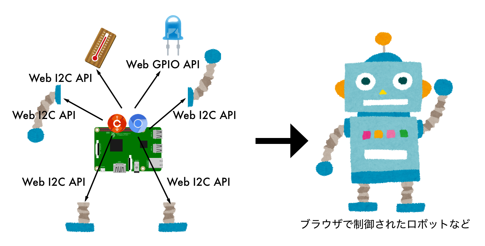
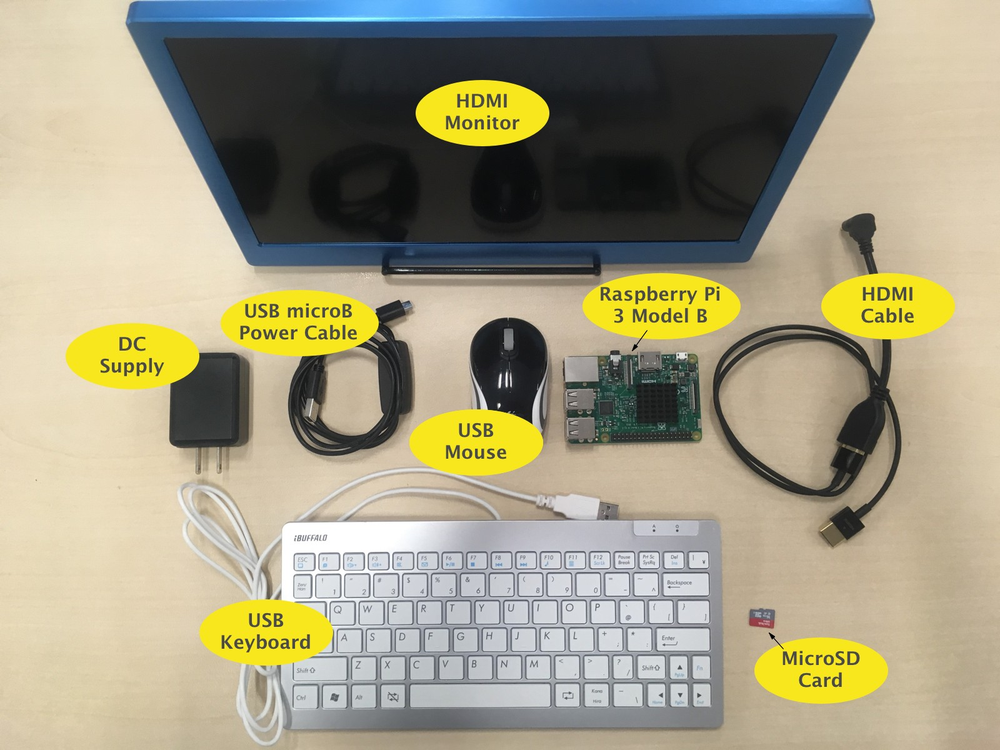
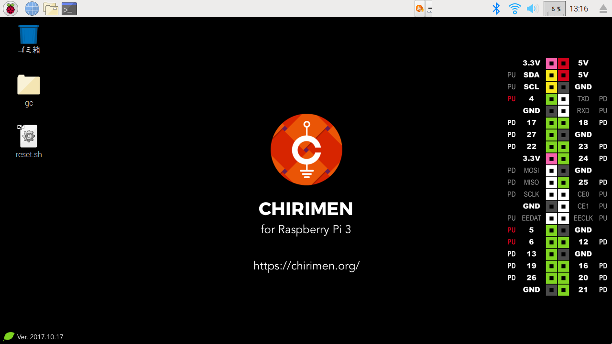
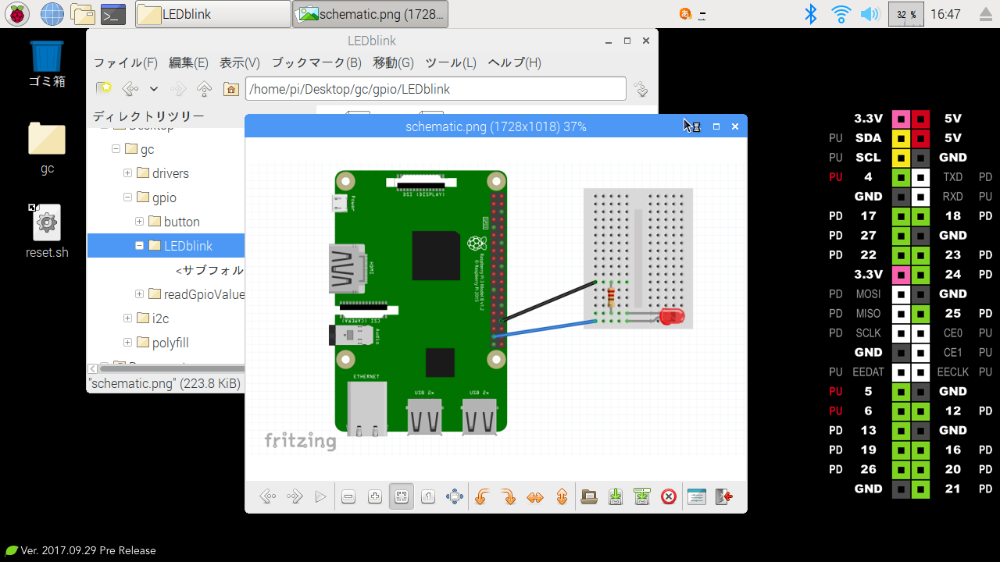
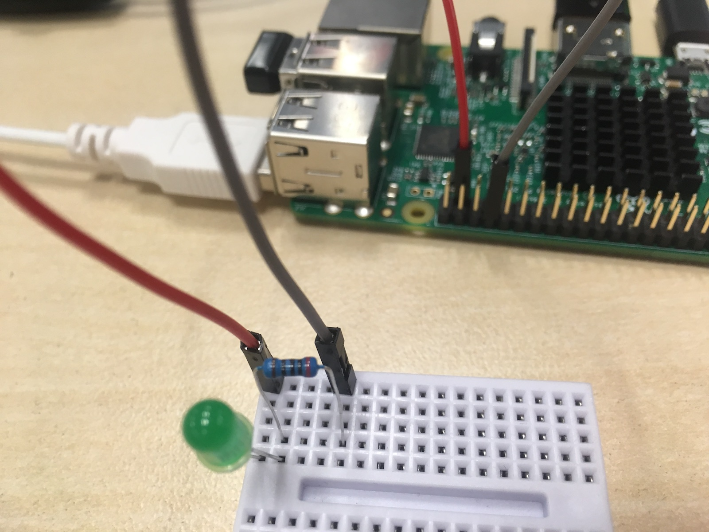
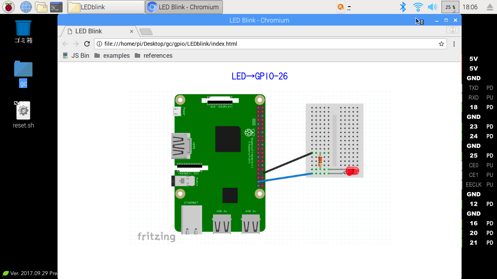
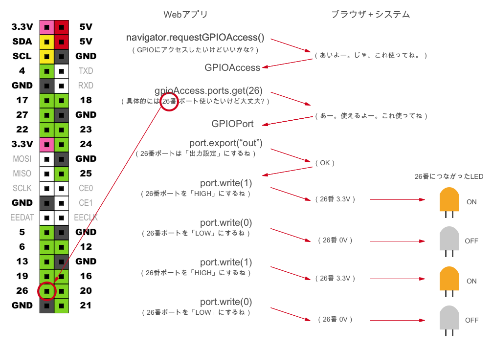

# Hello World

# 1. 今回のゴール
CHIRIMEN for Raspberry Pi 3 の使い方をおぼえて、Webアプリから「Lチカ」（LEDをつけたりけしたり）するプログラミングをやってみよう。

1. 今回のゴール
2. 準備
3. CHIRIMEN for Raspberry Pi 3 を起動してみよう
4. Lチカをやってみよう
5. コードを眺めてみよう

## CHIRIMEN for Raspberry Pi 3 とは
CHIRIMEN for Raspberry Pi 3 (以下 CHIRIMEN Raspi3) は、Raspberry Pi 3 (以下 Raspi3)上に構築した IoT プログラミング環境です。

[Web GPIO API (Draft)](http://browserobo.github.io/WebGPIO/)や、[Web I2C API (Draft)](http://browserobo.github.io/WebI2C/)といったAPIを活用したプログラミングにより、Web アプリから Raspi3 に接続した電子パーツを直接制御することができます。



# 2. 事前準備 (機材の確認)

## 用意するもの

### 基本ハードウエア
下記が CHIRIMEN for Raspberry Pi 3 の起動に最低限必要となる基本ハードウエアです。



* [Raspberry Pi 3 Model B](https://www.raspberrypi.org/products/raspberry-pi-3-model-b/) もしくは [Raspberry Pi 3 Model B+](https://www.raspberrypi.org/products/raspberry-pi-3-model-b-plus/) × 1
* AC アダプタ + micro B USB電源ケーブル  × 1
  * 例: [Raspberry Pi用電源セット(5V 3.0A) - Pi3フル負荷検証済](https://www.physical-computing.jp/product/1171)
  * 注意: 一般的なスマホ向けのもの (1.0〜2.0A 程度の出力) でも起動できることがありますが、公式には 3.0A を必要としており、PC からの給電などでは電力不足で性能が落ちたり電力不足で不安定になることがあります。また、microUSB 端子は強度がそれほど高くないのでスイッチ付きでコネクタの抜き差しの回数を少なく済ませられるケーブルのものがオススメです
* HDMI ケーブル (モニタ側の端子と合うものを選んでください) × 1
* HDMI 入力つきのモニタ (720Pの解像度に対応したもの) × 1
  * モバイルモニタでも文字が見やすいようデフォルト解像度を 720p としています
* USB マウス × 1
* USB キーボード (日本語入力に対応したもの) × 1
* micro SDカード (8GB 以上必須、Class 10 以上で高速なものを推奨) × 1

### L チカに必要となるパーツ
基本ハードウエアに加え「Lチカ」を実施するには下記パーツも追加で必要です。


* ブレッドボード × 1
* リード付きLED × 1
* リード付き抵抗器 (150-470Ω ※お使いのLEDにより) × 1
* ジャンパーワイヤー (オス-メス) x 2

## SD カードへ CHIRIMEN for Raspberry Pi 3 環境を書き込む
起動する前に、SD カードへ CHIRIMEN Raspi3 環境（imageファイル）を書き込んでおく必要があります。

手順は、[SDカードへCHIRIMEN for Raspberry Pi 3 環境を構築する](https://gist.github.com/tadfmac/527b31a463df0c9de8c30a598872344d) を参照してください。

# 3. CHIRIMEN for Raspberry Pi 3 を起動してみよう
## 接続方法
材料が集まったら、いよいよ Raspi3 を接続して起動してみましょう。
基本ハードウエアを下図のように接続してください。(Raspi3 への電源ケーブルの接続は最後にしましょう)


もしよくわからない場合には、[Raspberry Pi Hardware Guide](https://www.raspberrypi.org/learning/hardware-guide/) なども参照してみると良いでしょう。

電源ケーブルの接続、あるいは、スイッチ付きケーブルの場合はスイッチの ON により Raspi3 が起動します。

## 起動確認
Raspi3の起動後、下記のようなデスクトップ画面が表示されたら CHIRIMEN Raspi3 の起動に成功しています。おめでとうございます。



## 残念ながら上記画面が表示されなかった！？
もし、違う画面が表示される場合には、CHIRIMEN Raspi3 とは異なるSDカードで起動された可能性があります。
その場合は、もう一度 [SDカードへCHIRIMEN for Raspberry Pi 3 環境を構築する](https://gist.github.com/tadfmac/527b31a463df0c9de8c30a598872344d) をご確認ください。

また、電源を入れても何も画面に映らないような場合には、配線が誤っている可能性があります。
接続方法を再度確認してみましょう。正しく接続しているはずなのに、Raspi3 の赤い LED が点灯していない場合、AC アダプタまで電気が来ていない可能性もあります。

## WIFIの設定
デスクトップ画面が表示されたら、さっそく WiFi を設定して、インターネットに繋げてみましょう。
CHIRIMEN Raspi3 では、ネットワークに繋がなくてもローカルファイルを使ったプログラミングが一応可能ですが、JS Bin や JSFiddle などの Web 上のエディタを活用することで、より便利にプログラミングが進められるようになります。
また、CHIRIMEN Raspi3 に関する情報も今後インターネット上で充実していく予定です。

ぜひ、最初にインターネット接続環境を整えておきましょう。

WiFi の設定は、タスクバーの右上の WiFi アイコンから行えます。


# 4. Lチカをやってみよう
無事、Raspi3 の起動と WiFi の設定が行えたら、いよいよLチカに挑戦してみましょう。

## そもそも「Lチカ」って何？
「Lチカ」とは、LED を点けたり消したりすることで、チカチカさせることです。今回は「LEDを点ける」「LEDを消す」をプログラムで繰り返し実行することで実現します。

* 参考：[LED（発光ダイオード）](https://ja.wikipedia.org/wiki/%E7%99%BA%E5%85%89%E3%83%80%E3%82%A4%E3%82%AA%E3%83%BC%E3%83%89)

## 配線してみよう
LED を点けたり消したりするためには、Raspi3 と正しく配線する必要があります。
LED は2本のリード線が出ていますが、長い方がアノード（+側）、短い側がカソード（-側）です。

Lチカのための配線図は、基本的な作例（examples）と一緒に、下記にプリインストールされています。

```
/home/pi/Desktop/gc/gpio/LEDblink/schematic.png
```


それでは、まず先に ```schematic.png``` をダブルクリックして見てみましょう。



LED のリード線の方向に注意しながら、この図の通りにジャンパー線やブレッドボードを使って配線してみましょう。

(図の LED の下側の方がアノード(+側))

実際に配線してみると、こんな感じになりました。



### 参考
* [ブレッドボードの使い方](https://www.sunhayato.co.jp/blog/2015/03/04/7)
* [LEDの使い方](https://www.marutsu.co.jp/pc/static/large_order/led)
* [抵抗値の読み方](http://www.jarl.org/Japanese/7_Technical/lib1/teikou.htm)
* [Raspberry Pi3のGPIO](https://tool-lab.com/make/raspberrypi-startup-22/)
* [テスターを使って抵抗値を確かめる](http://startelc.com/elcLink/tester/elc_nArtcTester2.html#chapter-2)

## exampleを実行してみる
配線がうまくできたら、さっそく動かしてみましょう。
L チカのためのサンプルコードは先ほどの配線図と同じフォルダに格納されています。

```
/home/pi/Desktop/gc/gpio/LEDblink/index.html
```

index.html をダブルクリックすると、ブラウザが起動し、先ほど配線した LED が点滅しているはずです！

## ブラウザ画面


## Lチカの様子


L チカに成功しましたか？！

## うまくいかなかったら?
セキュリティーエラーが発生している可能性があります。

まずは、[CHIRIMEN for Raspberry Pi 3 におけるセキュリティーエラーへの対処方法](https://qiita.com/tadfmac/items/2d7929fe3560c77fe867) をご確認のうえ、セキュリティーエラーが発生している場合には対処をお願いします。

> ToDo: https://localhost:33330 のブックマーク箇所のスクリーンショットを貼る

# 5. コードを眺めてみよう
さきほどは、L チカをデスクトップにある example から実行してみました。
実は、CHIRIMEN Raspi3 にはもうひとつ、「オンラインのexample」が用意されています。

こちらを利用することで、コードを書き換えながら学習を進めることができます。

今度はオンラインの example からさきほどと同じ L チカを実行してコードを眺めてみましょう。

その前に。**オンラインの example を起動する前に、必ず先ほど実行した ```file:///home/pi/Desktop/gc/gpio/LEDblink/index.html```のブラウザWindow (タブ) は閉じるようお願いします。先に既存の Window を閉じておかないと、これから実行するサンプルが正常に動作しなくなります。** 複数のプログラムから同時に同じ Raspi3 のハードウェア (GPIO ポート) にアクセスしようとしないよう、必ず example は同時に一つだけ開くようにしましょう。

上記に記載した Window を確実に閉じるには、一度ブラウザを閉じてから、再度ブラウザを起動すると確実です。(タブだけ消してももちろんOKです)


## ブラウザのブックマークから、JS Bin の example を起動
それでは、さっそくオンラインの example を実行してみます。
配線は、さきほどのままで OK です。

ブラウザを起動後、ブックマークバーから ```examples > GPIO-JSBIN > GPIO-Blink - JS Bin``` を選んでアクセスしてください。


そのまま起動すると下記のような画面になります。(下記スクリーンショットはアクセス直後の画面からJS Binのタイトルバー部の「Output」タブを 1 回押して非表示にしています)


それでは、コードを眺めてみましょう。

## HTML
```html
<!DOCTYPE html>
<html>
<head>
  <meta charset="utf-8">
  <meta name="viewport" content="width=device-width">
  <title>GPIO-Blink</title>
</head>
<body>
<script src="https://chirimen.org/chirimen-raspi3/gc/polyfill/polyfill.js"></script>
</body>
</html>
```

HTML では `polyfill.js` という JavaScript ライブラリを読み込んでいます。
polyfill.js は [Web GPIO API](http://browserobo.github.io/WebGPIO/) と、[Web I2C API](http://browserobo.github.io/WebI2C/) という W3C でドラフト提案中の 2 つの API への [Polyfill (ブラウザ標準に未実装の機能などを利用可能にするためのライブラリ)](https://developer.mozilla.org/ja/docs/Glossary/Polyfill)となっています。


## JavaScript
```javascript
mainFunction(); // 下記のasync関数を実行します（このプログラムのエントリーポイント）

async function mainFunction(){ // プログラムの本体となる関数、非同期処理のためプログラム全体をasync関数で包みます。
  var gpioAccess = await navigator.requestGPIOAccess(); // thenの前の関数をawait接頭辞をつけて呼び出します。
  var port = gpioAccess.ports.get(26);
  await port.export("out");
  while ( true ){ // 無限ループ
    await sleep(1000); // 1000ms待機する
    v ^= 1; // v = v ^ 1 (XOR 演算)の意。(vが1の場合はvが0に、0の場合は1に変化する。1でLED点灯、0で消灯するので、1秒間隔でLEDがON OFFする。)
    port.write(v);
  }
}

function sleep(ms){
  return new Promise( function(resolve) {
    setTimeout(resolve, ms);
  });
}
```

### 注記
CHIRIMEN Raspi3 はウェブブラウザをプログラムの実行環境として用いてシステムを構築します。ウェブブラウザが実行できるプログラムのプログラミング言語はJavaScript です。JavaScript を学んだことのない人は、まず[こちらの資料「JavaScript 1 Day 講習」](https://r.chirimen.org/1dayjs)を履修しましょう。

## 非同期処理

物理デバイスを使用するためには非同期処理をする必要があります。本チュートリアルではこれを async await によって記述することにします。

非同期処理を学んだことのない人、および async await による記述をしたことのない人は、まず[こちらの資料「非同期処理 (async await版)」](appendix0.md)を参照し、理解したうえで次に進んでください。

### Note:
本チュートリアルが async await を用いた非同期処理に統一している理由は初心者にとってわかりやすいことです。ただしこの機能は比較的新しい JavaScript 言語機能であるため非対応のブラウザもありますが、Chrome や Firefox ではサポートしています。([様々なウェブブラウザでのサポート状況](https://caniuse.com/#feat=async-functions))

## 処理の解説

JavaScript ファイルで、最初に出てくるコードが ```navigator.requestGPIOAccess()``` です。
ここで先ほど出て来た [Web GPIO API](http://browserobo.github.io/WebGPIO/) を使い、```gpioAccess```というGPIOにアクセスするためのインタフェースを取得しています。

コードを読み進める前に、ここで少し GPIO について記載しておきたいと思います。

## GPIOとは
[GPIO](https://ja.wikipedia.org/wiki/GPIO)は、「General-purpose input/output」の略で汎用的な入出力インタフェースのことです。

Raspi3 に実装されている 40 本のピンヘッダから GPIO を利用することができます。（40 本全てのピンが GPIO として利用できるわけではありません）

CHIRIMEN Raspi3 では Raspi3 が提供する 40 本のピンヘッダのうち、下記緑色のピン(合計17本)を Web アプリから利用可能な GPIO として設定しています。

Raspi3 の GPIO 端子は、GND 端子との間に、0V もしくは 3.3V の電圧を印加(出力)したり、逆に 0V もしくは 3.3V の電圧を検知(入力)したりすることができます。LED は数 mA の電流を流すことによって点灯できる電子部品のため、印加する電圧を 3.3V(点灯)、0V(消灯) と変化させることで L チカが実現できるのです。

詳しくは[こちらのサイトの解説](https://tool-lab.com/make/raspberrypi-startup-22/)などを参考にしてみましょう。


## GPIOPortの処理
さて、コードに戻りましょう。

```var port = gpioAccess.ports.get(26);``` という部分で、**GPIOの26番ポートにアクセスするためのオブジェクト** を取得しています。

続いて、```await port.export("out")``` で、**GPIOの26番を「出力設定」**にしています。これにより LED への電圧の切り替えが可能になっています。

ここで、関数の呼び出しに ```await``` 接頭詞がついていることに注意してください。この関数は非同期処理の関数でその処理の完了を待って次の処理に進みます。そしてawait 接頭詞を使いますので、それを使っている関数(```mainFunction()```)はasync接頭詞が付く、非同期処理の関数となっています。

最後に ```await sleep(1000)``` で 1000ms 待機させて無限ループをつくることで、 1000ms ごとに ```port.write(1)``` と ```port.write(0)``` を交互に呼び出し、GPIO 26 番に対する電圧を 3.3V → 0V → 3.3V → 0Vと繰り返し設定しています。

LED は一定以上の電圧 (赤色 LED だと概ね 1.8V 程度、青色 LED だと 3.1V 程度) 以上になると点灯する性質を持っていますので、3.3V になったときに点灯、0V になったときに消灯を繰り返すことになります。

まとめると下図のような流れになります。



## exampleを修正してみよう
JS Bin の JavaScript のペインにカーソルを当てればコード修正が可能です。
試しにいろいろ変えてみましょう。

* 点滅を早くしたり遅くしたりしてみる
* GPIO ポートを他のポートに変えてみる (指定した GPIO へジャンパーを付け替える必要があります)
* index.html にボタンなどのインターフェースを作ってみて、押すと LED が反応するよう変えてみる

# まとめ
このチュートリアルでは、下記を実践してみました。

* CHIRIMEN for Raspberry Pi 3の起動
* L チカのサンプルを動かしてみた
* JS Bin で L チカのコードを変更してみた

次の『[チュートリアル 1. GPIO編](https://tutorial.chirimen.org/raspi3/ja/section1)』では GPIO の入力方法について学びます。
