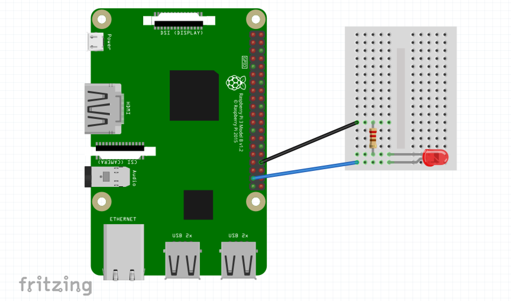
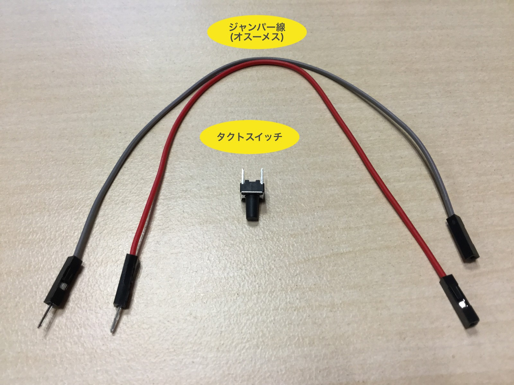
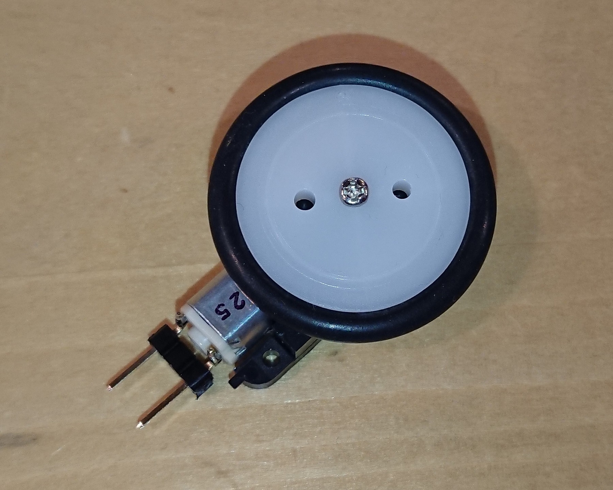
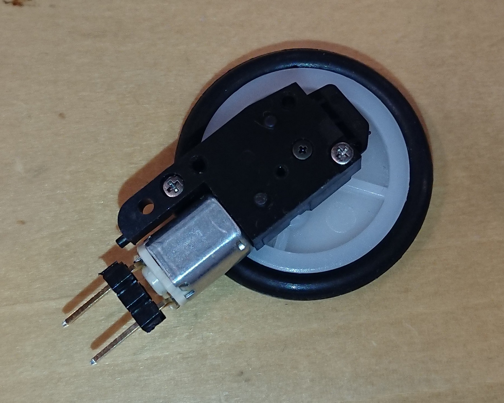
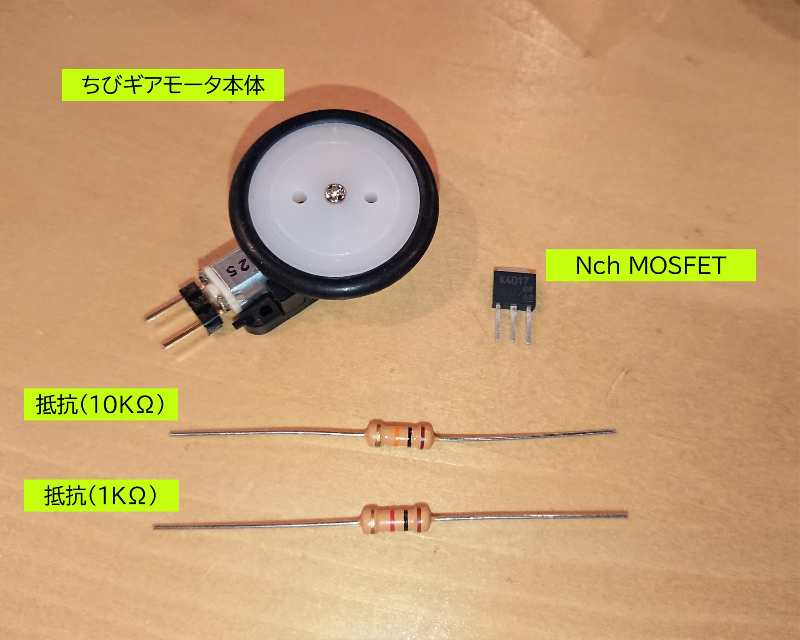

# 1. GPIO 編

# 概要

CHIRIMEN for Raspberry Pi 3 (以下 CHIRIMEN Raspi3) を使ったプログラミングを通じて、Web GPIO API の使い方を学びます。

CHIRIMEN Rapi3 を初めて使う方は本チュートリアルを進める前に「[CHIRIMEN for Raspberry Pi 3 Hello World](section0.md)」で基本的な操作方法を確認しておいてください。

## (※1) CHIRIMEN for Raspberry Pi 3 とは

CHIRIMEN Raspi3 は Raspberry Pi 3（以下「Raspi」）上で動作する IoT プログラミング環境です。

[Web GPIO API](http://browserobo.github.io/WebGPIO/) や、[Web I2C API](http://browserobo.github.io/WebI2C/) といった API を活用したプログラミングにより、Web アプリから Raspi に接続した電子パーツを直接制御できます。

CHIRIMEN Raspi3 の開発やこのチュートリアルの執筆・更新は [CHIRIMEN Open Hardware コミュニティ](https://chirimen.org/) によって行われています。

# 1. 準備

## 用意するもの

このチュートリアル全体で必要になるハードウエア・部品は下記の通りです。

- [Hello World 編](section0.md) に記載の「基本ハードウエア」と「L チカに必要となるパーツ」
- タクトスイッチ (2pin, 4pin を使う場合は向きに注意) x 1
- ジャンパーワイヤー (オス-メス) x 5
- [Nch MOSFET (2SK4017)](http://akizukidenshi.com/catalog/g/gI-07597/)
- リード抵抗 (1KΩ) x 1
- リード抵抗 (10KΩ) x 1
- [DC ファン](http://akizukidenshi.com/catalog/g/gP-02480/) x 1
  - ブレッドボードに接続できるようケーブルを加工したものを利用する

## CHIRIMEN for Raspberry Pi 3 の起動と L チカの確認

- [Hello World 編](section0.md) の 「3. CHIRIMEN for Raspberry Pi 3 を起動してみよう」を参照して、CHIRIMEN for Raspberry Pi 3 を起動してください。
- ついでに [Hello World 編](section0.md) の 「4. L チカをやってみよう」を実施して、L チカが正しく行えることを確認しておいてください。

## L チカでのおさらい

- CHIRIMEN Raspi3 では、各種 example の配線図とコードが `~/Desktop/gc/` 配下においてある
- CHIRIMEN Raspi3 で利用可能な GPIO Port 番号と位置は壁紙を見よう
- LED には方向がある。アノードが足が長い方でこちらを GPIO ポートに繋ぐ。反対の足が短い方を GND 側に繋ぐ。抵抗はどちらかに繋ぐ
- CHIRIMEN Raspi3 では Web アプリからの GPIO の制御に [Web GPIO API](http://browserobo.github.io/WebGPIO/) を利用する

# 2. マウスクリックで LED の ON/OFF を制御してみる

それでは、実際にプログラミングしてみましょう。

[Hello World 編](section0.md) では、[JS Bin](http://jsbin.com/) を使って L チカの example コードを少し触ってみるだけでしたが、今度は最初から書いてみることにします。

サンプル同様に JS Bin で書いても良いですが、折角ですので、このチュートリアルでは他のオンラインエディタ [JSFiddle](https://jsfiddle.net/) を使ってみましょう。

> Web 上のオンラインサービスは便利ですが、メンテナンスや障害、サービス停止などで利用できなくなることがあります。
> ローカルでの編集も含め、いくつかのサービスを使いこなせるようにしておくと安心です。
>
> 各サービスにはそれぞれ一長一短がありますので、利用シーンに応じて使い分けると良いかもしれません。

## a. 部品と配線について

このパートでは [Hello World 編](section0.md) で実施した L チカの配線をそのまま利用します。必要な部品も同じです。


LED は、26 番ポートに接続しておいてください。



## b. HTML/CSS を記載する

さて、今回はボタンと LED の状態インジケータを画面上に作ってみましょう。
HTML に `<button>` と `<div>` 要素を 1 つづつ作ります。

[JSFiddle](https://jsfiddle.net/) にアクセスすると、初期状態でコード編集を始めることができます。
この画面の HTML ペインに下記コードを挿入します。

```html
<button id="onoff">LED ON/OFF</button>
<div id="ledView"></div>
```

※JSFiddle の HTML ペインには HTML タグの全てを書く必要はなく、`<body>` タグ内のみを書けばあとは補完してくれます。

`ledView` 要素には下記のようなスタイルを付けて黒い丸として表示させましょう。こちらは CSS ペインに記載します。

```css
#ledView {
  width: 60px;
  height: 60px;
  border-radius: 30px;
  background-color: black;
}
```

最後に、HTML に戻って、[Web GPIO API](http://browserobo.github.io/WebGPIO/) を利用可能にする Polyfill を読み込ませましょう。
先ほど追加した `ledView` のすぐ下に下記 `<script>` タグを記載します。

```html
<script src="https://chirimen.org/chirimen-raspi3/gc/polyfill/polyfill.js"></script>
```

## c. ボタンに反応する画面を作る

GPIO を実際に使う前に、まずは「ボタンを押したら LED の ON/OFF 状態を表示する画面を切り替える」部分を作ってみます。

早速 JavaScript を書いていきましょう。

```javascript
window.onload = function mainFunction() {
  var onoff = document.getElementById("onoff");
  var ledView = document.getElementById("ledView");
  var v = 0;
  onoff.onclick = function controlLed() {
    v = v === 0 ? 1 : 0;
    ledView.style.backgroundColor = v === 1 ? "red" : "black";
  };
};
```

このコードでは `onoff` 要素と `ledView` 要素を取得し、`onoff` ボタンのクリックイベント発生時に `letview` の色を書き換えるイベントハンドラを登録しています。また、その処理は HTML 要素の読み込み後に実行するよう `window.onload` に設定する関数内に処理を書いています (HTML の読み込み前に処理すると `getElementById()` で要素が取得できません)。

実行タイミングを考えてコードを書くことは重要ですが、HTML の読み込み後に処理させたいことは多いので、実は JSFiddle では JavaScript は onload 後に実行する初期設定となっています。しかしこのままでは「読み込み完了時の処理を読み込み完了後に登録する」ことになってしまい、折角書いたコードが実行されません。

JSFiddle 利用時にはいずれかの対応をしてください (ローカルファイル編集時や JS Bin では不要):

- `JavaScript + No-Library (pure JS)` と書かれているところをクリックし `LOAD TYPE` の設定を `On Load` 以外 (`No wrap - bottom of <head>` など) に変更する (推奨)
- onload に関数を登録せず処理を直接 JavaScript ペインに書き込む (最初の `onload = function() {` と 最後の行の `}` を削除)

ここまでできたら JSFiddle の JavaScript の `▷ Run` をクリックして実行してみましょう。

これで、`LED ON/OFF` ボタンが表示されるはずですので、ボタンをクリックしてみてください。

ディスプレイの丸が、赤 → 黒 → 赤 → 黒 → 赤 → 黒 → とクリックする都度切り替えできるようになったら成功です。


## d. ボタンに LED を反応させる

画面ができましたので、いよいよ Web GPIO を使った LED 制御コードを入れていきます。

一度 L チカの時に学んだことを思い出せばできるはずですが、まずは書き換えてみましょう。

```javascript
window.onload = async function mainFunction() {
  var onoff = document.getElementById("onoff");
  var ledView = document.getElementById("ledView");
  var v = 0;
  var gpioAccess = await navigator.requestGPIOAccess();
  var port = gpioAccess.ports.get(26);
  await port.export("out");
  onoff.onclick = function controlLed() {
    v = v === 0 ? 1 : 0;
    port.write(v);
    ledView.style.backgroundColor = v ? "red" : "black";
  };
};
```

これで、画面のボタンクリックに反応して LED の ON/OFF ができたら成功です。

JSFiddle 利用時には `LOAD TYPE` を変更するか、`mainFunction()` 呼び出しを onload で囲まず最上位で直接呼び出すことに注意してください。

[Hello World 編](section0.md) の L チカのパートでも簡単に説明しましたが、ここでもういちど[GPIO 編 (Web GPIO API)](section1.md) の流れをおさらいしておきましょう。

### await navigator.requestGPIOAccess()

Web GPIO を利用するための `GPIOAccess` インタフェースを取得するための最初の API 呼び出しです。
`requestGPIOAccess()` は非同期処理でインターフェイス初期化を行う非同期メソッドですので `await` で完了を待って次の処理を記述します。

async/await を使わずプロミスでコードを書きたい場合は返されるプロミスの `then` にコールバック関数を登録してください。初期化が完了したら `GPIOAccess` パラメータ付きでコールされます。

### gpioAccess.ports.get()

`GPIOAccess.ports` は利用可能なポートオブジェクトの一覧 ([Map](https://developer.mozilla.org/docs/Web/JavaScript/Reference/Global_Objects/Map)) です。

`gpioAccess.ports.get(26)` のようにすることで利用可能なポートオブジェクトの一覧から、 **GPIO ポート番号 26** を指定して `port` オブジェクトを取得しています。

### await port.export()

`port.export("out")` により取得した GPIO ポートを**「出力モード」**で初期化しています。この初期化処理も非同期処理となっているため、`await` を付けて処理完了を待ってから次の処理に進めます。

GPIO ポートにかける電圧を Web アプリで変化させたい時には「出力モード」を指定する必要があります。一方、GPIO ポートはもうひとつ「入力モード」があり、これは GPIO ポートの状態 (電圧の High/Low 状態) を読み取りたい時に利用します。入力モードについてはスイッチを使う例の中で説明します。

### port.write()

`port.write()` は、出力モードに指定した GPIO ポートの電圧を切り替える指定を行う API です。
`port.write(1)` で、指定したポートから HIGH (Raspi3 では 3.3V) の電圧がかかり、`port.write(0)` で LOW(0V) になります。


# 3. マウスクリックのかわりにタクトスイッチを使ってみる

それでは、さきほどまで書いたコードをベースに、マウスの替わりにスイッチを利用してみます。

今回は一般的に「タクトスイッチ」と呼ばれるものを利用します。

### タクトスイッチについて

「タクトスイッチ」は[アルプス電気の商標](http://www.alps.com/j/trademark/)ですが、電子部品屋さん等ではアルプス電気製ではないスイッチも、同様の形状・配線のものは「タクトスイッチ」として売られています。

- [秋月電気の「タクトスイッチ」一覧](http://akizukidenshi.com/catalog/c/ctactsw/)

本チュートリアルでは次のような仕様の「電気部品屋さん等でタクトスイッチとして売られてるスイッチ」を使います。

- SPST (Single-Pole Single-Throw、1 回路 1 接点)
- プッシュボタンが 1 つで押し込みでスイッチ ON、離すとスイッチ OFF (モーメンタリ動作)

タクトスイッチには 2 端子のものだけでなく、端子が 4 つあるタクトスイッチが多いので注意が必要です。4 ピンのタクトスイッチではどの端子間が常に接続されており、どの端子間がボタンによってオンオフされるか注意してください。

[タクトスイッチの製品ページ](https://www.alps.com/prod/info/J/HTML/Tact/SnapIn/SKHW/SKHWALA010.html) などにも回路図がありますが、端子が出ている向き (次の図では縦方向) は常に接続されており、それと直角方向がボタンによって切り替わります。次の図では左の 4pin スイッチと 2pin スイッチ (とジャンパー線) が同じ回路となります。


## a. 準備：画面のボタンをモーメンタリ動作に変えておく

これまでに作成したプログラムは「ブラウザ画面のボタンをクリックしたら LED の HIGH/LOW を切り替える」というものでした。

クリック後は変更後の状態が維持されます。これは「オルタネート」のスイッチと同じ動きです。

一方で、今回用意したタクトスイッチは「モーメンタリ」のものです。

### スイッチの動作：オルタネートとモーメンタリ

- オルタネート : 状態をトグル (切り替え) します。一度ボタンを押すと ON になりボタンから手を離しても OFF に変わりません。次にボタンを押すと OFF になります。ボタンから手を離しても ON に変わることはありません。
- モーメンタリ : 押している間だけ ON になります。スイッチから手を離すと OFF に戻ります。

この 2 つの動作が混在すると画面とスイッチで状態が一致せず、面倒なことになるので、ブラウザ画面のボタンを「モーメンタリ」に合わせておきましょう。

下記のように、現在は `onclick` イベントで切り替えています。クリックイベントは、「マウスのボタンを押して離す」ことで発生します。

```javascript
  :
  onoff.onclick = function controlLed() {
    v = v === 0 ? 1 : 0;
    port.write(v);
    ledView.style.backgroundColor = v ? "red" : "black";
  };
  :
```

これを、マウスボタンを押した時と離した時にそれぞれオンオフさせるように変えましょう:

- マウスのボタンを押す → LED を ON
- マウスのボタンを離す → LED を OFF

```javascript
  :
  onoff.onmousedown = function onLed() {
    port.write(1);
    ledView.style.backgroundColor = "red";
  };
  onoff.onmouseup = function offLed() {
    port.write(0);
    ledView.style.backgroundColor = "black";
  };
  :
```

これで、思った通りの動作になったはずです。

後でスイッチを追加したときに、同じ処理を呼ぶことになるので、LED の ON/OFF と `ledView` のスタイル切り替えをまとめて関数化しておきましょう。

下記のようになりました。

```javascript
var port;

function ledOnOff(v) {
  var ledView = document.getElementById("ledView");
  if (v === 0) {
    port.write(0);
    ledView.style.backgroundColor = "black";
  } else {
    port.write(1);
    ledView.style.backgroundColor = "red";
  }
}

window.onload = async function mainFunction() {
  var onoff = document.getElementById("onoff");
  var gpioAccess = await navigator.requestGPIOAccess();
  port = gpioAccess.ports.get(26);
  await port.export("out");
  onoff.onmousedown = function onLed() {
    ledOnOff(1);
  };
  onoff.onmouseup = function offLed() {
    ledOnOff(0);
  };
};
```

## b. 部品と配線について

今回追加するのは下記部品です。

- 前述のタクトスイッチ × 1
- ジャンパーワイヤー（オスーメス）× 2



下図のように、さきほどの LED の配線にタクトスイッチを追加しましょう。この図の例では 2 ピンのタクトスイッチを使っていますが、4 ピンの場合も黄色と黒のジャンパー線の間にボタンでオンオフが切り替わるよう向きに注意してスイッチを配置してください。


### 今回のスイッチは「プルアップ」回路で接続

上記回路ではスイッチが下記のように接続されています。

- Port 5 にスイッチを接続
- GND にスイッチの反対側を接続

これでどのようになるかというと、下記のようになります。

- スイッチを押す前は、Port 5 は HIGH (3.3V)
- スイッチを押している間、Port 5 は LOW (0V)

どうしてこうなるのでしょうか。

実は、Raspi3 の GPIO ポートのいくつかは、初期状態で「プルアップ」されています。

プルアップとは、回路を初期状態で「HIGH にしておく」ことですが、CHIRIMEN Raspi3 で利用可能な GPIO ポートのうち、下記ポート番号がプルアップ状態となっています。


今回の回路では、このうち、Port 5 を利用しています。
さきほどの動作となるメカニズムは下記の通りです。


この動作を頭に入れておきましょう。

## c. スイッチに反応するようにする (port.read()を使ってみる)

いよいよ、スイッチに対応させてみましょう。

まずは、単純に「GPIO ポートの状態を読み込む」 `port.read()` を使ってみたいと思います。

`port.read()` で GPIO を読み込むコードは次のように書けます:

```javascript
var gpioAccess = await navigator.requestGPIOAccess(); // writeと一緒。
var port = gpioAccess.ports.get(5); // Port 5 を取得
await port.export("in"); // Port 5 を「入力モード」に。
var val = await port.read(); // Port 5の状態を読み込む
```

### await port.export()

`port.export("in")` により取得した GPIO ポートを「入力モード」で初期化しています。非同期処理の待機が必要です。

GPIO ポートにかかる電圧を Web アプリ側から読み取りたい時に使います。

### await port.read()

`port.export("in")` で入力モードに設定した GPIO ポートのデータを任意のタイミングで読み取ります。読み取りは非同期処理になるので `await` で完了を待つようにしてください。

プロミスでコードを書きたい場合は `port.read().then((data)=>{ ... });` のように書きます。

上記コードで GPIO ポートの読み取りが１度だけ行えますが、今回は「スイッチが押され状態を監視する」必要がありますので、定期的に `port.read()` を行って GPIO ポートを監視する必要があります。

例えば単純に `setInterval()` でポーリング (定期問い合わせ) 処理するとこんなコードになります:

```javascript
  var gpioAccess = await navigator.requestGPIOAccess(); // writeと一緒。
  var port = gpioAccess.ports.get(5); // Port 5 を取得
  await port.export("in"); // Port 5 を「入力モード」に。
  setInterval(() => {
    var val = await port.read(); // Port 5の状態を読み込む
    //
    // ここにswitchの状態による処理を書き足す
    //
  }, 100); // 100ms 毎に実行
```

一応これでも動作しますが、この場合 `setInterval()` のポーリング間隔を極端に短くすると `port.read()` の読み取り結果が返って来る前に、次の Interval で読み取り要求してしまうようなケースも発生します。

場合によっては、こうした「順序の乱れ」が意図しない不具合を招くことも考えられます。

順序の乱れが生じないようにするには `setInterval()` で一定時間毎に実行するのではなく、繰り返し処理の最後に一定時間の待ち時間を入れます。そうすることで順序が維持されるポーリング処理となります:

```javascript
var gpioAccess = await navigator.requestGPIOAccess(); // writeと一緒。
var port = gpioAccess.ports.get(5); // Port 5 を取得
await port.export("in"); // Port 5 を「入力モード」に。
while (1) {
  var val = await port.read(); // Port 5の状態を読み込む
  //
  // ここにswitchの状態による処理を書き足す
  //
  await sleep(100); // 100ms 秒待ってから繰り返す
}
```

LED の処理と組み合わせた全体のコードは下記のようになります:

```javascript
var ledPort;
var switchPort;

function ledOnOff(v) {
  var ledView = document.getElementById("ledView");
  if (v === 0) {
    ledPort.write(0);
    ledView.style.backgroundColor = "black";
  } else {
    ledPort.write(1);
    ledView.style.backgroundColor = "red";
  }
}

window.onload = async function mainFunction() {
  var onoff = document.getElementById("onoff");
  var gpioAccess = await navigator.requestGPIOAccess();
  var val;

  ledPort = gpioAccess.ports.get(26); // LED のポート番号
  await ledPort.export("out");

  switchPort = gpioAccess.ports.get(5); // タクトスイッチのポート番号
  await switchPort.export("in");

  onoff.onmousedown = function onLed() {
    ledOnOff(1);
  };
  onoff.onmouseup = function offLed() {
    ledOnOff(0);
  };

  for (;;) {
    val = await switchPort.read(); // Port 5の状態を読み込む
    val = val === 0 ? 1 : 0; // スイッチは Pull-up なので OFF で 1、LED は OFF で 0 なので反転させる
    ledOnOff(val);
    await sleep(100);
  }
};
```

さて、出来たらスイッチを押してみてください。
LED が押してる間だけ点灯したら成功です。

ただ、このコードではブラウザ画面上の「LED ON/OFF」ボタンを押すと正しく点灯しなくなってしまいました。

スイッチを読み込む処理がポーリング動作しているため、スイッチが押されていないとすぐ LED が消えてしまいます。

## d. スイッチに反応するようにする (port.onchange())

これまで一通り `port.read()` を使ったスイッチの制御方法を見てきましたが、実は Web GPIO API には「入力モード」の GPIO ポートの状態を取得する方法がもうひとつ用意されています。それが `port.onchange()` です。

`port.onchange()` の説明は後回しにして、さきほどのサンプルを `port.onchange()` を使ったコードに書き換えてみましょう。

```javascript
var ledPort;
var switchPort; // LED とスイッチの付いているポート

function ledOnOff(v) {
  var ledView = document.getElementById("ledView");
  if (v === 0) {
    ledPort.write(0);
    ledView.style.backgroundColor = "black";
  } else {
    ledPort.write(1);
    ledView.style.backgroundColor = "red";
  }
}

window.onload = async function initialize() {
  var onoff = document.getElementById("onoff");
  var gpioAccess = await navigator.requestGPIOAccess();
  ledPort = gpioAccess.ports.get(26); // LED のポート番号
  await ledPort.export("out");
  switchPort = gpioAccess.ports.get(5); // タクトスイッチのポート番号
  await switchPort.export("in");
  // Port 5 の状態が変わったタイミングで処理する
  switchPort.onchange = function toggleLed(val) {
    // スイッチは Pull-up なので OFF で 1、LED は OFF で 0 と反転させる
    ledOnOff(val === 0 ? 1 : 0);
  };

  onoff.onmousedown = function onLed() {
    ledOnOff(1);
  };
  onoff.onmouseup = function offLed() {
    ledOnOff(0);
  };
};
```

コードを見ていただけたらお気づきかもしれません。 `port.onchange()` は入力モードの GPIO ポートの「状態変化時に呼び出される関数を設定する」ための機能です。

`port.read()` を使ったコードと異なりポーリングする処理が不要になったので、今回のケースでは簡潔に書けるようになりましたね。

また、ポーリングによる LED 制御処理を行なっていないので、ブラウザ画面のボタンも正しく反応できるようになります。

# 4.LED のかわりに ギヤードモータ（ちびギアモータ）を動かしてみる

Web GPIO API の機能が一通り確認できましたので、本パートのしめくくりに違う部品も制御してみましょう。

ここでは、**MOSFET** を使って ギヤードモータ（ちびギアモータ）の単純な ON/OFF を制御してみましょう。
  > CHIRIMEN for Raspberrry Pi 3 スターター・キットではギヤードモータの一例として、ちびギアモータをセットに含めています。ここまで「ギヤードモータ」と「ちびギアモータ」を併記してきましたが、以下では「ちびギアモータ」とのみ記載します。ちびギアモータ以外のギヤードモータを利用する場合には製品の仕様をご確認の上お試しください。

## MOSFET とは

MOSFET は[電界効果トランジスタ (FET)](https://ja.wikipedia.org/wiki/%E9%9B%BB%E7%95%8C%E5%8A%B9%E6%9E%9C%E3%83%88%E3%83%A9%E3%83%B3%E3%82%B8%E3%82%B9%E3%82%BF) の一種で、主にスイッチング素子として利用される部品です。

[MOSFET(Wikipedia)](https://ja.wikipedia.org/wiki/MOSFET)

今回は、Nch MOSFET「[2SK4017](http://akizukidenshi.com/catalog/g/gI-07597/)」を利用します。


## ギヤードモータとは

ギヤードモータとは、モーターに減速機（ギヤ）を組み合わせることにより、低回転、高トルクを出せる駆動装置です。

今回はとても小型なギヤードモータである、[ちびギアモータ](https://tiisai.dip.jp/?p=2676)を利用します。

 

## a. 部品と配線について

ちびギアモータ本体に加え、以下のものを用意します。



次に、先ほどの「タクトスイッチを押したら LED をつけたり消したり」する回路から、LED と LED 用の抵抗を一旦外して、MOSFET と抵抗、ちびギアモータを次のように配置します。

!ちびギアモータの回路図](imgs/section1/DC3motor.png)

回路図の配置を多少調整していますが、黄色のジャンパーピンと黒のジャンパーピンの間をスイッチでオンオフできるように配線するのは同じです。手持ちのスイッチやジャンパワイヤに合わせて上手く配線してみてください。

さて、それでは遊んでみましょう。

## b. コードは... 書き換えなくて良い

実は、この回路は先ほどまでのコード **「d. スイッチに反応するようにする (port.onchange())」** と同じコードで動きます。
LED が点灯する替わりにちびギアモータが動くようになりました。

<!-- //画像が用意でき次第挿入 -->

## c. しかし... (オチ w)

スイッチを押して DC ファンが回るだけなら、5V→ タクトスイッチ →DC ファン →GND と繋げば **プログラムを書かなくても出来る！！！！**

...... スイッチじゃないのでやりましょう。(次回に続く)

# まとめ

このチュートリアルでは、実際にコードを書きながら Web GPIO API の基本的な利用方法を学びました。

- Web GPIO API を使った GPIO 出力ポートの設定と出力処理までの流れ (`navigator.requestGPIOAccess()`〜`port.write()`）
- Web GPIO API を使った GPIO 入力ポートの設定と読み出し処理の流れ (`navigator.requestGPIOAccess()`〜`port.read()`）
- Web GPIO API を使った GPIO 入力ポートの設定と変化検知受信の流れ (`navigator.requestGPIOAccess()`〜`port.onchange()`)

このチュートリアルで書いたコードは以下のページで参照できます:

- [GitHub リポジトリで参照](https://github.com/chirimen-oh/tutorials/tree/master/raspi3/examples/section1)
- ブラウザで開くページ (各ステップ)
  - [画面のボタンで画面の要素の色を変える](https://tutorial.chirimen.org/raspi3/examples/section1/s1_1.html)
  - [他面のボタンで LED が光り画面の要素の色も変わる](https://tutorial.chirimen.org/raspi3/examples/section1/s1_2.html)
  - [マウスで画面のボタンを押している間だけ LED が光る](https://tutorial.chirimen.org/raspi3/examples/section1/s1_3.html)
  - [タクトスイッチを押している間だけ LED が光る](https://tutorial.chirimen.org/raspi3/examples/section1/s1_4.html)
  - [画面のボタンまたはタクトスイッチを押している間だけ LED が光る](https://tutorial.chirimen.org/raspi3/examples/section1/s1_5.html)

次の『[チュートリアル 2. I2C 　基本編（ADT7410 温度センサー）](section2.md)』では Web I2C API の学習をします。
