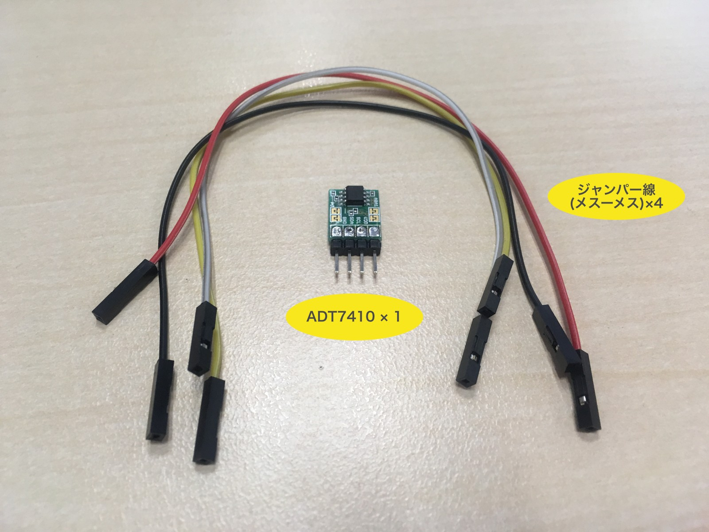
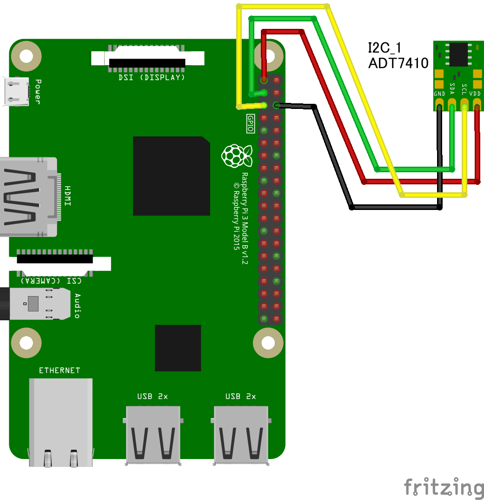
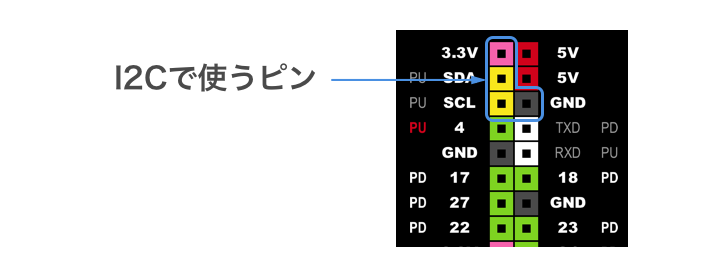
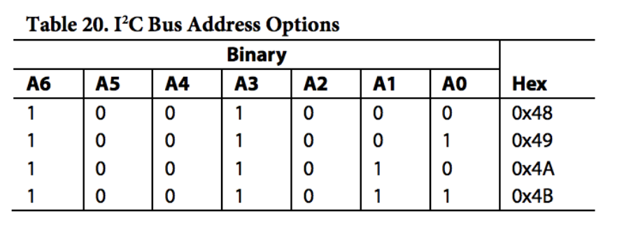
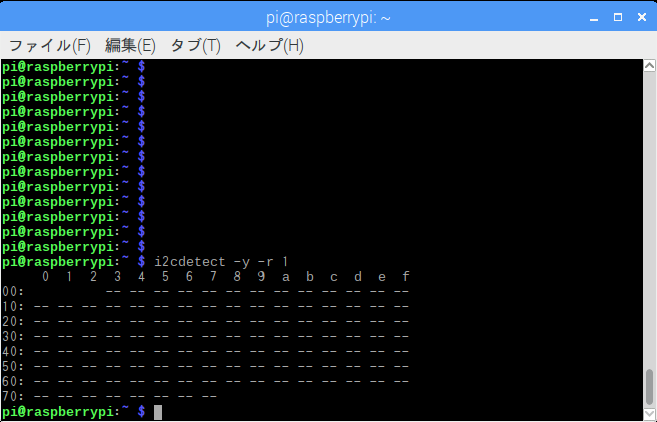

# 2. I2C　基本編 (ADT7410温度センサー)

# 概要

CHIRIMEN for Raspberry Pi 3 （以下「CHIRIMEN Raspi3」）を使ったプログラミングを通じて、[Web I2C API](https://rawgit.com/browserobo/WebI2C/master/index.html) の使い方を学びます。

## (※1) CHIRIMEN for Raspberry Pi 3とは

Raspberry Pi 3（以下「Raspi3」）上に構築したIoTプログラミング環境です。

[Web GPIO API](http://browserobo.github.io/WebGPIO/) (Draft)や、[Web I2C API](http://browserobo.github.io/WebI2C/) (Draft)といったAPIを活用したプログラミングにより、WebアプリからRaspi3に接続した電子パーツを直接制御することができます。 
CHIRIMEN Open Hardware コミュニティにより開発が進められています。

## 前回までのおさらい

本チュートリアルを進める前に「[Hello World編](section1.md)」と、「[GPIO編](section1.md)」でCHIRIMEN Raspi3 の基本的な操作方法とプログラミング方法を確認しておいてください。

前回までのチュートリアルで学んだことは下記のとおりです。

* CHIRIMEN Raspi3 では、各種 example が `~/Desktop/gc/`配下においてある。配線図も一緒に置いてある。
* CHIRIMEN Raspi3 で利用可能なGPIO Port番号と位置は壁紙を見よう。
* CHIRIMEN Raspi3 では Web アプリからのGPIOの制御には[Web GPIO API](http://browserobo.github.io/WebGPIO/) を利用する。GPIOポートは「出力モード」に設定することで LED の ON/OFF などが行える。また「入力モード」にすることで、GPIOポートの状態を読み取ることができる
* [async function](https://developer.mozilla.org/ja/docs/Web/JavaScript/Reference/Statements/async_function) を利用すると複数ポートの非同期コードがすっきり書ける

# 1.準備

## 用意するもの

このチュートリアル全体で必要になるハードウエア・部品は下記の通りです。

* [Hello World編](section0.md) に記載の「基本ハードウエア」
* [ジャンパーワイヤー (メス-メス)] x 4
* 温度センサ[ADT7410](http://akizukidenshi.com/catalog/g/gM-06675/) x 1 ※付属のピンヘッダでなく、通常サイズのピンヘッダをハンダ付けしておいてください

# 2.I2Cとは

[I2C](https://ja.wikipedia.org/wiki/I2C) とは2線式の同期式シリアル通信インタフェースです。「アイ・スクエア・シー」とか「アイ・ ツー・シー」などと読みます。 

SDA（シリアルデータ）と SCL（シリアルクロック）の2本の線で通信を行います。


上図のように、i2cの SDA、SCL は複数のモジュール間で共有します。（「I2Cバス」と言います。）

I2Cではマスターとスレーブの間で通信が行われます。常にマスター側からスレーブ側に要求が行われます。スレーブ側からマスター側へ要求を行うことはできません。

マスターは、スレーブが持つ「SlaveAddress」を用いて、特定のスレーブとの通信を行います。

このため、同じI2Cバス上に同じSlaveAddressのスレーブを繋ぐことはできません。


通信するモジュール同士が同一基板上にない場合には、SDA、SCL の2本の通信線に加え電源やGNDの線を加えて4本のケーブルを用いて接続するのが一般的です。

詳細は下記をご参照ください。

* [I2C](https://ja.wikipedia.org/wiki/I2C) - Wikipedia
* I2Cバス仕様書　最新版（[日本語](https://www.nxp.com/docs/ja/user-guide/UM10204.pdf)、[English](http://www.nxp.com/documents/user_manual/UM10204.pdf)）
* [I2Cの使い方](http://www.picfun.com/i2cframe.html)（後閑哲也氏サイト)

ここでは I2C の概要として下記を押さえておきましょう。

* I2Cには複数のモジュールが繋がる（I2Cバス）
* I2Cに繋がるモジュールにはマスターとスレーブがある
* I2Cでは必ずマスターからスレーブに対して通信要求が行われる
* I2Cスレーブは SlaveAddress を持っている
* 同じ I2C バスに同じ SlaveAddress のスレーブは繋げない

# 3.温度センサー(ADT7410)を使ってみる

それでは実際に I2C に対応したモジュールを使ってみましょう。

CHIRIMEN Raspi3 では、センサーなど、いくつかのI2Cモジュールのサンプルがプリインストールされています。

`/home/pi/Desktop/gc/i2c/`

この中から、ADT7410という温度センサーモジュールを使ってみたいと思います。

Raspberry Pi 3とADT7410との接続方法(回路図)と example コードは下記フォルダに格納されています。

`/home/pi/Desktop/gc/i2c/i2c-ADT7410/`

> I2Cバス上、Raspi3 がマスター、ADT7410がスレーブになります。

## a. 部品と配線について

まずは、下記ファイルをダブルクリックしてください。回路図が表示されます。

`/home/pi/Desktop/gc/i2c/i2c-ADT7410/schematic.png`

この回路を作成するのに必要な部品は下記の通りです。(Raspi3基本セットを除く)



これらのパーツを下記回路図の通りに接続してみてください。



下記がRaspi3 側の接続ピンの位置を拡大した図になります。

間違えないよう接続をお願いします。



## b. 接続がうまくいったか確認する

ここで、ターミナルを起動して下記コマンドを入力してみてください。

`$ i2cdetect -y -r 1`

すると、下記のような画面が表示されるはずです。


`48`という表示が見えます。これは16進数表示ですので`0x48`という意味です。

`i2cdetect`コマンドでは I2C バスに接続されている SlaveAddress を確認することができます。

`0x48`は、ADT7410 の SlaveAddress と思われるものですが、念のためデータシートも確認してみましょう。

> [ADT7410のデータシート](http://www.analog.com/media/en/technical-documentation/data-sheets/ADT7410.pdf)

データシートのP.17に「SERIAL BUS ADDRESS」の項があり、ここに SlaveAddress の記載があります。

ADT7410は`0x48`がデフォルトの SlaveAddress で、A0,A1ピンの HIGH/LOW により SlaveAddeess の下位2bitを変更できることがわかります。


(ADT7410 Data Sheetより抜粋)

試しに、一度 Raspi3 の3.3Vに接続している線を抜いて、もう一度 `i2cdetect -y -r 1` を実行してみてください。



`0x48` が見つからなくなりました。

これで、ADT7410のSlaveAddressが`0x48`となっていることが確認できました。

再度、先ほど外した3.3Vの線を戻してADT7410に電源を供給しておいてください。

## c. exampleを実行してみる

配線と SlaveAddress が確認できましたので、さっそく動かしてみましょう。

ADT7410 のためのサンプルコードは先ほどの配線図と同じフォルダに格納されています。

`/home/pi/Desktop/gc/i2c/i2c-ADT7410/index.html`

ダブルクリックすると、ブラウザが起動し下記のような画面になります。


画面の回路図の下の数値が温度（摂氏）になります。

ADT7410センサに触ると、ゆっくりと温度が上がるはずです。

ADT7410 は I2C という通信方式でセンサーデータを送出するモジュールです。

この情報を Web I2C API 経由でWebアプリが読み取り、画面に情報を表示しているわけです。

# 4.温度センサー(ADT7410)exampleのコードを読んでみる

それでは、コードを見てみましょう。

`/home/pi/Desktop/gc/i2c/i2c-ADT7410/` 配下の `index.html`、`main.js` をみてみます。

## d-1. index.html

下記が index.html の中から主要な部分を抜き出したコードです。

index.html
```html
  : 
  <script src="../../polyfill/polyfill.js"></script>
  <script src="../../drivers/i2c-ADT7410.js"></script>
  <script src="./main.js"></script>
  :
  <body>
    :
    <p id="head">TEST</p>
    :
  </body>
```

まず最初に読み込んでいるのが `polyfill.js`。Web GPIO API の時に出てきた `https://chirimen.org/chirimen-raspi3/gc/polyfill/polyfill.js` と同じ Web GPIO API と Web I2C API の Polyfill です。

次に読み込んでいるのが、`i2c-ADT7410.js`。このファイルは、Web I2C API を使って ADT7410 との通信を行うためのドライバーとなるライブラリです。

最後に読み込んでいる `main.js` が、ドライバーライブラリを使ってこのアプリケーションの動作を記述している部分です。

## d-2. main.js

次に、`main.js` を見てみましょう。(重要な部分以外は削っています)

main.js
```javascript
  var head = document.querySelector("#ADT7410value");
  var i2cAccess = await navigator.requestI2CAccess(); // i2cAccessを非同期で取得
  var port = i2cAccess.ports.get(1); // I2C I/Fの1番ポートを取得
  var adt7410 = new ADT7410(port, 0x48); // 取得したポートの0x48アドレスをADT7410ドライバで受信する
  var value;
  await adt7410.init();
  for (;;) {
    // 無限ループ
    value = await adt7410.read();
    head.innerHTML = value ? `${value} degree` : "Measurement failure";
    await sleep(1000);
  }
```

ここで温度センサーの情報を定期的に取得し、画面に出力する処理が行われています。
少し詳し解説してみます。

### await navigator.requestI2CAccess()

Web I2C APIを利用するための `I2CAccess` インタフェースを取得するための最初の API 呼び出しです。この関数も非同期処理の関数で、
処理完了を待機し、その結果正しくインタフェースが取得されたら `i2cAccess` オブジェクトに保持されます。

### i2cAccess.ports.get()

`I2CAccess.ports` は、利用可能な I2C ポートの一覧です。

```javascript
  var port = i2cAccess.ports.get(1);
```

CHIRIMEN Raspi3 で利用可能なI2Cポート番号は`1`番だけです。
ここでは、ポート番号に`1` を指定して、`port` オブジェクトを取得しています。

### var adt7410 = new ADT7410(port,0x48)

ここで ADT7410 用のドライバーライブラリのインスタンス生成を行なっています。

### await adt7410.init()

ADT7410 用のドライバーライブラリのインスタンス (adt7410) が持つ非同期処理の関数 `init()` は、その内部でインスタンス生成時に指定した `port` オブジェクトと `slaveAddress(0x48)` を用いて `I2CPort.open()` を行なっています。

`I2CPort.open()` が成功すると、`I2CSlaveDevice` という I2C ポートへデータ書き込みや読み込みなどを行うインタフェースが返されます。
`I2CSlaveDevice` インタフェースは、ライブラリ内に保存され、その後の処理でこのインターフェースを使って I2C デバイスである adt7410 との通信が可能になります。

### await adt7410.read()

ADT7410 の仕様に基づくデータ読み出し処理をここで実施しています。

内部では、`I2CSlaveDevice.read8()` というAPIを2回呼び出すことで、温度データの [MSB](https://ja.wikipedia.org/wiki/最上位ビット), [LSB](https://ja.wikipedia.org/wiki/最下位ビット) を 8bit ずつ読み出し、両方の読み出しが終わった時点で MSB と LSB を合成、16bitデータとしたのちに、温度データに変換して返却しています。

### Web I2C APIに着目して流れをまとめると

ADT7410 ドライバーライブラリの内部の処理をまとめると以下のようなことが行われています。
1. await navigator.requestI2CAccess() で I2CAccess インタフェースを取得
2. i2cAccess.ports.get(1) で、1番ポートの `port` オブジェクトを取得
3. await port.open(0x48) で、SlaveAddress 0x48 番の I2CSlaveDevice インタフェースを取得
4. i2cSlave.read8() で 温度データ を読み込み (ADT7410 の場合、常に2回セット)

となります。

この流れは、ADT7410 以外の他のI2Cデバイスでも基本的に同様になります。

I2Cデバイスにより変わるのは、`port.open()`に指定する SlaveAddress と、[4.の実際の処理](#4温度センサーadt7410の値をドライバーを使わずに読むコードを書いてみる) になります。

CHIRIMEN Raspi3の example として用意されているサンプルコードとドライバーが提供されている I2C デバイスは下記リストの通りですが、下記リストに無い I2Cデバイスでも、上記流れを押さえておけば対応するコードを書くのはそれほど難しくありません。

新たなI2Cデバイスへの対応方法については、下記記事も参考にしてください。

(CHIRIMEN Raspi3 ではなく、CHIRIMEN ボード向けの記事ですが、Web I2C API への対応観点では同じ方法論で対応が可能です)

[CHIRIMENでI2Cデバイスを使ってみる](https://qiita.com/tadfmac/items/04257bfe982ba0f050bb)

# 4.温度センサー(ADT7410)の値をドライバーを使わずに読むコードを書いてみる

それでは、ADT7410 ドライバー内部での処理の流れがだいたいわかったところで、ドライバーを使わずに自力で値を読み込むコードを一応書いてみましょう。

example と同じコードを書いても面白くないので、今回は`i2c-ADT7410.js`は使わずに、[JSFiddle](https://jsfiddle.net/) を使って一通り温度を読み込む処理を書いてみましょう。

もし、ブラウザで `/home/pi/Desktop/gc/i2c/i2c-ADT7410/index.html` 開いている場合、一度閉じておいてください。

## JSFiddleでHTMLを書く

それでは始めましょう。

JSFiddle の HTMLペインに Polyfill の読み込みと、温度表示のためのタグだけ書いておきます。

```html
<div id="ADT7410value">---</div>
<script src="https://chirimen.org/chirimen-raspi3/gc/polyfill/polyfill.js"></script>
```

こんな感じで良いでしょう。

## JavaScriptを書いてみる
次にJavaScriptです。async functionを使って書いてみます。

今回は定期的なポーリング処理が必要になるので、[GPIO編 c. スイッチに反応するようにする (port.read()を使ってみる)](section1.md#c--portread) の時に書いたコードが参考になります。

```javascript
// ADT7410のドライバを使わず、自力でADT7410の値を読むサンプル

window.onload = async function mainFunction() {
  var head = document.querySelector("#ADT7410value");
  var i2cAccess = await navigator.requestI2CAccess(); // i2cAccessを非同期で取得
  var port = i2cAccess.ports.get(1); // I2C I/Fの1番ポートを取得
  var i2cSlaveDevice = await port.open(0x48); // アドレス0x48のI2Cスレーブデバイスを得る
  var MSB;
  var LSB;
  var temperature;

  for (;;) {
    // 無限ループ
    MSB = await i2cSlaveDevice.read8(0x00); // これ以下の３行が肝です
    LSB = await i2cSlaveDevice.read8(0x01);
    temperature = ((MSB << 8) | (LSB & 0xff)) / 128.0;
    head.innerHTML = `${temperature} ℃`;
    await sleep(1000);
  }
};
```

JavaScriptを書いたら、`▷ Run` を押して実行してみましょう。

温度センサーの値が表示されたはずです。

ADT7410 を指で触って温度が変わることを確認してみてください。

# まとめ

このチュートリアルでは下記について学びました。

* I2Cの基礎知識
* i2cdetect コマンドを使った Raspi 3に接続された I2C モジュールの SlaveAddress 確認方法
* Web I2C API を使った処理の流れ
* ADT7410 温度センサーの制御方法

このチュートリアルで書いたコードは以下のページで参照できます:

* [GitHub リポジトリで参照](https://github.com/chirimen-oh/tutorials/tree/master/raspi3/examples/section2)
* ブラウザで開くページ (各ステップ)
  * [ADT7410 温度センサー (ドライバを使ったコード例)](https://tutorial.chirimen.org/raspi3/examples/section2/s2_1.html)
  * [ADT7410 温度センサー (ドライバを使わないコード例)](https://tutorial.chirimen.org/raspi3/examples/section2/s2_2.html)


次の『[チュートリアル 3. I2C　応用編（その他のセンサー）](section3.md)』では加速度センサーなど他のセンサーも触っていきます。

