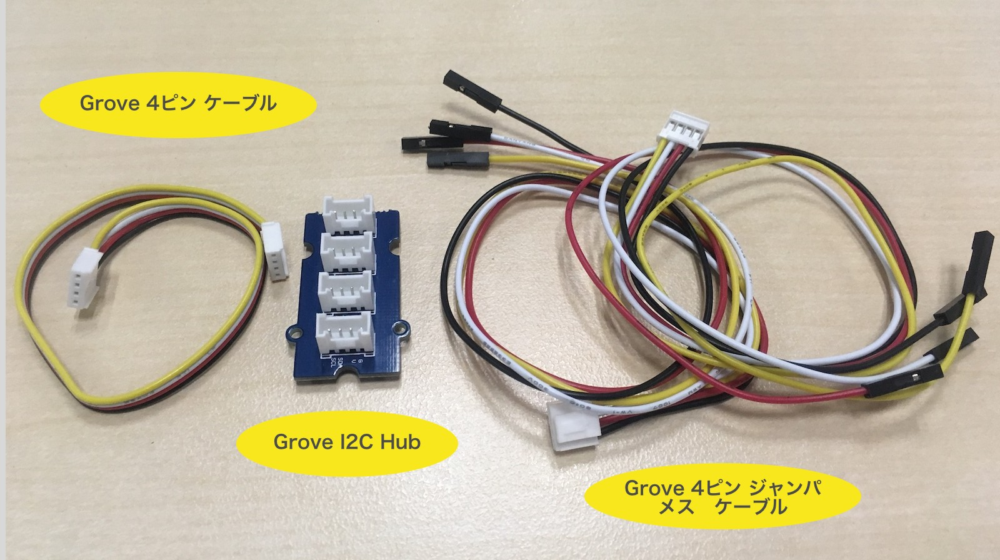
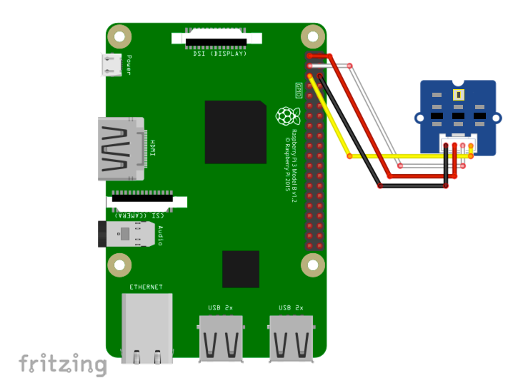
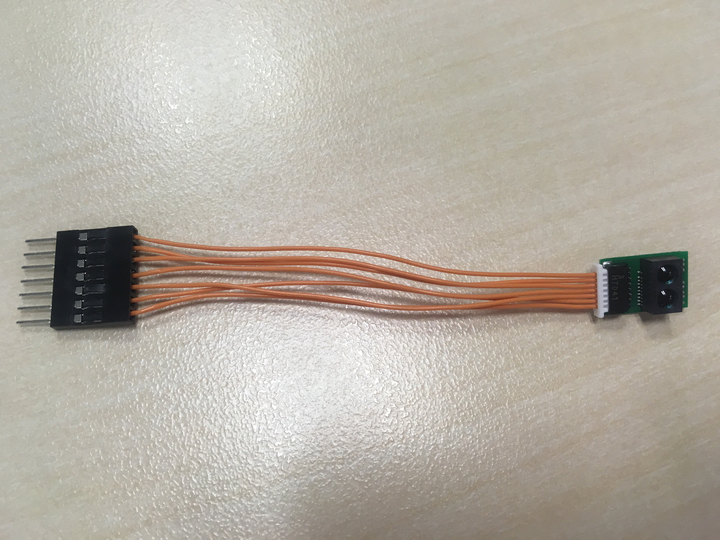
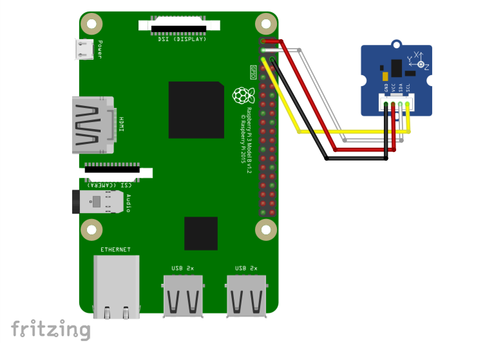
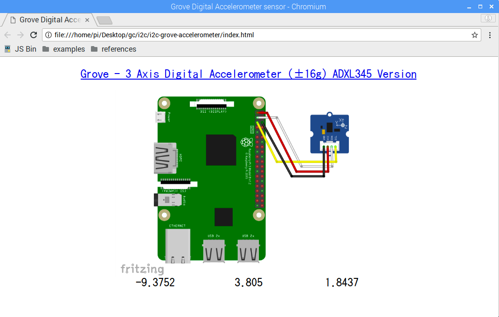

# 3. I2C 応用編 (その他のセンサー)

# 概要

CHIRIMEN for Raspberry Pi 3（以下 「CHIRIMEN Raspi3」） を使ったプログラミングを通じて、Web I2C API の使い方を学びます。 

前回は温度センサーを使いながら Web I2C API の基本的な利用方法を学びました。今回は温度センサー以外のI2Cセンサーの使い方を見ていきましょう。

ここでは例として光センサー、距離センサー、加速度センサーの 3 つについて詳しく説明していますが、最後に「他の I2C モジュールも使ってみる」として紹介しているように、CHIRIMEN ではそれ以外にも多くの I2C デバイス (あるいは I2C の ADC を使って様々なアナログセンサー類) が簡単に扱えるようになっており、 [examples ページ (オンライン版)](http://chirimen.org/chirimen-raspi3/gc/top/examples/) に回路図とサンプルコードが用意されています。各自興味のあるセンサーを順に試していってください。

## 前回までのおさらい

本チュートリアルを進める前に前回までのチュートリアルを進めておいてください。

* [Hello World編](section0.md)
* [GPIO編](section1.md)
* [I2C 基本編（ADT7410 温度センサ）](section2.md)

前回までのチュートリアルで学んだことは下記のとおりです。

* CHIRIMEN Raspi3 では、各種 example が `~/Desktop/gc/` 配下に配線図と一緒においてある
* CHIRIMEN Raspi3 で利用可能な GPIO Port 番号と位置は壁紙を見よう
* CHIRIMEN Raspi3 では Web アプリからの GPIO の制御には Web GPIO API を利用する。GPIOポートは「出力モード」に設定することで LED の ON/OFF などが行える。また「入力モード」にすることで、GPIO ポートの状態を読み取ることができる
* [async function](https://developer.mozilla.org/ja/docs/Web/JavaScript/Reference/Statements/async_function) を利用すると複数ポートの非同期コードがすっきり書ける
* CHIRIMEN Raspi3 ではWebアプリからI2C通信に対応したモジュールの制御に [Web I2C API](http://browserobo.github.io/WebI2C/) を利用することができる

# 1.準備

## 複数のI2Cモジュールを接続するために

前回は Raspberry Pi と温度センサーを4本のジャンパケーブルで直接接続しました。

I2Cバスには複数のモジュールが接続できますので、今回は複数の I2C モジュールを容易に追加・削除できるように [Grove I2C Hub](http://wiki.seeed.cc/Grove-I2C_Hub/) を利用することにします。

Grove I2C Hub は、4つの Grove コネクタを備えた I2C モジュールを接続するためのハブです。

4ピンの [Grove 4ピン ケーブル](https://www.seeedstudio.com/Grove-Universal-4-Pin-Buckled-20cm-Cable-5-PCs-pack-p-936.html)を経由すれば、後述する[Grove Digital Light Sensor](http://wiki.seeed.cc/Grove-Digital_Light_Sensor/)などGroveコネクタを備えたI2Cモジュールを直接接続することができます。

Raspi 3 や前回のADT7410などピンヘッダを備えた（あるいは事前にスルーホールにピンヘッダをはんだ付けしてある）モジュールとの接続には、[Grove 4ピン ジャンパ　メスケーブル](https://www.seeedstudio.com/grove-to-4-pin-254-female-jumper-wire5-pcs-pack-p-1020.html) 経由で接続することができます。

## 用意するもの

ここでは、1つのGroveコネクタつきI2Cモジュールと1つのピンヘッダつきI2Cモジュールを接続することを想定し、下記を用意しておきましょう。

* [Hello World編](section0.md) に記載の「基本ハードウエア」



* [Grove I2C Hub](http://wiki.seeed.cc/Grove-I2C_Hub/) x 1
* [Grove 4ピン ジャンパー メス　ケーブル](https://www.seeedstudio.com/grove-to-4-pin-254-female-jumper-wire5-pcs-pack-p-1020.html) x 2
* [Grove 4ピン ケーブル](https://www.seeedstudio.com/Grove-Universal-4-Pin-20cm-Unbuckled-Cable-%285-PCs-Pack%29-p-749.html) x 1
* ブレッドボード x 1
* ジャンパーケーブル(オス-メス) x 4

上記に加え今回紹介するセンサーが必要となりますが、センサーについては各センサーの説明のパートに記載します。

# 2. 光センサーを使ってみる

光の強度に反応するセンサーを使ってみましょう。

## a. 部品と配線について
「1.準備」のパートに記載したものに加え、下記を用意してください。

* [光センサー(Grove Digital Light Sensor)](http://wiki.seeed.cc/Grove-Digital_Light_Sensor/) x 1

Raspberry Pi 3との接続方法については、下記回路図を参照ください。

`/home/pi/Desktop/gc/i2c/i2c-grove-light/schematic.png`



このセンサーモジュールはGroveコネクタを備えていますので、接続方法に応じてコネクタを選んでください。

* Grove I2C Hub 経由で接続する場合 ：Grove 4ピン ケーブル経由で接続してください。
* Raspberry Pi 3 へ直接接続する場合：Grove 4ピン ジャンパー メス ケーブル経由で接続してください。

## b. 接続確認とexampleの実行

i2cdetect で接続を確認しておきましょう。

`$ i2cdetect -y -r 1`

SlaveAddress `0x29` が見つかれば接続OKです。

次に example を動かします。

`/home/pi/Desktop/gc/i2c/i2c-grove-light/index.html`

画面の回路図の下の数値が明るさの値です。

センサーに当たる光を遮断してみてください。数値が小さくなるはずです。

逆にセンサーに LED の光を直接当てると数値が大きくなることが確認できるでしょう。

## c. コード解説

example のコードから、光センサーに関係する部分を見ていきます。

今回はドライバーライブラリの中までは深入りせずに、アプリケーションの流れを追ってみましょう。

ADT7410 の時とほとんど同じであることがわかるはずです。

### c-1. index.html

下記がindex.htmlの中から主要な部分を抜き出したコードです。

index.html
```html
: 
  <script src="../../polyfill/polyfill.js"></script>
  <script src="../../drivers/i2c-grove-light.js"></script>
  <script src="./main.js"></script>
  :
  <body>
    :
    <p id="head">TEST</p>
    :
  </body>
```

HTML は ADT7410 の時とほとんど同じです。
ドライバーライブラリが、`i2c-grove-light.js` に変わりました。

### c-2. main.js

次に、main.jsを見てみましょう。(重要な部分以外は削っています)

main.js
```javascript
  var i2cAccess = await navigator.requestI2CAccess();
  var port = i2cAccess.ports.get(1);
  var grovelight = new GROVELIGHT(port,0x29);
  await grovelight.init();
    while(1) {
    var value = await grovelight.read();
    head.innerHTML = value ? value : head.innerHTML;
    await sleep(200);
  }

```

`main.js` も温度センサーとほとんど同じです。

### var grovelight = new GROVELIGHT(port,0x29)

ここで光センサー用のドライバーライブラリのインスタンス生成を行なっています。

ライブラリ名が変わっただけで ADT7410 と同様に、`port` オブジェクトと、SlaveAddress をパラメータで渡しています。

### grovelight.init()

`init()` では、インスタンス生成時に指定したportオブジェクトと `slaveAddress(0x29)` を用いて `I2CPort.open()` を行ない、返却される `I2CSlaveDevice` を保存後に `resolve()` で呼び出し元に処理を返しています。

### grovelight.read()

Grove Digital Light Sensor の仕様に基づくデータ読み出し処理をここで実施しています。

# 3. 測距センサーを使ってみる

モノまでの距離を測定する測距センサー (GP2Y0E03) を使ってみましょう。

## a. 部品と配線について

「1.準備」のパートに記載したものに加え、下記を用意してください。

* [測距センサー(GP2Y0E03)](http://akizukidenshi.com/catalog/g/gI-07547/) x 1

Raspi 3 との接続方法については、下記回路図を参照ください。

`/home/pi/Desktop/gc/i2c/i2c-GP2Y0E03/schematic.png`


このセンサーモジュールには、細い7本のケーブルが付属していますが、このままでは Raspi3 と接続することができません。

この細いケーブルを 2.54mm のジャンパーピンにハンダづけするなどしてブレッドボード経由で Raspi3 と接続できるよう、加工しておいてください。

ピンの加工例



## b. 接続確認と example の実行

i2cdetect で接続を確認しておきましょう。

`$ i2cdetect -y -r 1`

SlaveAddress `0x40` が見つかれば接続OKです。

次にexampleを動かします。

`/home/pi/Desktop/gc/i2c/i2c-GP2Y0E03/index.html`

画面の回路図の下の数値が距離の値(cm)です。
センサーの前面(小さな目玉のような部品が着いた面)を障害物の方向に向けてみてください。障害物とセンサーの距離に応じて数字が変化するはずです。

> GP2Y0E03 が計測できる距離は 60cm くらいまでです。
> 
> 測定できる範囲を超えている場合、out of range と表示されます。

## c.コード解説

example のコードから、測距センサーに関係する部分を見ていきます。

### c-1. index.html
下記が`index.html`の中から主要な部分を抜き出したコードです。

index.html
```html
: 
  <script src="../../polyfill/polyfill.js"></script>
  <script src="../../drivers/i2c-GP2Y0E03.js"></script>
  <script src="./main.js"></script>
  :
  <body>
    :
    <p id="distance">init</p>
    :
  </body>
```

HTML は ADT7410 の時とほとんど同じです。
ドライバーライブラリが、`i2c-GP2Y0E03.js` に変わりました。

### c-2. main.js
次に、`main.js` を見てみましょう。(重要な部分以外は削っています)

main.js
```javascript
  var i2cAccess = await navigator.requestI2CAccess();
  var port = i2cAccess.ports.get(1);
  sensor_unit = new GP2Y0E03(port,0x40);
  await sensor_unit.init();

  while(1) {
    try {
      var distance = await sensor_unit.read();
      if(distance != null){
        valelem.innerHTML = "Distance:"+distance+"cm";
      } else {
        valelem.innerHTML = "out of range";
      }
    } catch(err) {
      console.log("READ ERROR:" + err);
    }
    await sleep(500);
  }
```

`main.js` も温度センサーとほとんど同じです。

### var sensor_unit = new GP2Y0E03(port,0x40)

ドライバーライブラリのインスタンス生成処理です。

### sensor_unit.init()

こちらも、内部で `I2CSlaveDevice` インタフェースを取得する処理で、他のセンサーと同様です。

### sensor_unit.read()

測距センサー GP2Y0E03 の仕様に基づくデータ読み出し処理をここで実施しています。

# 4. 三軸加速度センサーを使ってみる

傾きなどに反応するセンサーを使ってみましょう。

## a. 部品と配線について

「1.準備」のパートに記載したものに加え、下記を用意してください。

* 三軸加速度センサー([GROVE - I2C 三軸加速度センサ ADXL345搭載](http://www.seeedstudio.com/depot/grove-3-axis-digital-accelerometer-adxl345-p-1156.html)) x 1

Raspi 3 との接続方法については、下記回路図を参照ください。

`/home/pi/Desktop/gc/i2c/i2c-grove-accelerometer/schematic.png`



このセンサーモジュールはGroveコネクタを備えていますので、接続方法に応じてコネクタを選んでください。

* Grove I2C Hub 経由で接続する場合 ：Grove 4ピン ケーブル経由で接続してください。
* Raspi 3 へ直接接続する場合：Grove 4ピン ジャンパー メス　ケーブル経由で接続してください。

## b. 接続確認とexampleの実行

i2cdetect で接続を確認しておきましょう。

`$ i2cdetect -y -r 1`

SlaveAddress `0x53` が見つかれば接続OKです。

次に example を動かします。

`/home/pi/Desktop/gc/i2c/i2c-grove-accelerometer/index.html`

画面の回路図の下に表示されている3つの数値が加速度センサーの値です。

画面左から、X、Y、Zの値となっています。



センサーを傾けると数値が変化するはずです。

## c. コード解説

exampleのコードを見てみましょう。

### c-1. index.html

下記が`index.html`の中から主要な部分を抜き出したコードです。

index.html
```html
  : 
  <script src="../../polyfill/polyfill.js"></script>
  <script src="../../drivers/i2c-grove-accelerometer.js"></script>
  <script src="./main.js"></script>
  :
  <body>
    :
      <div id="ax" class="inner">ax</div>
      <div id="ay" class="inner">ay</div>
      <div id="az" class="inner">az</div>
    :
  </body>
```

ドライバーライブラリが、`i2c-grove-accelerometer.js` に、そしてX、Y、Z、3つの値を表示するため要素が3つに変わりましたが、それ以外は今回もこれまでとほとんど同じです。

### c-2. main.js

次に、`main.js` を見てみましょう。(重要な部分以外は削っています)

main.js
```javascript
  var i2cAccess = await navigator.requestI2CAccess();
  var port = i2cAccess.ports.get(1);
  var groveaccelerometer = new GROVEACCELEROMETER(port,0x53);
  await groveaccelerometer.init();
  while(1) {
    try {
      var values = await roveaccelerometer.read();
      ax.innerHTML = values.x ? values.x : ax.innerHTML;
      ay.innerHTML = values.y ? values.y : ay.innerHTML;
      az.innerHTML = values.z ? values.z : az.innerHTML;
    } catch ( err ){
      console.log("READ ERROR:" + err);
    }
    await sleep(1000);
  }
```
main.js も温度センサーとほとんど同じです。

### var groveaccelerometer = new GROVEACCELEROMETER(port,0x53)

ここで加速度センサー用のドライバーライブラリのインスタンス生成を行なっています。

### grovelight.init()

これまでのドライバーライブラリ同様に `init()` では、インスタンス生成時に指定した `port` オブジェクトと `slaveAddress(0x29)` を用いて `I2CPort.open()` を行ない、返却される `I2CSlaveDevice` を保存後に`resolve()`で呼び出し元に処理を返しています。

### groveaccelerometer.read()

`read()` では、加速度センサーの X、Y、Zの値が一度に返却されます。

# 5. 演習: 複数のセンサーを組み合わせて使ってみよう

せっかく Grove I2C Hub を用意しましたので、これまでの復習と応用を兼ねて下記のような組み合わせで2つのセンサーを繋いで動かしてみましょう。

* 「温度センサー (ADT7410)」か、「距離センサー (GP2Y0E03)」のどちらか 1つ
* 「光センサー (Grove Digital Light Sensor)」か「三軸加速度センサー」のどちらか１つ

※この組み合わせなら、冒頭で用意したケーブルで足りるはずです。

オンライン版のドライバーライブラリは下記にあります。

* [温度センサー (ADT7410): gc/drivers/i2c-ADT7410.js](https://chirimen.org/chirimen-raspi3/gc/drivers/i2c-ADT7410.js)
* [距離センサー (GP2Y0E03): gc/drivers/i2c-GP2Y0E03.js](https://chirimen.org/chirimen-raspi3/gc/drivers/i2c-GP2Y0E03.js)
* [Grove 光センサー: gc/drivers/i2c-grove-light.js](https://chirimen.org/chirimen-raspi3/gc/drivers/i2c-grove-light.js)
* [Grove 三軸加速度センサー: gc/drivers/i2c-grove-accelerometer.js](https://chirimen.org/chirimen-raspi3/gc/drivers/i2c-grove-accelerometer.js)

まずはセンサーを繋いでから、[jsbin](https://jsbin.com/) か [jsfiddle](https://jsfiddle.net/) を使ってコードを書いてみましょう。

# 6. 他の I2C モジュールも使ってみる

前回からこれまでに 4 つの I2C センサーを使ってみました。

CHIRIMEN Raspi3 には、他にも `/home/pi/Desktop/gc/i2c/` 配下に下記のようなI2Cモジュールの examples が含まれています。それぞれの回路図、デイバスドライバ、サンプルコードもあるので、お手持ちのデバイスを使ってみてください。

* i2c-grove-gesture : 「[Grove Gesture](http://wiki.seeed.cc/Grove-Gesture_v1.0/)」(簡単なジェスチャーを判定するセンサー)の接続例です。
* i2c-grove-oledDisplay : 「[Grove OLED Display](https://www.seeedstudio.com/Grove-OLED-Display-0.96%26quot%3B-p-781.html)」(Grove端子で接続できるOLED Display)の接続例です。
* i2c-grove-touch : 「[Grove Touch Sensor](http://wiki.seeed.cc/Grove-I2C_Touch_Sensor/)」(Grove端子で接続できるタッチセンサー)の接続例です。
* i2c-PCA9685 : 「[PCA9685 16-CHANNEL 12-BIT PWM/SERVO DRIVER](https://www.adafruit.com/product/815)」(I2C経由でLEDやサーボモータを16個まで制御可能なモジュール)の接続例です。
* i2c-ads1015 : 「[ADS1015搭載 12BitADC 4CH 可変ゲインアンプ付き](https://www.switch-science.com/catalog/1136/)」の接続例です。サンプルの回路図では可変抵抗器を繋いでいますが、圧力、曲げ、水滴 (濡れ)、土壌水分、などいろいろ安価で売られているアナログセンサーを接続して利用できます。
* i2c-S11059 : 「[S11059 カラーセンサー](http://akizukidenshi.com/catalog/g/gK-08316/)」(カラーセンサー)の接続例です。
* i2c-VEML6070 : 「[VEML6070 紫外線センサー](https://learn.adafruit.com/adafruit-veml6070-uv-light-sensor-breakout/overview)」(紫外線センサー)の接続例です。
* i2c-multi-sensors : 2つのセンサー（ADT7410とgrove-light）を利用する例です。

また、CHIRIMEN Raspi3 のイメージ内に同梱されている example 以外にも、[CHIIRMEN examples ページのオンライン版](http://chirimen.org/chirimen-raspi3/gc/top/examples/) にはこれらに加えてコミュニティによって順次いろいろなデバイス利用例が追加されています。作りたいもの、試したいものを考えながら試してみてください。

## I2C デバイスを複数使う場合の注意事項
I2Cデバイスを同時に接続して使用するとき、重要な注意事項があります。それは I2C アドレスの衝突です。チュートリアル２―２の図に書かれているように I2C デバイスはアドレスを持っています。このアドレスは I2C デバイスの製品ごとに固有のアドレスが設定されています。そのためたまたま同じアドレスを持ったデバイスが販売されていることがあります。そしてアドレスが衝突しているデバイスは接続できません。このチュートリアルで使ったデバイスのアドレスを以下の表に掲載します。`NativeAddr` がそのデバイスのオリジナルの状態のアドレスです。すでに衝突しているものがいくつかあるのがわかると思います。

一方、I2C デバイスのによってはこのアドレスを変更でき、アドレスの衝突を回避できる場合があります。ただしアドレスの変更はデバイスの基板上でハードウェア的（電気的）に設定するジャンパによって設定します。（ジャンパはピンヘッダとして用意され、ジャンパ線などで設定できるものもありますが、多くの場合は半田を盛ってジャンパとするタイプです。詳しくは各デバイスを購入すると付属しているデータシートを参照してください。）下表の `ChangedAddr` はアドレス変更可能なデバイスでジャンパーを設定し、すべてのデバイスのアドレスを衝突しないようにした例です。

| Device              | NativeAddr | ChangedAddr     |
| ------------------- | ---------- | --------------- |
| ADT7410             | 0x48       | =>test brd:0x49 |
| ADS1015             | 0x48       |                 |
| VEML6070            | 0x38, 0x39 |                 |
| S11059              | 0x2a       |                 |
| PCA9685             | 0x40       | =>test brd:0x41 |
| grove-touch         | 0x5a       |                 |
| grove-oledDisplay   | 0x3c       |                 |
| grove-gesture       | 0x73       |                 |
| grove-light         | 0x29       |                 |
| grove-accelerometer | 0x53       |                 |
| GP2Y0E03            | 0x40       |                 |


# まとめ

このチュートリアルでは 下記について学びました。

* Grove I2C Hubを使ったI2Cモジュールの接続方法
* 2.光センサーの使い方
* 3.超音波センサーの使い方
* 4.三軸加速度センサーの使い方
* 複数のセンサーの取扱い方

このチュートリアルで書いたコードは以下のページで参照できます:

* [GitHub リポジトリで参照](https://github.com/chirimen-oh/tutorials/tree/master/raspi3/examples/section3)
* ブラウザで開くページ (各デバイス)
  * [Grove I2C 光センサー](https://tutorial.chirimen.org/raspi3/examples/section3/i2c-grove-light/)
  * [測距センサー (GP2Y0E03)](https://tutorial.chirimen.org/raspi3/examples/section3/i2c-GP2Y0E03/)
  * [GROVE I2C 三軸加速度センサ](https://tutorial.chirimen.org/raspi3/examples/section3/i2c-grove-accelerometer/)

次のCHIRIMEN for Raspberry Pi 3 チュートリアルでは、『[Web GPIO APIとWeb I2C APIを組み合わせたプログラミング](section4.md)』に挑戦します！
