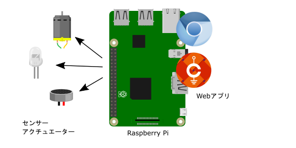
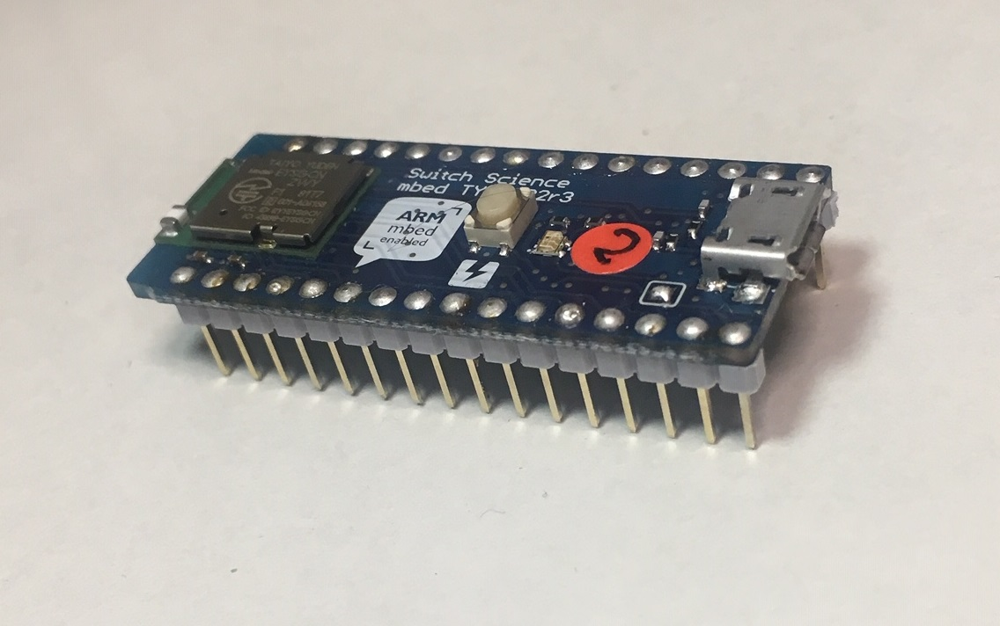
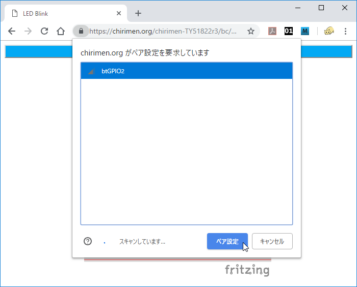

## 1. 今回のゴール

TY51822r3 で CHIRIMEN for TY51822r3 を使えるようにしてみよう。

## CHIRIMEN for TY51822r3 とは

まず CHIRIMEN for TY51822r3 の基礎となっている CHIRIMEN とは [Web GPIO](http://browserobo.github.io/WebGPIO/) や、[Web I2C](http://browserobo.github.io/WebI2C/) といった JavaScript の API を使用してセンサーやアクチュエーターなどの物理デバイスを Web 技術だけで制御する事ができる IoT 環境です。

CHIRIMEN についての詳しい情報は以下のリンクを参照してください。  
[CHIRIMEN 公式ページ](https://chirimen.org/)  
[CHIRIMEN チュートリアル](https://tutorial.chirimen.org)  

<!--
CHIRIMEN for Raspberry Pi 3 の構成  

-->

CHIRIMEN for TY51822r3 はこれを発展させて、PC 等のブラウザと Bluetooth LE (BLE) でワイヤレス接続された IO BLE インターフェースボードとセンサーやアクチュエーターの組み合わせで動作可能にした IoT 環境になります。BLE のインターフェースボードとしてはスイッチサイエンス社の BLE 開発ボード TY51822r3 を使用します。

<!--
CHIRIMEN for Raspberry Pi 3 では ラズベリーパイに接続されたセンサー等をラズベリーパイ自身の上で動作する Web アプリで制御するのに対し、CHIRIMEN for TY51822r3 では、BLE ボードに接続されたセンサー等をワイヤレス接続した PC 等の上で動作する Web アプリで制御します。
-->
CHIRIMEN for TY51822r3 の構成  

上の図では、Web アプリを動かす側が PC となっていますが Chrome または Chromium ブラウザであれば動作しますので、Raspberry Pi と BLE ボードの組み合わせでセンサーと本体が分離した組み込み型の機器などを作る事も可能です。

もし CHIRIMEN for Raspberry Pi 3 について既に知識があり、CHIRIMEN for TY51822r3 での相違点を知りたい場合は、
[CHIRIMEN for TY51822r3 と CHIRIMEN for Raspberry Pi 3 の違い](diff.md) のページをご覧ください。

## 2. TY51822r3 にピンヘッダーを半田付けする

TY51822r3 はピンヘッダーが無い状態で販売されています。ブレッドボードで使用するにはまず、別途用意したピンヘッダー (16 Pin x 2) を端子に半田付けしておく必要があります。ピンヘッダーを半田付けしたものが下の写真です。

## 3. TY51822r3 に CHIRIMEN for TY51822r3 のファームウェアを書き込む

TY51822r3 には MBED で CHIRIMEN for TY51822r3 用のファームウェア (btGPIO_TY51_xxxxxxxx.hex) を書き込んでおく必要があります。

### (1) ファームウェアのダウンロード
ビルド済みのバイナリファイルが準備されていますので下のリンクからダウンロードしてください。

**[btGPIO_TY51_20181220.hex](https://chirimen.org/chirimen-TY51822r3/bc/ble_fw/btGPIO_TY51_20181220.hex)**  

ブラウザでリンクを開くとダウンロードが開始されます。

### (2) TYBLE51822r3 ボードの USB コネクタと PC/Mac をケーブルで接続

接続すると PC/Macに MBED ドライブとして認識されます。もし認識されない場合はケーブルがデータ通信対応であることを確認してください

### (3) ファームウェアのコピー

MBED ドライブに (1) のファイルをコピーもしくはドラッグアンドドロップしてください。コピー中は TYBLE51822r3 ボード上の赤色 LED が点滅します。

コピーが終わると自動的に .hex ファイルを認識してファームの書き換えと再起動が行われ、コピーした .hex ファイルが削除されてから再度 MBED ドライブが認識されます。

もし MBED ドライブ内に FAIL.TXT があった場合はファイルの書き込みに失敗しています。ケーブルを繋ぎ直して再度実行してみてください。Mac で失敗することが多い場合は `cp -X` コマンドでファイルコピーをすると失敗しなくなる場合もあるようです。

TY51822r3 用のファームウェアを自分でビルドしてみたい場合は MBED のオンラインコンパイラを使用します。この手順については [TY51822r3 のファームウェアをビルドする](bridge.md) を参照してください。

## 4. ブラウザの確認

CHIRIMEN for TY51822r3 は WebBluetooth という新しい機能を使用しますので、ブラウザとして Chrome (Chromium) の最新版が必要です。
Chrome のバージョンを確認して必要ならアップデートしておいてください。

アドレスバーに `chrome://settings/help` と入力すれば最新版かどうかの確認とアップデートができます。

### Windows の場合

Windows の場合は WebBluetooth 機能がまだ実験的機能扱いのため、現在のところ次の設定も必要です。  
(2018年12月30日現在、リリースされている Windows 版 Chrome 71.0.3578.98 ではこの操作が必要ですが、今後の Chrome のアップデートで不要になります)

ブラウザのアドレスバーに `chrome://flags` と入力します。

各種フラグの一覧が表示されますので `Experimental Web Platform features` という項目を探します (`Search flags` のフィールドに `Experimental Web Platform` と入力すれば絞り込んでくれます)。

`Experimental Web Platform features` の設定がデフォルトでは `Disabled` になっているはずですのでこれを `Enabled` に設定します。その後 Chrome の再起動が要求されますので再起動してください。

### CHIRIMEN for TY51822r3 LIVE examples へのアクセス

CHIRIMEN for TY51822r3 のアプリはブラウザ上で動作する Web アプリですのでブラウザでアクセスするだけで動作します。

各種の example が次の URL で公開されていますので Chrome ブラウザでアクセスしてみてください。

[**Example**](https://chirimen.org/chirimen-TY51822r3/bc/)

なお、CHIRIMEN for TY51822r3 の本体は GitHub で公開されています。  
[https://github.com/chirimen-oh/chirimen-TY51822r3](https://github.com/chirimen-oh/chirimen-TY51822r3)  
ここから全体をダウンロードしてローカルに動作環境を構築する事もできます。

今回は、LIVE examples の中から、「**GPIO examples**」の「[**LEDblink**](https://chirimen.org/chirimen-TY51822r3/bc/gpio/LEDblink/)」のリンクをクリックしてください。

次のような画面が開きます。まだ動作を開始していませんが、これが「L チカ」のアプリになっており、また動作に必要なブレッドボード上の配線が図示されています。

### example を実行してみる
配線がうまくできたら、さっそく動かしてみましょう。
Chrome または Chromium ブラウザで LIVE examples の LEDblink のページは開いているでしょうか?

[**LEDblink**](https://chirimen.org/chirimen-TY51822r3/bc/gpio/LEDblink/)

ブラウザには次のような画面が表示されているはずです。

この状態ではまだ BLE の接続がされていません。  
次にブラウザ画面の上部にある「BLE 接続」の青いバー型のボタンをクリックします。  
すると次のようなダイアログが表示されて Bluetooth のスキャンが行われます。

TY51822r3 がちゃんと動作していれば、リストに「btGPIO2」 という名前のデバイスが見つかるはずです。これが CHIRIMEN for TY51822r3 用のデバイスになります。  
それを選択して「ペア設定」のボタンを押すとダイアログと青いバーが消え、接続が確立します。  

ここまで出来たら、CHIRIMEN for TY51822r3 の準備完了です。

『[チュートリアル 0. Hello World](section0.md)』をやってみましょう。

次の『[チュートリアル 0. Hello World](section0.md)』では CHIRIMEN for TY51822r3 の使い方について学びます。
